# HEY (hey.com) feature dossier

Research notes on HEY, the email and calendar service from 37signals, written as a reference for designing a calm, keyboard-first, Gmail-backed desktop client. Everything below was checked against hey.com, help.hey.com, 37signals' own writing and podcasts, and third-party reviews between the 2020 launch and September 2026. Where a claim could not be confirmed it is marked "unverified". Screenshots live in `screenshots/hey/` and are mostly frames from HEY's own product demo videos, plus a few images from the hey.com changelog (`/new/`) where those showed UI the videos did not.

## 1. Positioning

HEY launched on 15 June 2020 as a hosted email service, not an app on top of Gmail. Signing up gives you a new `@hey.com` address, and the service only works through HEY's own web app and native apps (web, Mac, Windows, Linux, iOS, Android, plus a PWA, a CLI and a terminal UI added in 2026). There is no IMAP or POP, you cannot read HEY mail in another client, and you cannot use HEY to check another account: the only inbound path from Gmail or iCloud is forwarding, and the only outbound path for another address is "send as" over SMTP or Google/Outlook OAuth. 37signals calls this "A Platform, Not a Client" and says the redesign was only possible because they own both ends.

The pitch, in HEY's own words, is "email as it should be": a set of opinions rather than a set of settings. The manifesto page (`/the-hey-way/`) lists fifteen principles. The ones that shape the product most:

- "No consent, no attention": nobody lands in your Imbox until you have said yes to them once in The Screener.
- "Get less email": reduce volume at the source (senders) and separate essential from secondary (three boxes) rather than helping you move faster through a pile.
- "Workflows, not workarounds": Reply Later, Set Aside and Bubble Up replace marking-as-unread and starring.
- "Convention over configuration" and "HI not AI": no rules engine, no regex filters, no algorithmic sorting. You tell HEY where a sender goes and it obeys.
- "Just say flow": no archive, no inbox zero. Read mail drops into Previously Seen and time pushes it down.
- "Surface, don't dig": attachments, clips and notes are pulled out to the top rather than buried in threads.
- "No bother": push notifications off by default, opted in per contact or per thread; no unread badges or counts anywhere ("Countless").
- "Counterintelligence": spy pixels stripped and reported; images proxied so your IP never leaks.
- "Pay with money, not privacy": flat fee, no ads, no data mining.

Jason Fried's framing in interviews is that "you cannot fix the email problem until you have control over who can email you", and that "spam is not the problem with email anymore"; the problem is legitimate but unwanted mail. DHH's framing is that inbox zero is "tyranny", because the archive button turned every email into an obligation.

Pricing and plans (September 2026):

| Plan | Price | Notes |
|---|---|---|
| HEY for You | $99/year (billed annually only) | One @hey.com address, HEY Calendar, 100 GB, HEY World blog, all features. 30-day free trial with no credit card; the trial is capped at 500 emails/day and excludes HEY World and public share links. |
| Ultra-short addresses | $349/year for 3-character, $999/year for 2-character | Vanity addresses only. |
| HEY for Families | $179/year total | Up to five separate @hey.com accounts under one payer. |
| HEY for Domains | $12/user/month, first user $10/month, billed monthly | Your own domain, no @hey.com address, no HEY World. Adds multi-user admin, Extensions (sales@, support@ group addresses that can deliver to several people or forward out), Shared Threads with private comments, shared Collections and Workflows, a Catch-all box, account managers. No free trial; you get 30 days to complete setup. |

If you pay for one year, the @hey.com address is yours forever and can forward out even after cancelling; trial-only addresses are recycled after 90 days. Export is MBOX for mail, vCard for contacts, .ics for calendars. Import of old mail is refused on principle ("a fresh start is a blessing, not a curse"); you import contacts (vCard) and forward new mail.

Sources: https://www.hey.com/, https://www.hey.com/the-hey-way/, https://www.hey.com/pricing/, https://www.hey.com/domains/, https://www.hey.com/faqs/, https://help.hey.com/article/754-can-we-import-our-old-emails, https://help.hey.com/article/719-can-i-use-hey-to-check-my-other-email-accounts, https://help.hey.com/article/882-what-can-i-do-on-the-free-trial, https://techcrunch.com/2020/07/06/oh-hey/, https://37signals.com/podcast/hey-whats-going-on/

## 2. The workflow, end to end

### A new sender arrives

Every inbound message first passes HEY's spam filter. If it survives and the sender has never emailed you before (and is not in your contacts), it does not reach any box. It lands in The Screener, and the Imbox shows a small mint pill in the top-left corner, "Screen 3 first-time senders". The Screener itself is a page with a row per sender: avatar, name, address, subject and a snippet, with two buttons on the left, a thumbs-up "Yes" and a thumbs-down "No". Clicking the row expands the message inline so you can read it (with recipients and timestamp) before deciding, and offers "Screen in to Imbox & Reply" for the case where you want to answer immediately.

"Yes" screens the sender in. The default destination is the Imbox, but the Yes button has a chevron that lets you pick The Feed or the Paper Trail instead, and that choice becomes the permanent delivery rule for that sender. "No" screens them out silently: nothing is sent back, the sender cannot tell, and all future mail from them goes to a Screened Out box that auto-deletes after 90 days. The decision is per sender, not per message, and can be reversed later from Screener History or the contact page (re-screening someone in reveals whatever they sent in the last 90 days). Contacts you add or import are pre-approved and skip the Screener. If the Screener piles up, "Clear all" punts everything without decisions.

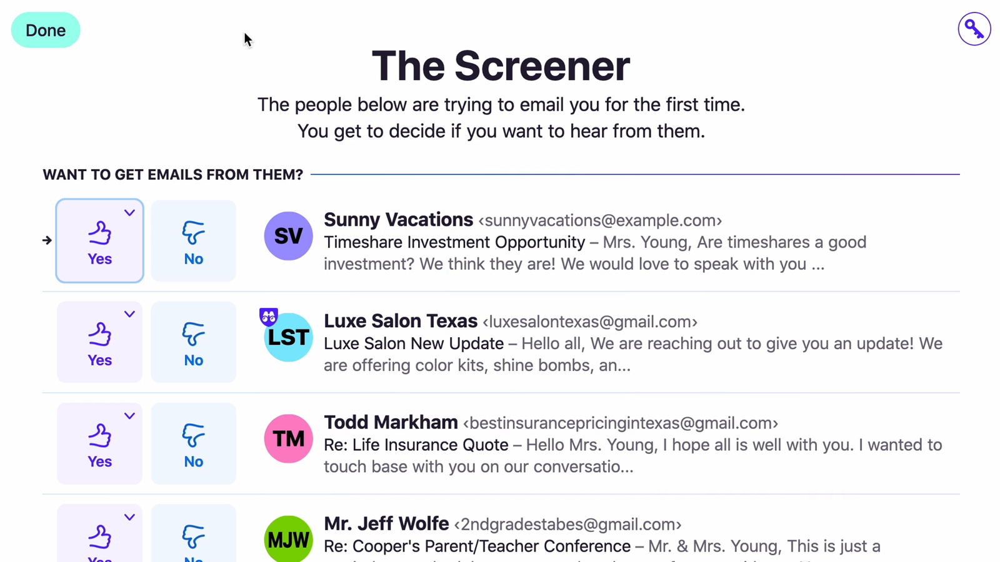
The Screener. Each row is a first-time sender; Yes has a dropdown for choosing which box they go to.

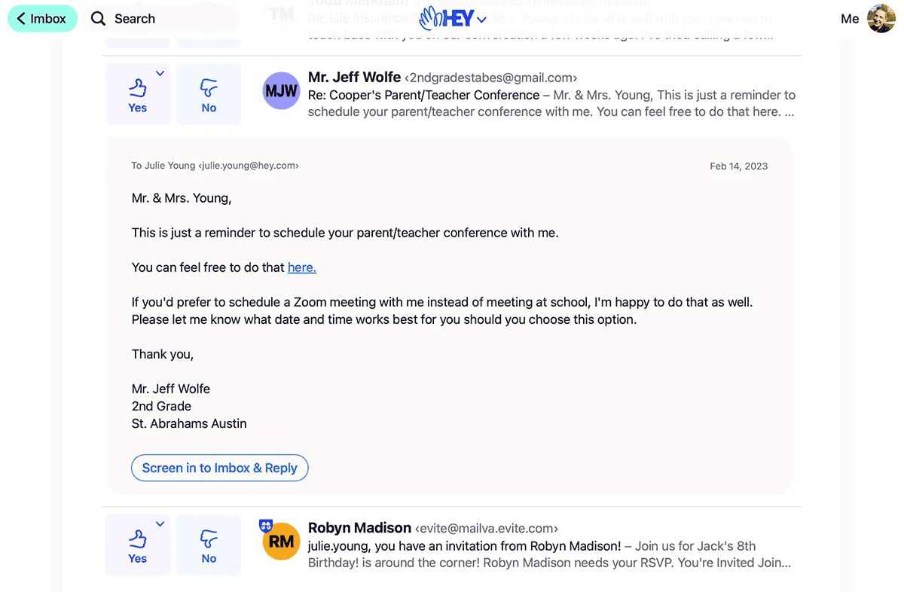
Clicking a row expands the message inline with recipients and timestamp, plus a "Screen in to Imbox & Reply" shortcut.

### Where screened-in mail goes

Every approved sender has exactly one delivery destination, changeable at any time from their contact page ("Delivering to..."), and changing it moves their existing mail too:

- The Imbox (the "im" is for important) is for people and services you want to hear from now. It is the only box with a read/unread concept.
- The Feed is for newsletters, promotions and long reads. It renders every email already open in a single scrolling column, newest first, like a social feed. No unread state, no obligation; items are recycled after 90 days by default.
- The Paper Trail is for receipts, confirmations and notifications. A plain chronological list with no unread state, "a digital shoebox". Senders that flood you can be bundled into one row here or in the Imbox.

One rule overrides the sender setting: any message with In-Reply-To or References headers (a reply, including automated "reply" notifications from Basecamp or GitHub) goes to the Imbox so you never miss a reply. HEY's advice for noisy services is "Imbox, bundled".

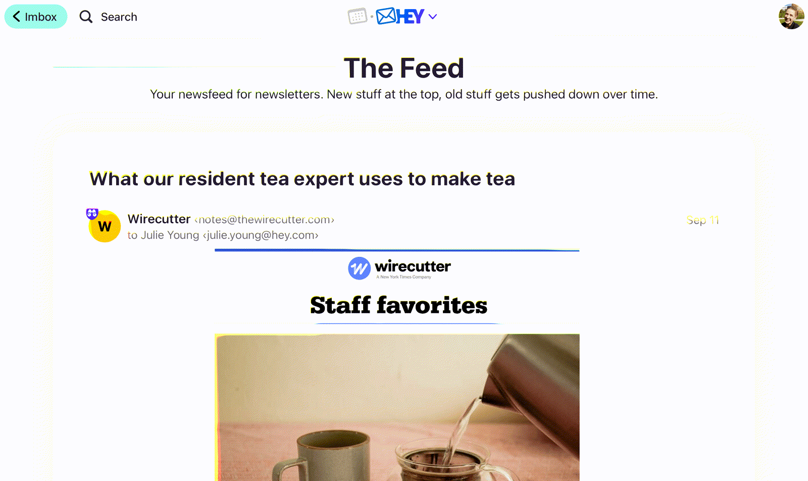
The Feed. Every newsletter is already expanded; you scroll, and "See more" or "See less" toggles the long ones.

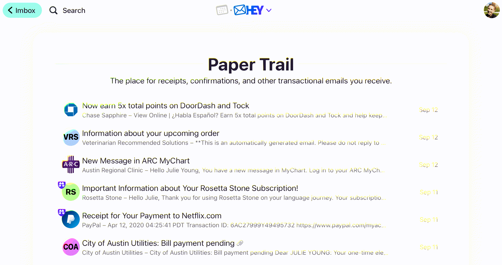
The Paper Trail: receipts and transactional mail in a flat list with brand avatars and no unread dots.

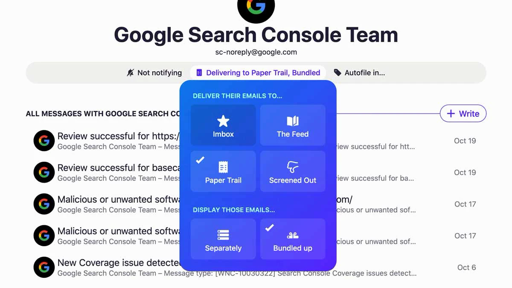
The per-contact delivery menu. Every sender has one destination and an optional "Bundled up" display mode.

### Triage in the Imbox

The Imbox is a single centred column. New For You is at the top: threads you have not opened, each with an orange dot, avatar, subject in bold, sender plus snippet underneath, date on the right. Previously Seen sits below in a slightly tinted band: everything you have read or sent, newest first, pushed down by time. A thread jumps back into New For You whenever a new reply arrives and drops back to Previously Seen once you look at it. You can "Mark Seen" without opening (from the avatar action menu), hover the New For You heading for "Mark all as seen", or press "Power Through New" to see every unread message on one page with inline reply boxes and quick actions. There is no archive: HEY's help centre answer to "Can I archive emails?" is that read mail goes to Previously Seen, and if you do not want to see it, put Cover Art over it or set the contact to recycle.

At the bottom of the screen two piles are always visible: Reply Later on the left, Set Aside on the right, each drawn as a small stack of cards with the top item's subject and sender. Clicking a pile fans it out; Reply Later's fan ends in a "Go to Focus & Reply" button, Set Aside's in "View the Set Aside Board". Reply Later is for things you owe a response to, Set Aside for things you need to reference (tickets, itineraries, links). Neither uses a flag icon in the list; the thread physically moves out of the list into the pile.

Focus & Reply is a dedicated page listing every Reply Later thread, each with the latest message on the left and a reply box on the right. Sending removes the thread from the queue and leaves a green "Sent!" banner in its place; you can do five of twelve and come back.

Bubble Up is HEY's snooze: pick "Later today", "Tomorrow", "This weekend", "Next week", "Surprise me", "Pick a date" or "If no reply by...", and the thread leaves the list and reappears in a Bubbled Up section above New For You at that time. It stays there until you "Pop" it, and a "Bubble Up Now" option pins something to the top immediately.

Bulk selection is by clicking the circle avatar on each row (or `x` on the keyboard); an action menu pops up with Reply Later, Set Aside, Mark Unseen, Move to Paper Trail, Move to The Feed, File in label, Add a Note, Read Together, Reply Together, Merge, Ignore, Trash.

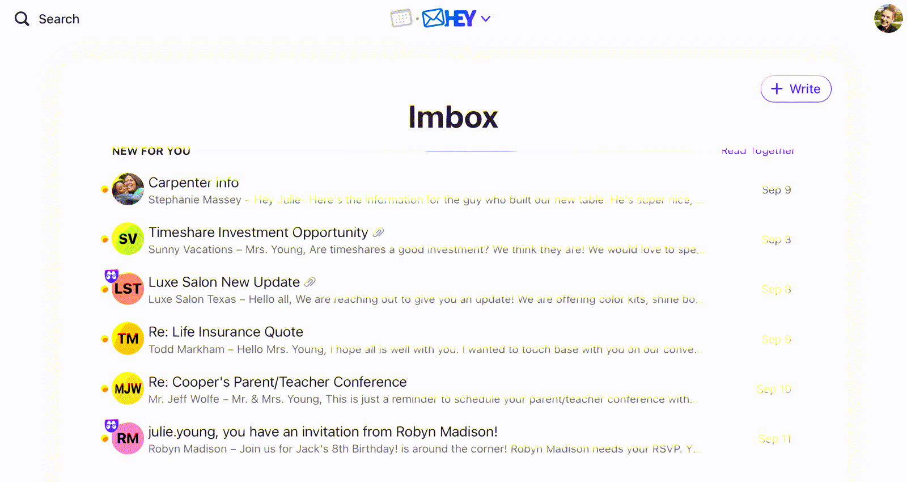
The Imbox: New For You on top, Previously Seen below. Note the absence of any count.

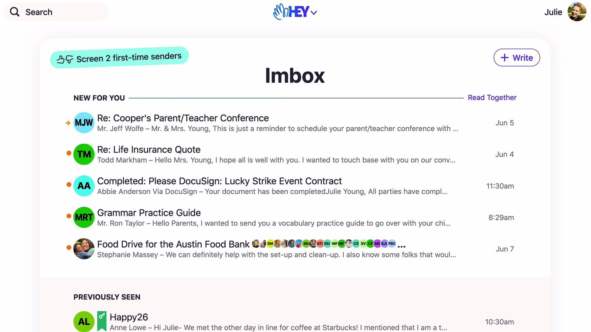
The two piles at the foot of the Imbox, and the "Screen N first-time senders" pill top left.

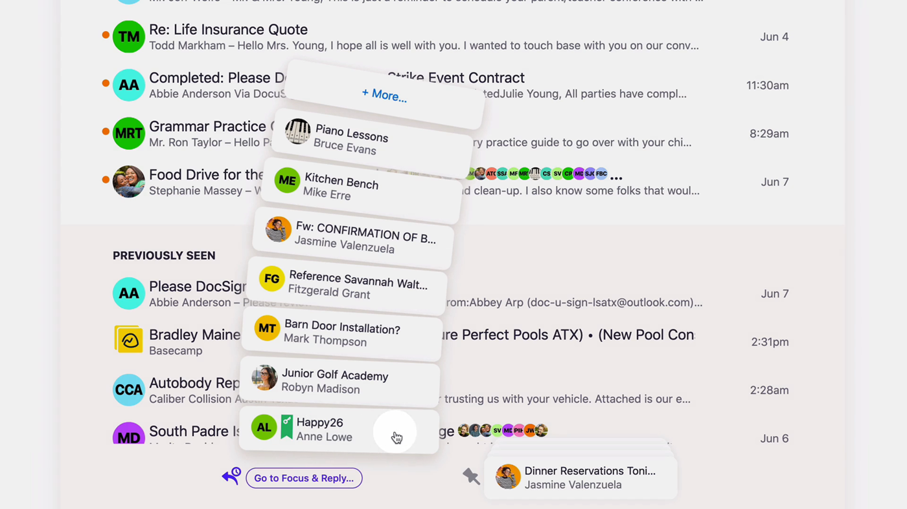
The Reply Later pile fanned open, with the "Go to Focus & Reply" button.

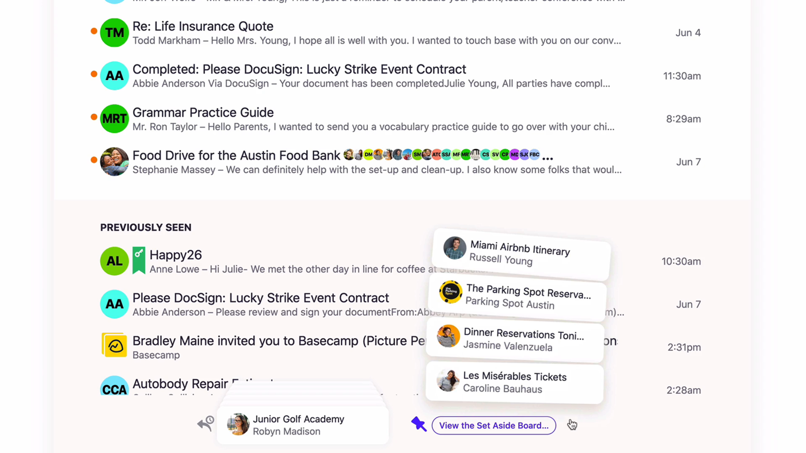
The Set Aside pile fanned open, with "View the Set Aside Board".

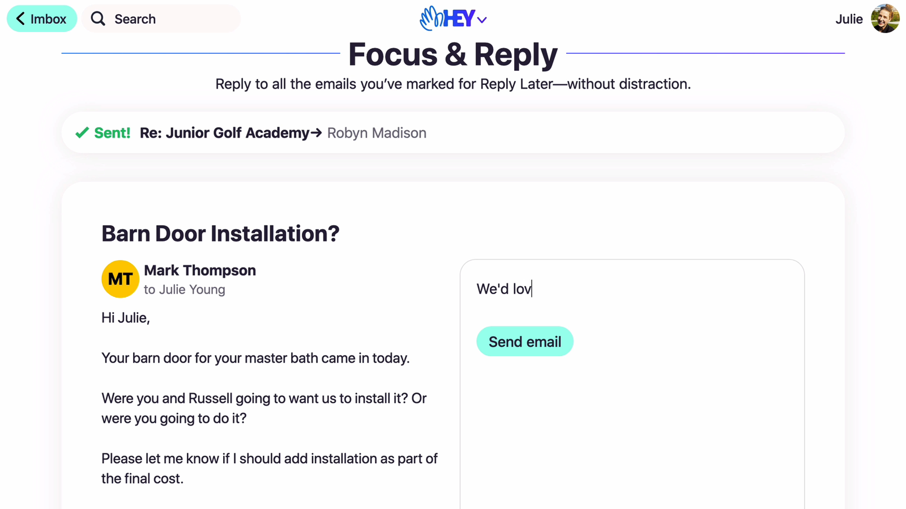
Focus & Reply: each Reply Later thread with its own reply box; sent ones collapse to a "Sent!" line.

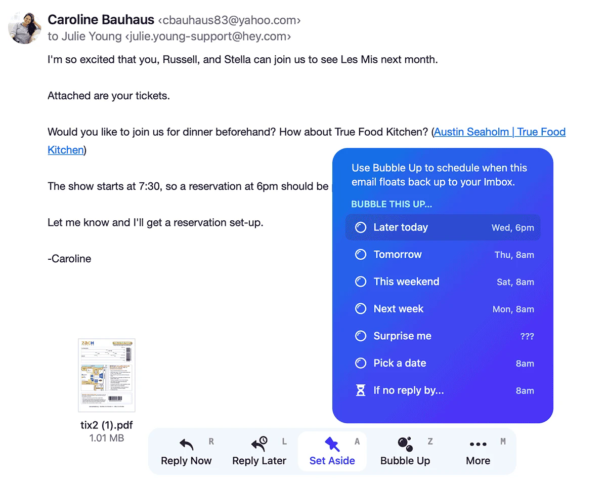
Bubble Up options, and the thread action bar with its single-letter key hints (R, L, A, Z, M).

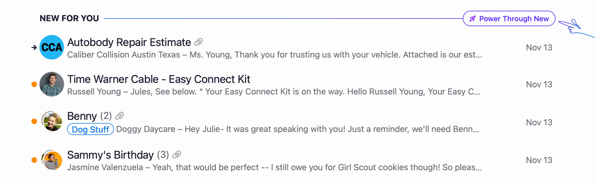
Power Through New: all unread mail on one page with inline replies and quick actions.

### Reading a thread

There is no reading pane. Opening a thread navigates to a full page: participant avatars and a large centred subject at the top, then each message as a white card (sender, recipient, date, body, attachments as thumbnails), and a floating action bar at the bottom with Reply Now, Reply Later, Set Aside, Bubble Up and More. Each message has its own "•••" for view original, print, download and report spam. The More menu holds thread-level actions: notification options (send me push notifications, ignore this thread), add a note to self, get a public link, start another thread, forward, label, move (including redeliver to another linked account), trash, add to Collection or Workflow, don't automatically recycle.

From here you can clip any selected text into a Clips Library, add private notes (text or files) between messages, rename the subject for yourself only, and merge another thread into this one. A spy-tracker banner at the top of the page tells you which vendor's pixel was stripped.

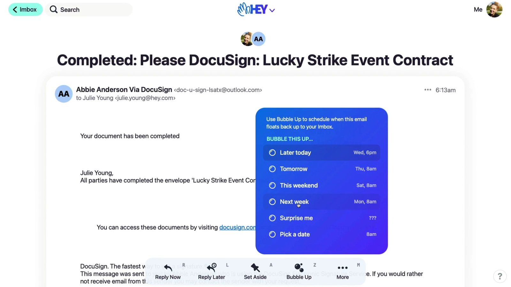
A thread page. Big centred subject, message cards, floating action bar with key hints.

### Sending

Compose opens as a full "New Message" sheet (or a separate window with Shift+W): To, CC/BCC, Subject, body, then a row of "Send email", "Save draft", a clock (Send Later), a paperclip and a formatting toggle. Replies open inline under the message. Reply-all is the default when there are multiple recipients; you switch to sender-only from the To field. Drafts autosave and can be minimised to a dock at the bottom of the screen. Send Later exists (arrow next to Send email, choose day and time; scheduled mail waits in Drafts). Undo Send exists (banner after sending, or `q`; enabled by default for accounts created after December 2022, toggle in Accounts & Settings). Signatures are replaced by Name Tags: 150 characters of text, bold/italic/link only, no images. Big attachments are sent as permanent download links with no download tracking. Special send variants exist for the piles: "Send & Mark Done" from Set Aside, "Now and Pop" from Bubble Up, and "Reply to Everyone" to send one reply to several selected threads.

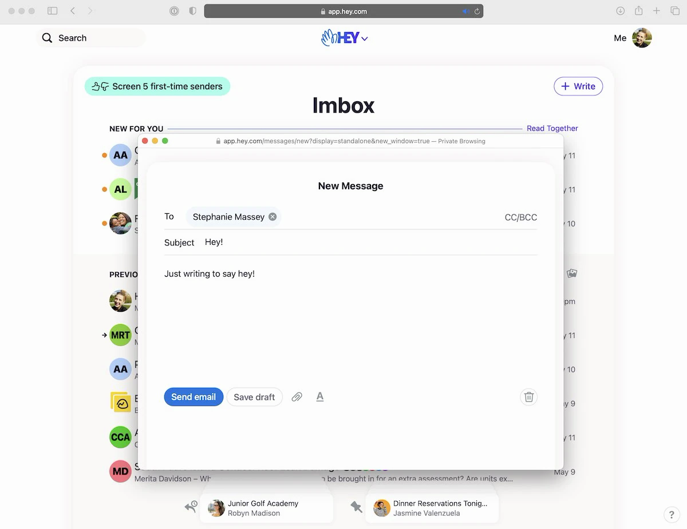
New Message in its own window: To, CC/BCC, Subject, Send email, Save draft, Send Later clock, attach, format.

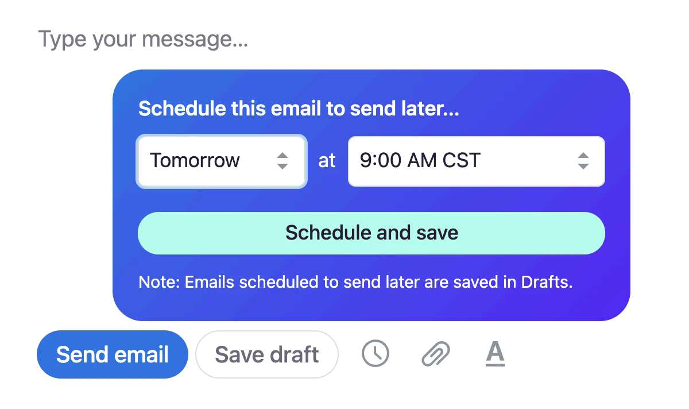
Send Later: a day and time picker; scheduled emails are held in Drafts.

Sources: https://www.hey.com/how-it-works/, https://www.hey.com/flow/, https://help.hey.com/article/722-the-screener, https://help.hey.com/article/759-imbox, https://help.hey.com/article/840-why-are-these-notifications-going-to-my-imbox-instead-of-the-feed-paper-trail, https://help.hey.com/article/892-email-threads, https://help.hey.com/article/859-can-i-archive-emails, https://help.hey.com/article/820-how-do-i-undo-sending-a-message, https://help.hey.com/article/821-how-do-i-send-an-email-later, https://help.hey.com/article/807-reply-to-sender-or-reply-all

## 3. Feature catalogue

### The Screener

What it does: holds mail from any sender who has never emailed you (and is not in Contacts) until you say Yes or No. Runs after the spam filter. Yes defaults to Imbox; the Yes chevron chooses The Feed or Paper Trail. No is silent and permanent until you reverse it. Details and rules:

- Screener History (avatar menu, Accounts & Settings) lists everyone screened out and lets you screen them back in; doing so reveals their mail from the last 90 days.
- Screen out an existing contact from their page: Delivering To, then Screened Out.
- Domain screening: open a message, click the sender name, then the @domain button, and choose auto-screen in to Imbox, auto-screen out, or decide per sender. Large consumer domains such as gmail.com cannot be screened out as a whole.
- Imported or manually added contacts bypass the Screener.
- Speakeasy code: a secret word (key icon at the top right of the Screener) that, when it appears as a standalone word in a subject line, bypasses the Screener and marks the mail as special in the Imbox. Regenerate any time.
- HEY Spam Corps: opt in to get a third "Spam" button in the Screener; marking spam also screens out.
- "Clear all" empties the Screener without decisions. Screened Out and Spam are deleted after 90 days.
- Easter egg: Shift-click on No turns the thumbs-down into a middle finger (the "F*#k No" feature from the REWORK podcast).
- Forwarding out of HEY bypasses the Screener entirely.

Source: https://help.hey.com/article/722-the-screener, https://www.hey.com/features/the-screener/, https://help.hey.com/article/773-the-speakeasy-code, https://help.hey.com/article/889-spam-corps, https://37signals.com/podcast/the-f-k-no-feature/

### The Imbox

The only box with a read state. Two automatic groups, New For You and Previously Seen, plus a Bubbled Up group above them when anything is bubbled. Sent mail lands in Previously Seen. A new reply pulls a thread back to New For You. Actions: Mark Seen/Unseen from the avatar menu, Mark all as seen on the New For You heading, Power Through New, Read Together (link at the right of the New For You heading, or select rows). Bundles collapse all mail from one sender into a single row (Imbox and Paper Trail only; clicking a bundle with new mail shows all the new messages on one page). Cover Art can hide Previously Seen. There is no archive and no folders; labels are the closest thing.

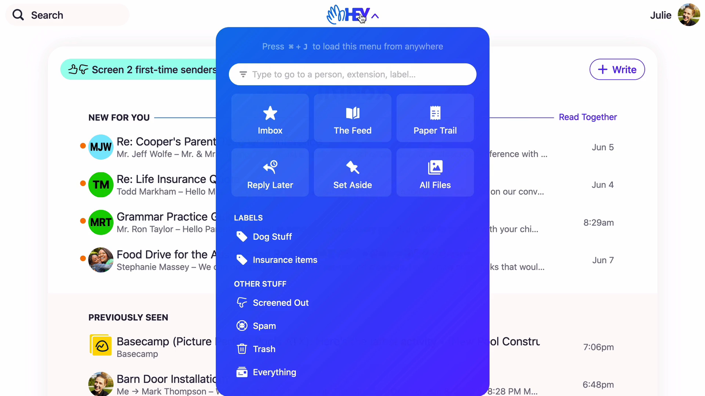
The HEY menu, opened from the logo or `h`: a filter box, the six boxes as tiles with their number keys, labels, then Screened Out, Spam, Trash and Everything.

Source: https://help.hey.com/article/759-imbox, https://help.hey.com/article/784-different-states, https://help.hey.com/article/930-mark-all-as-seen, https://help.hey.com/article/765-bundle-emails

### The Feed

Newsletter reader. Each item is rendered expanded in a card with a large title, sender line and the full HTML; long items truncate with "See more..." and can be collapsed with "See less". Newest at top. No read state and no bulk unread count; HEY remembers "where you left off" and the HEY menu flags "new since you last visited". Actions (forward, move, label) come from the circle avatar on the item. Routing to the Feed is per sender only, never per domain. Feed mail is recycled after 90 days by default. Clips can be saved from Feed text (coupon codes are the stated use case). The Feed does not support bundles.

Source: https://help.hey.com/article/761-the-feed, https://www.hey.com/features/the-feed/, https://www.hey.com/new/

### The Paper Trail

Flat list for receipts and transactional mail. No read state. Supports bundles per sender. You cannot turn recycling on for the whole box, but per-contact recycling still applies to mail that lives there. Android can keep the last 30 days offline.

Source: https://help.hey.com/article/787-paper-trail, https://www.hey.com/features/paper-trail/

### Reply Later

Button in the thread action bar (`l`) or bulk menu. Moves the thread out of the list into the Reply Later pile at the bottom left; the pile fans open on click; a dedicated Reply Later box is reachable with `4`. Take a thread out by toggling the button again; it returns to the Imbox. There is no due date on Reply Later; Bubble Up's "If no reply by" covers that case.

Source: https://help.hey.com/article/774-reply-later, https://www.hey.com/features/reply-later/

### Set Aside

Button (`a`). Same pile mechanic on the bottom right, plus a Set Aside Board that previews every set-aside thread as a card on one screen. Inside the Set Aside box you can drag threads into named groups at the top ("bills to pay", "trip"). Remove with "Done" (`i` in the pile), or "Mark all as Done". Replying from Set Aside offers "Send & Mark Done".

Source: https://help.hey.com/article/777-set-aside, https://www.hey.com/features/set-aside/, https://www.hey.com/new/

### Focus & Reply

Page listing every Reply Later thread with a reply box beside each. Replying removes the item and shows a "Sent!" line; unanswered items stay for next time. Fried: "Focus and reply takes you out of that loop completely".

Source: https://help.hey.com/article/764-focus-and-reply, https://www.hey.com/features/reply-mode/

### Bubble Up

HEY's snooze (`z`). Presets: Later today, Tomorrow, This weekend, Next week, Surprise me, Pick a date, If no reply by..., and Bubble Up Now. Bubbled threads sit in a Bubbled Up section at the top of the Imbox until popped; a reply to a bubbled thread moves it to New For You; when replying you can choose "Now and Pop". Works from the bulk menu and from Power Through New. A Bubble Up box lists everything scheduled (`6`).

Source: https://help.hey.com/article/766-bubble-up, https://www.hey.com/new/

### Power Through New

Button on the New For You heading (`o`). Shows every unread thread on one page; reply inline, mark seen, Reply Later, Set Aside or Bubble Up per item; press `x` on an item for the full action menu; "Mark all as seen" at the bottom. Untouched items remain New For You.

Source: https://help.hey.com/article/923-power-through-new

### Read Together and Reply to Everyone

Select several Imbox rows and choose Read Together to open them all on one scrolling page (also the way to print several at once). Reply Together / Reply to Everyone sends one reply to every selected thread.

Source: https://help.hey.com/article/786-read-together, https://www.hey.com/features/reply-to-everyone/

### Clips

Select text in any message (Imbox or Feed), a "Save clip" button appears. Clips go to a Clips Library (HEY menu, Clips; `app.hey.com/clips`) showing the clipped text, sender and thread. Text only, any length, unlimited, synced across devices; deleting a clip does not touch the email; clipped threads are exempt from recycling.

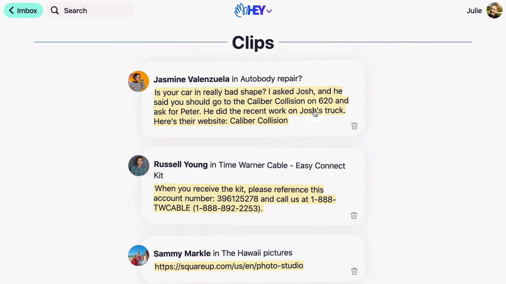
The Clips Library: highlighted passages with their sender and thread.

Source: https://help.hey.com/article/771-clips

### Collections

A named page that gathers several threads (with their own notes and a Recent Files strip) without merging them. Add from the thread's More menu or the bulk menu (`n`). Originally Domains-only, now on all accounts. Sharing a Collection with teammates is Domains-only; Collections can have notes and push notifications. Manual only, no auto-sorting.

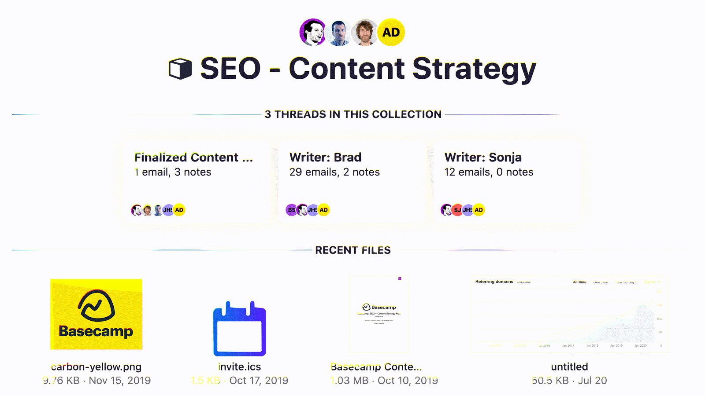
A Collection: three threads and their recent files on one page.

Source: https://help.hey.com/article/762-collections, https://help.hey.com/article/1006-collaboration-with-collections

### Cover Art

Picture icon at the top right of Previously Seen. Choose a preset or upload PNG/JPG/GIF (up to 40 MB, under 16K by 16K). The image slides over Previously Seen so the Imbox shows only new mail; tap to reveal. Stickies: a "+" at the top left of the cover adds yellow sticky notes (reminders, snippets, links) that live on the cover. Calendar cover art (web only) shows today and tomorrow, habits, "sometime this week" tasks, countdowns, and a join-call button 15 minutes before a meeting.

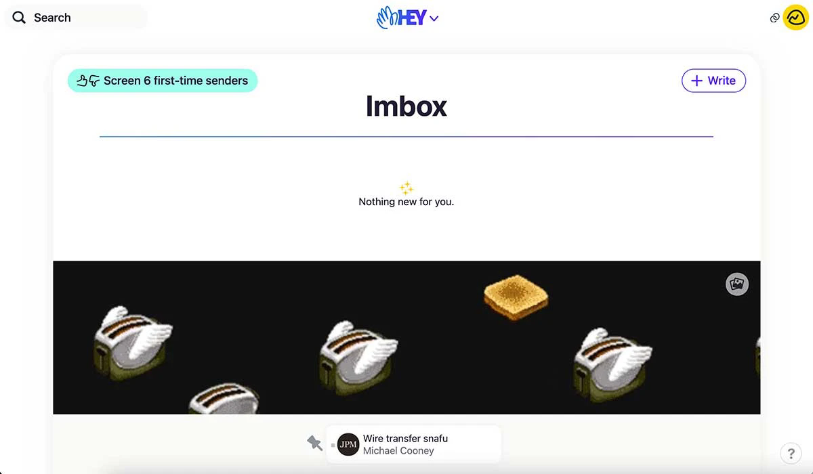
Cover Art hiding Previously Seen; the Imbox above it is empty ("Nothing new for you").

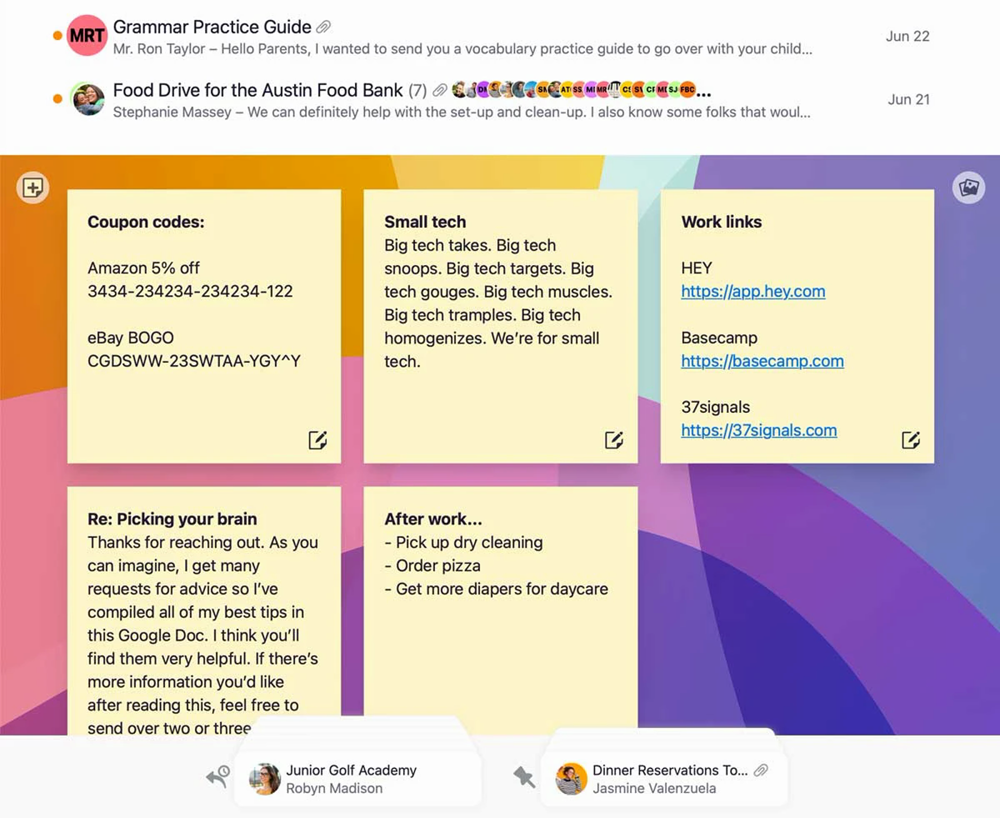
Stickies pinned to the cover art.

Source: https://help.hey.com/article/781-cover-art

### Merge threads

Select two or more threads, Merge (`g`). A dialog asks "What should we call the new thread?" (prefilled from the longer thread) and lists the threads being merged. Permanent, with a confirmation; the other party is unaffected and their replies to either original thread arrive in your merged thread.

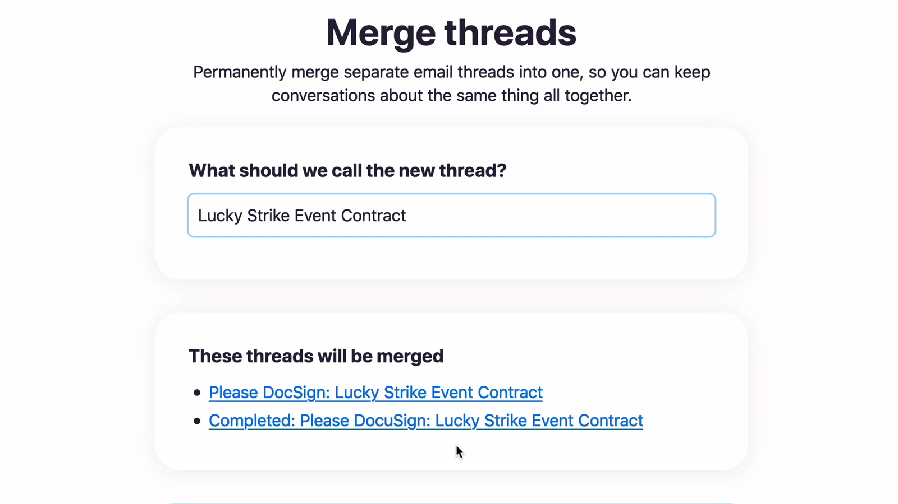
The Merge dialog: name the result, confirm the list.

Source: https://help.hey.com/article/780-merge-threads

### Rename subject

Click the subject on a thread page. A popover asks "What would you like to call this?", notes that people outside HEY will not see the new name, and shows the original. The rename is yours only and persists no matter what others do.

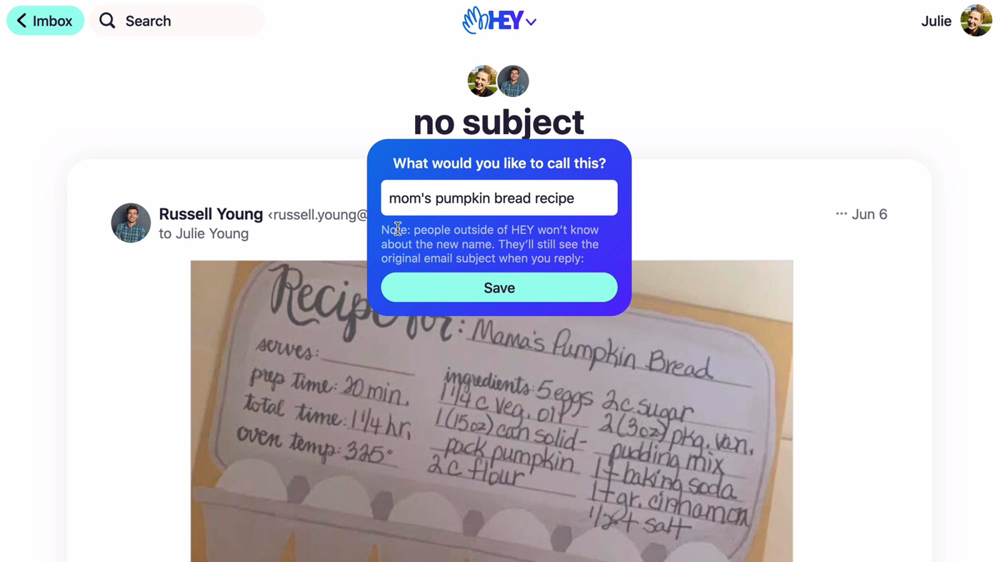
Renaming a "no subject" thread for yourself.

Source: https://help.hey.com/article/783-rename-the-subject

### Sticky notes on Imbox rows

From the bulk menu, "Add a Note" (`y`). A yellow private note appears under the row in the Imbox only, not on the thread page.

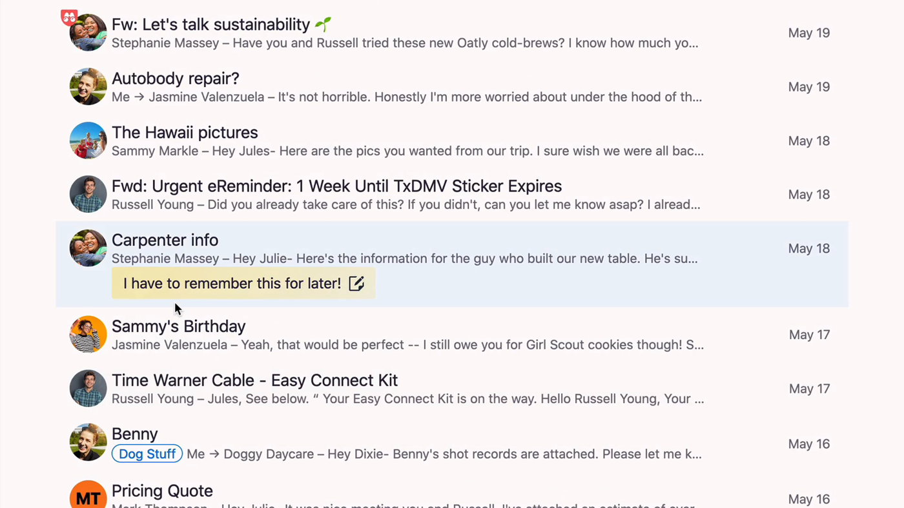
A private sticky note attached to an Imbox row.

Source: https://help.hey.com/article/775-sticky-notes

### Notes to self (thread notes)

More menu, "Add a note to self". A blue block inside the thread, dated, with text and files (drag in, or paste images). Private; unlimited; can sit between messages. On HEY for Domains the same mechanism becomes private comments visible to teammates on a shared thread.

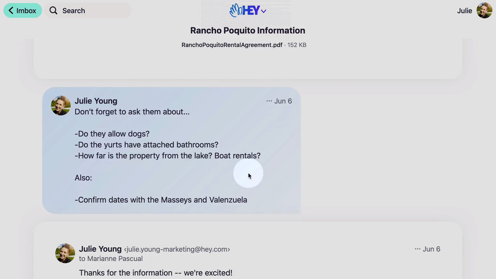
A private note between two messages in a thread.

Source: https://help.hey.com/article/782-note-to-self, https://www.hey.com/features/shared-threads/

### Workflows

Kanban boards. Create a workflow, add stages, drag threads between stages; the whole thread (replies, notes, files) travels with the card. Add a thread from its More menu. On Domains, workflows are shared with all users and Extensions can auto-add incoming mail to a workflow. HEY positions Workflows plus Contact Notes as its "light CRM".

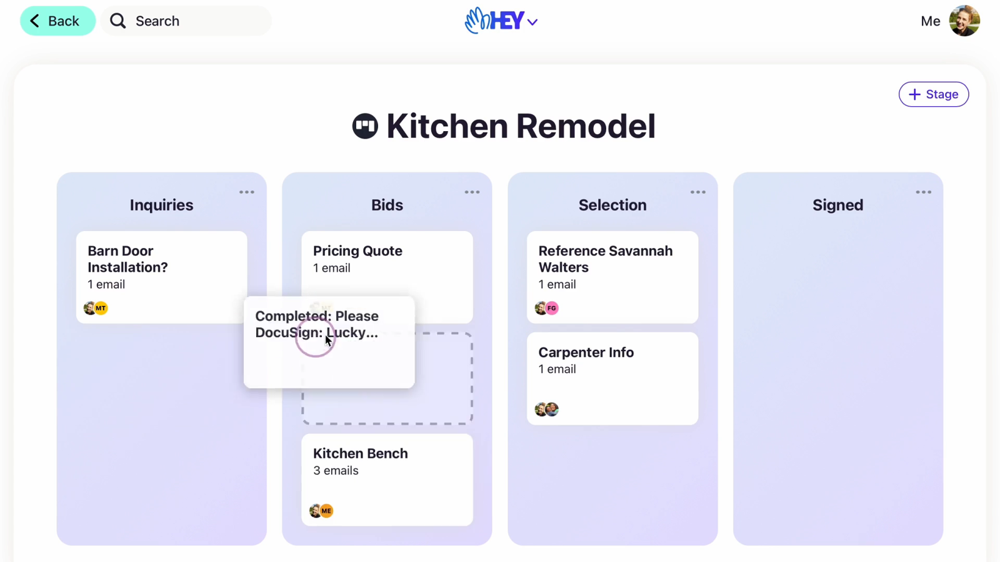
A Workflow: stages as columns, threads as cards.

Source: https://help.hey.com/article/767-workflows, https://help.hey.com/article/929-crm

### Labels

Tags, not folders. Apply from the bulk menu (`b`) or a contact page ("Autofile in..." labels all new mail from that sender). Plus-addressing `you+label@hey.com` auto-labels if the label exists and the sender is screened in. Labels appear as small pills on the row and as entries in the HEY menu.

Source: https://help.hey.com/article/884-labels

### Contact pages and contact notes

Click any avatar to reach the contact page: avatar, name, address, then a pill row: Not notifying / Delivering to Imbox / Autofile in... / Set up recycling / Add a note. Below that a rich-text Notes area, a Recent Files strip, and every thread with that person plus a Write button. Contacts list shows only approved (screened-in) contacts; unapproved still appear in search. Import vCard, export vCard, merge contacts by adding a second address, Contact Groups for addressing many people by one name.

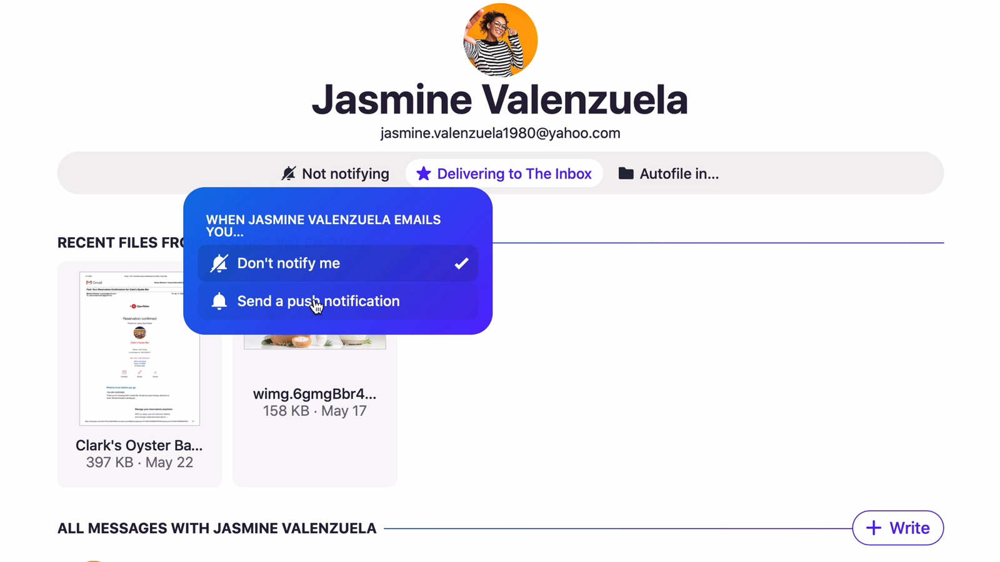
A contact page with the "When X emails you..." choice: Don't notify me or Send a push notification.

Source: https://help.hey.com/article/885-contacts, https://help.hey.com/article/770-contact-notes, https://help.hey.com/article/788-contact-groups

### Recycling

Off by default except The Feed (90 days). Per contact or per domain, choose 30 days, 90 days or 2 years measured from the last message in the thread; recycled mail goes to Trash and is deleted 30 days later. Longest applicable period wins. Clipped threads are exempt, and any thread can be set "Don't automatically recycle".

Source: https://help.hey.com/article/805-recycling-center

### Spy pixel blocking

HEY strips known tracking pixels and anything that looks like one (1x1 images, hidden trackers), names the vendor in a purple banner at the top of the thread ("You're protected. We blocked a spy tracker in this thread", expandable to explain what Hubspot or Mailchimp would have learned), and proxies all remaining images through HEY's servers so the sender never sees your IP. HEY claims about 98% coverage and publishes the list of blocked vendors. Outgoing HEY mail never contains trackers, and big-file download links are not tracked.

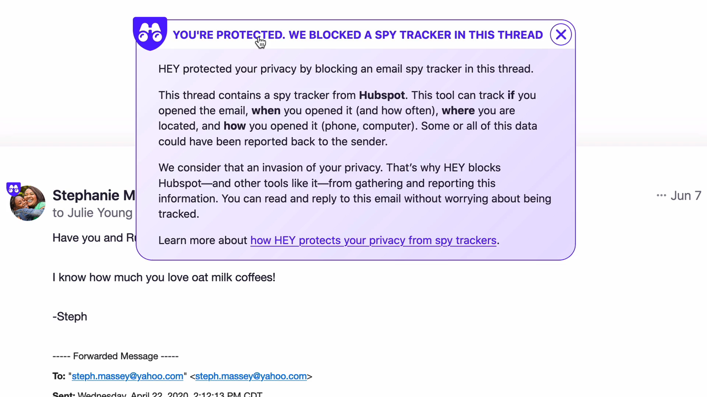
The spy tracker banner expanded, naming the vendor.

Source: https://www.hey.com/spy-trackers/, https://www.hey.com/features/spy-pixel-blocker/

### Ignore thread (mute) and unsubscribe

More menu, "Ignore this thread" (bulk `-`). Replies still arrive and are appended to the thread page, but the thread never returns to New For You; a yellow banner on the thread says "You ignored this thread" with "Stop ignoring". Deleting would not work because the next reply would resurrect the thread. HEY does not document any unsubscribe action; nothing on hey.com, in the changelog or in the help centre mentions one. The HEY answer to unwanted newsletters is to screen the sender out, route them to The Feed, or set them to recycle.

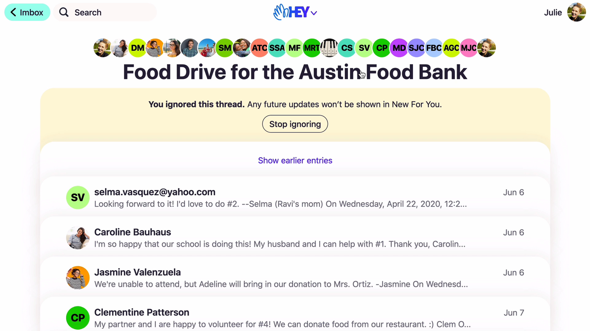
An ignored thread, with the "Stop ignoring" control.

Source: https://help.hey.com/article/769-ignore-a-thread, https://www.hey.com/features/mute-thread/

### Notifications

Push notifications are off by default everywhere. Turn them on per contact (contact page, "Send a push notification") or per thread (More menu, "Send me push notifications"), or per Collection. HEY refuses to show icon badges or unread counts "by design". Android notifications carry Mark Seen, Reply Later and Set Aside actions.

Source: https://help.hey.com/article/772-notifications, https://www.hey.com/features/notifications/

### Attachments, All Files, big files

All Files (HEY menu) is a library of every attachment ever received, filterable by type (images, PDFs, calendar invites, documents, spreadsheets, presentations, media, zip) and by sender at the same time, each card showing the thread it came from as a link. Signature junk (logos, social icons) is excluded. Sent Mail has a Recent Files strip of everything you have sent. Download all attachments in a thread with two clicks. Big attachments are sent as permanent direct-download links to any recipient, untracked.

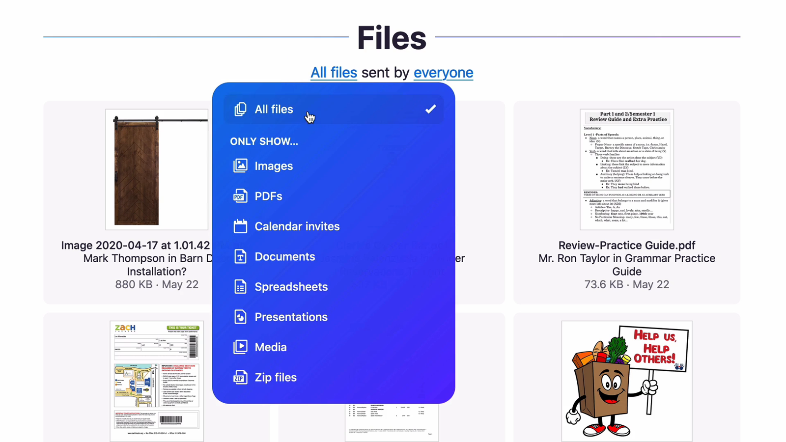
All Files with the type filter open.

Source: https://help.hey.com/article/785-all-files, https://help.hey.com/article/768-sending-large-files

### Search

`s` or `/`. Results appear as you type (first seven), Cmd+Return or "View all results" opens the full page with a "Refine your results" rail: box (Imbox, The Feed, Paper Trail), also these words, none of these words, this exact phrase, from, to, subject, date, label, has attachment. Search covers Trash. Results support bulk actions. Mobile keeps a local search history. HEY says search became "up to 7x faster" in 2025, which is an admission that it used to be slow.

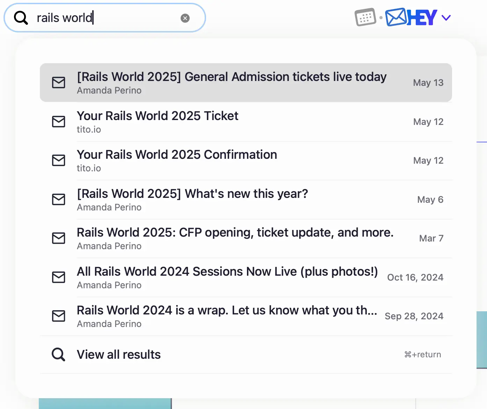
Quick search dropdown as you type, with "View all results".

Source: https://help.hey.com/article/845-search, https://www.hey.com/new/

### Everything, Spam, Trash, Screened Out, Sent, Drafts

The HEY menu's "Other stuff" section: Screened Out (auto-deleted after 90 days), Spam (90 days), Trash (30 days), Everything (`app.hey.com/topics/everything`, every message across all boxes including spam and screened out). Sent Mail and Drafts are in the "Your" section. Drafts autosave; a draft can be minimised to a dock at the bottom of the window.

Source: https://help.hey.com/article/903-how-can-i-see-all-my-emails, https://help.hey.com/article/1014-empty-trash-spam-or-screened-out, https://help.hey.com/article/848-email-drafts

### Sorting and grouping in the Imbox

There are no sort options. Order within a group is strictly newest first. Grouping is fixed: Bubbled Up (if any), New For You, Previously Seen. The only other structure is bundles (per sender), labels (pills), and multi-account markers (a triangle for personal, a square for work when accounts of different types are linked).

Source: https://help.hey.com/article/784-different-states, https://www.hey.com/link-multiple-accounts/

### Signatures (Name Tags), Snippets, Autoresponder, forwarding, send-as

- Name Tag: a 150-character text-only signature (bold, italic, link) toggled in Edit Profile; one per address, including send-as addresses.
- Snippets: saved blocks of text or whole emails, inserted while composing (HEY menu, Snippets).
- Autoresponder: per account, with its own message; ignores forwarded mail, lists, bulk, auto-replies and spam; one auto-reply per contact per 7 days.
- Forwarding in: Accounts & Settings, Forwarding & Sending, Connect an address; then set forwarding at Gmail or iCloud. Replies to forwarded mail can go from the HEY address or the external one.
- Send as: SMTP with basic auth, or OAuth for Google and Outlook. Google Advanced Protection accounts cannot be used.
- Forwarding out: everything non-spam, bypassing the Screener. Redeliver: route a specific sender's mail from one linked account to another.

Source: https://help.hey.com/article/744-name-tags, https://help.hey.com/article/795-snippets, https://help.hey.com/article/776-autoresponder, https://help.hey.com/article/1055-forwarding, https://help.hey.com/article/733-sending-with-a-non-hey-email, https://help.hey.com/article/1013-redeliver

### Sharing: public links, Shared Threads, Extensions

Any thread can get a public read-only link (paid accounts only) that shows the whole thread and future replies on a HEY-formatted page; link holders cannot reply. On Domains, threads can be shared with teammates who then see everything including future replies, with private comments in blue blocks. Extensions are group addresses (sales@) delivered to several people or forwarded to a help desk, with a choice of whether new members see history.

Source: https://help.hey.com/article/779-shareable-links, https://www.hey.com/features/shared-threads/, https://help.hey.com/article/819-extensions

### HEY Calendar

Included since 2024. Views: Day (a single vertical timeline "telling the continuous story of your life"), Week, Year (all-day and multi-day events only). Extras: "Sometime this week" undated tasks that roll forward, Habits, Time tracking, Journal (private daily notes), countdowns, named days, day background photos, circled days, collapsed Nighttime hours, colour-coded sub-calendars, multiple reminders, multi-timezone, sharing with HEY users, ICS import and feeds, Google/Apple/Outlook import, create an event from an email (auto-linked back), calendar search. Cannot print. Keyboard: `0` toggles between mail and calendar.

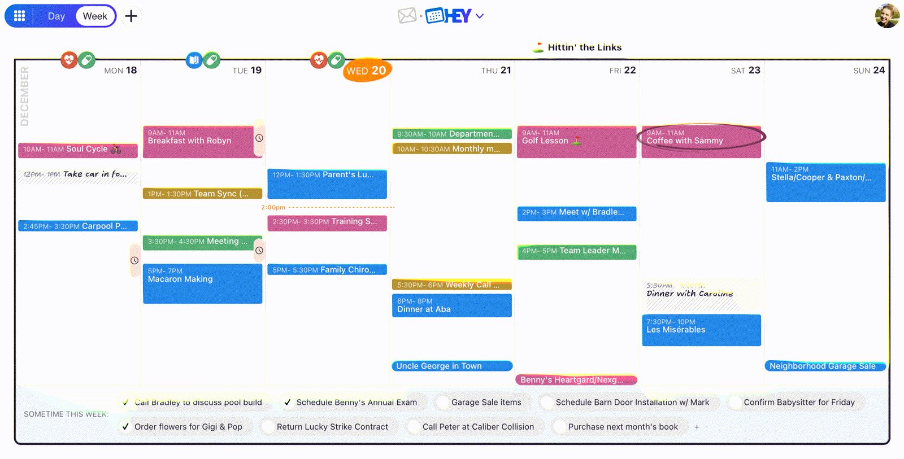
Week view with the "Sometime this week" row of undated tasks at the bottom.

Source: https://www.hey.com/calendar/, https://help.hey.com/article/800-calendar-overview, https://help.hey.com/article/900-sometime-this-week, https://help.hey.com/article/837-calendar-day-features

### HEY World

Send an email to `world@hey.com` (sole To recipient) from a paid HEY for You account and it is published at `world.hey.com/you/post-title`; readers subscribe by email or RSS; you can add a bio, pin posts, edit or delete posts, and export or import subscribers. Not available on trials or on HEY for Domains.

Source: https://www.hey.com/world/, https://help.hey.com/article/763-hey-world

### Mobile apps

iOS and Android apps for Email and Calendar (separate apps), described as full-featured. Layout is the same single column with the piles at the bottom; the HEY menu is reachable everywhere. Swipe left/right defaults to Seen/Unseen and is customisable to Reply Later or Set Aside. iOS has home screen widgets (New for you, The Feed, Paper Trail, Reply Later, Set Aside, Screener), Siri shortcuts, share sheet, iPad multi-window and keyboard navigation. Android has Material You calendar widgets, notification actions, device contacts, and offline Paper Trail. No app icon badges on either platform.

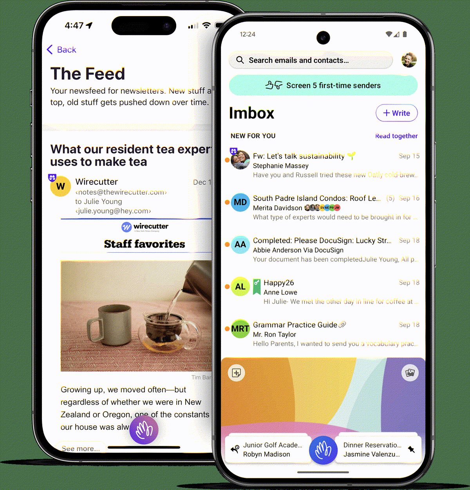
HEY on iOS: The Feed and the Imbox with the piles at the bottom.

Source: https://www.hey.com/apps/, https://help.hey.com/article/847-widgets, https://www.hey.com/new/

### Multi-account, security, CLI

Link any number of HEY accounts and see them merged in one Imbox (with type markers) or one at a time. Mandatory TOTP two-factor for paying customers, WebAuthn keys supported, no SMS. A dark-mode toggle independent of the OS. In 2026 HEY shipped a CLI (`curl -fsSL https://hey.com/install-cli | bash`), a TUI (`hey tui`), and an MCP server (`hey mcp`, with a `--read-only` flag) so agents such as Claude Code can screen mail, clear Reply Later and draft replies.

Source: https://www.hey.com/features/multi-account/, https://www.hey.com/features/security/, https://www.hey.com/agents/, https://help.hey.com/article/1189-using-ai-agents-with-hey

## 4. Keyboard shortcuts

The model is single, unmodified mnemonic keys: no two-key sequences ("g then i") and only a handful of modifier chords (Cmd/Ctrl+J for the menu, Cmd/Ctrl+Return to send, Shift+. and Shift+W). Keys are contextual: `o` is Power Through New on the Imbox page but Read Together in the bulk menu; `r` is Reply Now on a thread but Reply Together in bulk; `i` is Move to Imbox in bulk and "Done" inside the Set Aside pile. Press `?` anywhere (or the keyboard icon bottom right) for the list. The bottom action bar on a thread prints the letter next to each button.

Navigation (anywhere):

| Key | Action |
|---|---|
| 1 | Imbox |
| 2 | The Feed |
| 3 | Paper Trail |
| 4 | Reply Later |
| 5 | Set Aside |
| 6 | Bubble Up |
| 9 | Previously Seen |
| 0 | Toggle Calendar / Email |
| s or / | Search |
| h or Cmd/Ctrl+J | HEY menu |
| ? | Help and shortcut list |

Imbox page:

| Key | Action |
|---|---|
| w | Write a new email |
| Shift+W | Write in a new window (desktop browsers) |
| o | Power Through New |
| z | Bubbled Up |

On a thread ("message action shortcuts"):

| Key | Action |
|---|---|
| r | Reply Now |
| l | Move to Reply Later |
| a | Move to Set Aside |
| z | Bubble Up |
| f | Forward |
| b | Label |
| v | Move |
| t | Trash |
| m | More menu (shown on the action bar; the help page lists it for adding to a Collection) |
| u | Mark Unseen (from the More menu) |
| Shift+. (>) | Expand message previews ("See more") |
| Cmd/Ctrl+Return | Send |
| q | Undo send (immediately after sending) |
| Cmd/Ctrl+B, I, K | Bold, italic, link while composing |

Bulk actions (Imbox, The Feed, Paper Trail, Set Aside, Reply Later, Bubble Up lists):

| Key | Action |
|---|---|
| x | Select row |
| j / down | Next row |
| k / up | Previous row |
| Enter | Open thread |
| ; | Focus the bulk actions menu |
| l | Move to Reply Later |
| a | Move to Set Aside |
| z | Bubble Up |
| u | Mark Unseen |
| e | Mark Seen (listed in the help centre article, not on the marketing page) |
| i | Move to Imbox (also "Done" inside the Set Aside pile) |
| p | Move to Paper Trail |
| d | Move to The Feed |
| o | Read Together |
| r | Reply Together |
| b | Add to label |
| n | Add to Collection |
| y | Add a sticky |
| g | Merge |
| - | Ignore |
| t | Trash |

Calendar:

| Key | Action |
|---|---|
| 0 | Back to Email |
| t | Today |
| d | Day view |
| w | This week |
| u | Week view |
| y | Year view |
| n | New event |
| s or / | Search |
| b | Habits |
| l | Time tracking |
| j | Journal |
| k | Write in Journal (Day view) |
| left / right | Previous / next day |

Pop-up menus: Enter or Space opens, up/down move, Esc clears typed text then closes on a second press, Tab closes and moves focus on.

Sources: https://www.hey.com/keyboard-shortcuts/, https://help.hey.com/article/758-keyboard-shortcuts, https://www.hey.com/new/ (Shift+W)

## 5. Interaction and UI design notes

Layout. One centred column of roughly 900px on a pale grey page, holding a white "sheet" with rounded corners and a soft shadow. Chrome is minimal: Search at top left, the HEY hand logo with a chevron in the centre (this opens the HEY menu), your avatar at top right, a "< Imbox" back pill when you are inside a page. There is no sidebar and no reading pane: the list is a page, the thread is a page, the contact is a page, and you navigate between them. The HEY menu is the only global navigation and behaves like a command palette: a "Type to go to a person, place, or label..." field over six large tiles (Imbox, The Feed, Paper Trail, Reply Later, Set Aside, Bubble Up) with their number keys printed in the corner, then labels, then Screened Out, Spam, Trash, Everything.

Page headers. Every page has a big centred title ("Imbox", "The Screener", "Paper Trail", "Focus & Reply") flanked by thin rules, and a one-line grey subtitle explaining the page ("The place for receipts, confirmations, and other transactional emails you receive."). Section headers inside a page are small uppercase labels with a rule ("NEW FOR YOU", "PREVIOUSLY SEEN", "WANT TO GET EMAILS FROM THEM?").

Rows. A row is: an orange dot for unread (Imbox only), a circular avatar (photo, brand logo, or two or three initials on a saturated colour), subject in black semibold, then on the second line the sender name, a short separator, then the snippet, all in grey, and the date or time right-aligned in grey. Group threads show a cluster of tiny avatars after the subject. Attachments show a paperclip glyph after the subject, labels show as small outlined pills. Rows are about 40px tall and there is no density option. Selecting a row is done by clicking the avatar, which turns into a checked circle, and the bulk menu slides in as a floating indigo panel.

The two piles. At the foot of the Imbox, two stacks of two or three overlapping white cards, each with an icon (a reply-clock for Reply Later, a pin for Set Aside), the top card showing subject and sender. Click to fan them up into a vertical stack of small cards ending in a button. It is a literal desk metaphor and the strongest single visual idea in the product.

Thread page. Participant avatars above a large centred subject; each message a white card with sender name in bold, address in grey, "to" line, date and "•••" at right; attachments as thumbnails with file name and size; quoted text collapsed behind a chevron. A floating pill-shaped action bar sits at the bottom centre with five icon-and-label buttons and their key letters. Notes to self are blue blocks; the spy tracker warning is a purple banner at the top.

Compose. New mail opens as a modal sheet (or its own window). Reply is an inline box under the message; in Focus & Reply the reply box sits to the right of the message. Buttons are pills: "Send email" filled indigo, "Save draft" outlined. Formatting is behind a toggle; there is a colour tool and code blocks but no markdown (a reviewer complaint).

Colour and type. White surfaces, #f5-ish grey page, HEY indigo/purple (around #5522fa) for primary actions and menus, mint/teal pills for status ("Screen 5 first-time senders", "Send email" in Focus & Reply, "Done"), orange for unread dots, yellow for stickies, saturated avatar colours. Menus and popovers are solid indigo-to-purple gradients with white text, which reads as playful rather than corporate. Type is the system sans (SF on Apple), with heavy weight for page titles and a fairly small body size in lists.

Illustration and voice. Hand-drawn blue arrows and squiggles in marketing and onboarding, the waving-hand logo, sparkles on the empty state ("Nothing new for you."), a keyboard glyph in the bottom corner for shortcuts. Copy is first person and cheeky ("Everyone else can put stuff in your inbox, but you can't. With HEY you can."). Reviewers are split: some call the oversized "Imbox" wordmark "corny".

Empty states. The Imbox with nothing new shows a small sparkle and "Nothing new for you." with Previously Seen (or cover art) below. Screened Out and Spam pages explain their retention ("These will be automatically deleted after 90 days") with an "Empty" button.

Feed rendering. Each newsletter is a card with a big bold title (the subject), sender and address, then the HTML email at full width inside the card, truncated after roughly one screen with "See more...", and "See less..." once expanded. There are no row previews in the Feed: the preview is the email.

Mobile. Same structure squeezed to one column: title, New For You, rows with avatar and two-line text, piles fixed at the bottom, a floating hand button for the HEY menu. Notifications and badges are absent unless opted in. Dark mode exists on all platforms but email bodies stay light (a common complaint).

Sources: the screenshots in this folder, https://www.hey.com/how-it-works/, https://www.hey.com/features/, https://hulry.com/hey-email-review/, https://danielcassman.com/posts/2020/08/29/hey-email/

## 6. What people praise and what they criticise

Praise:

- The Screener is the feature people name first. TapSmart: the reviewer's "favorite feature by far". Hulry: "Instead of reacting to spammy senders, I am proactively blocking them out."
- The Feed lets people batch-read newsletters two or three times a day instead of one at a time.
- Paper Trail and All Files: receipts out of the way, attachments findable without finding the email first.
- Reply Later and Set Aside are described as "separation of concerns"; Hulry: "HEY is all about workflows, not workarounds."
- Silence by default and the absence of unread counts genuinely lower anxiety for people who stick with it.
- Privacy: tracker blocking is visible and on by default, and the flat fee removes the incentive to mine data.
- Design: "Email is fun again" (Hulry); "the best email product I've ever used" (Daniel Cassman); Agentys says the $99 "deserves credit" given the calendar, storage and apps included.

Criticism:

- Price: $99/year, annual only, no monthly option for personal accounts.
- A new address and lock-in: you must move to @hey.com (or pay for Domains), forwarding leaves your old provider still reading your mail ("Paying for email with both data and money", Hulry), and nothing but forwarding survives if you leave. Corporate users on company domains are out.
- No IMAP/POP, no third-party clients, no checking other accounts, no import of history. TechCrunch called it "the literal opposite of an MVP" and noted the deliberate lock-in.
- It is entirely manual. Every new sender is a decision, and routing is per sender only: you cannot route by subject or by domain to the Feed, so form responses and automated mail are "either in or out". Agentys: "HEY makes that time feel more intentional. It does not reduce it."
- The Screener still gets a trickle of spam (one reviewer: one to five a day), and the spam filter has false positives on bank mail.
- No reading pane and no dense list: each thread is a page, list rows are truncated, and read mail sliding into Previously Seen frustrates people who want a stable list to work through.
- Search was widely criticised as weak into early 2025; HEY's own "7x faster" and "Refine your results" changelog entries confirm it needed work.
- Editor: no markdown, formatting behind buttons, partial dark mode (email bodies stay light).
- Rigidity: "you can't pick and choose the bits you like" (TapSmart). The spy-tracker banner is "distracting" with no way to hide it (Cassman).
- No AI features at all, a plus for some and a minus in 2026 comparisons (Agentys, MailOver).
- Trust: reports of missing mail with support blaming the user (Phil Reynolds), no end-to-end encryption, and some users leaving over 37signals leadership controversies.
- Early complaint about no multi-account support was fixed by account linking; early complaint about no custom domains was fixed by HEY for Domains.

Sources: https://www.tapsmart.com/apps/hey-email-review/, https://hulry.com/hey-email-review/, https://www.agentys.io/en/blog/is-hey-email-worth-it, https://justinharter.com/a-new-review-of-hey-email-in-2024-and-how-its-changed-my-processes/, https://danielcassman.com/posts/2020/08/29/hey-email/, https://techcrunch.com/2020/06/16/basecamp-launches-hey-a-hosted-email-service-for-neat-freaks, https://philreynolds.dev/posts/2023/bye-to-hey, https://mailover.ai/blog/best-hey-email-alternatives.html, https://en.wikipedia.org/wiki/Hey_(email_service)

## 7. Takeaways for a new client

Steal the model, not the branding. HEY's real invention is that a sender has exactly one destination and the client owns that decision, not the sender; on Gmail that maps cleanly to a "first-time sender" query (no prior thread with that address, not in Contacts) held under a `Screener` label and three destination labels that a client-side rule applies on arrival. Gmail filters can do the steady-state routing once you have decided, so the Screener only has to be a client feature for the first message.

Three boxes are right, two groups are right. Imbox / Feed / Paper Trail beats Gmail's five tabs because the user chose every placement and there is no algorithm to second-guess. New For You over Previously Seen is a better default than unread-mixed-with-read, and it costs nothing to implement on top of Gmail's UNREAD label. Skip Gmail's Important marker entirely.

Reply Later and Set Aside as physical piles are worth copying, including the fact that a thread leaves the list when you pile it. Focus & Reply is the payoff and is trivial once the pile exists. Bubble Up is just snooze, but "If no reply by" is a good addition and the Bubbled Up section at the top is better than Gmail's snoozed-mail-reappears-as-unread.

Keep HEY's keyboard grammar: numbers for boxes, single mnemonic letters, letters printed on the action bar, `x` to select, `;` for the bulk menu. Drop the contextual reuse (`o`, `r`, `i` meaning different things in different places); a keyboard-first client should not do that.

Per-thread and per-contact notification opt-in, no badges, and no counts are cheap and are the single biggest calm-ness win. Do them.

Rename-for-me, merge, private notes, clips and cover art all depend on owning the data model. On Gmail you can only fake them with client-side metadata that other clients will not see; rename and notes are worth that, merge probably is not (it is permanent and Gmail threading will fight you), cover art is a gimmick.

Do not copy the no-reading-pane, one-thread-per-page layout wholesale. It is the most consistent complaint, and a desktop client has the width. A collapsible reading pane, or a single column with a keyboard-driven inline expand, keeps the calm without the round trips.

Do not copy "no archive". HEY can afford it because it controls storage and retention; on Gmail, archive is how the user's other clients stay sane, so keep `e` as archive and treat Previously Seen as a view, not a policy.

Do not copy per-sender-only routing. The lack of subject or domain rules is HEY's most repeated functional complaint; let the Screener decision also offer "everyone at this domain" and let a rule match on List-Unsubscribe or Precedence headers to pre-suggest Feed and Paper Trail.

Spy pixel blocking is achievable on Gmail (proxy or strip remote images, keep a vendor list, show the banner) and is a differentiator worth the effort.

HEY's weakest parts are search and the editor; both are places where a Gmail-backed client gets to inherit Gmail's strengths. Lean on them.
