# Email client landscape

A survey of the clients around the product we are designing: a calm, keyboard-first, Gmail-backed native desktop client, macOS first, then Linux, then phones. HEY and Superhuman are covered in their own documents; they appear here only in the comparison table. Everything below is as of early September 2026. Prices are USD. Anything we could not confirm from a primary page is marked "unverified" inline.

The short version: Mimestream is the only shipping native client built directly on the Gmail API and it proves the model works, but it copies Apple Mail's layout and has spent six years unable to ship scheduled send or a real snooze because it refuses to run a server. Everyone else either went web-first and AI-first (Shortwave, Notion Mail, Zero), or relays your credentials through their own servers (Spark), or is a hosted mail service rather than a client (Fastmail, Proton). Nobody has shipped a quiet, dense, keyboard-driven native Gmail client with HEY-style sender screening. That is the gap.

## Mimestream

Mimestream is a Swift, AppKit plus SwiftUI macOS client that talks only to the Gmail API. Neil Jhaveri, previously on Apple's Mail team, started it in 2019; the public beta ran from September 2020 and 1.0 shipped on 22 May 2023. The company is five people, bootstrapped, and the current release is 1.10.6 (29 July 2026). It costs $4.99 a month or $49.99 a year after a 14-day trial with no card, covers every Google account you own on up to five devices, and is subscription only: the app stops working when the subscription lapses, which is the single loudest complaint on Hacker News. It requires macOS 12 or later and is distributed directly, not through the App Store. An iOS build exists only as a TestFlight beta (open beta since July 2026, iOS 26 required) with no App Store date; one reviewer guesses autumn 2026, unverified.

The Gmail mapping is the most faithful in the field. Labels are real Gmail labels: many per conversation, nested, colours and sidebar visibility synced both ways, drag to re-parent, shown as coloured chips in the list and on drafts. Gmail's categories (Primary, Social, Promotions, Updates, Forums) appear as separate inboxes in the sidebar, per account, with an honest caveat in the help text: there is no Gmail API for the category settings, so the app can silently disagree with Gmail about which tabs are on. The Important marker is an opt-in overlay, `is:important` works in search, and importance is a filter criterion. Server-side filters are editable in-app, as are the vacation responder and aliases. Accounts are grouped into Profiles (Personal, Work) shown as tiles at the top of the sidebar; each profile is a unified inbox of its accounts, and 1.10 added an optional "All" profile plus per-profile notification schedules and Focus Filter support.

Keyboard support comes as three switchable sets: Mimestream's own, Apple Mail, and Gmail. The Gmail set is single-key (`j`/`k`, `e`, `c`, `r`, `/`, `g` then `i` or `l`, `z`, `b` for snooze, `#` for trash); the others are Cmd chords. "Go to Folder" (Shift-Cmd-O) is a fuzzy jump across labels. There is no command palette and no per-shortcut customisation, and reviewers ask for both. Sync is delta sync on the Gmail history API, and push arrives through "Private Push": the app registers `users.watch` against Mimestream's Pub/Sub topic, Google publishes only the email address and a historyId, Mimestream's relay forwards that to the Mac (APNs on iOS), and the app fetches the changes itself. The relay never holds OAuth tokens. On macOS before 26 it falls back to IMAP IDLE. It is deliberately a "streaming" client: only a sliding window of recent mail per label is cached, older mail is reachable through server search, and offline actions are queued. Search is Gmail's server search (every operator works) merged with a local From and Subject prefix index. Reviewers consistently call it the fastest-syncing client they have used; one measured a six-minute initial sync for 46k messages across three accounts and sub-1.5-second searches.

The limits are structural rather than accidental. No scheduled send, because the Gmail API cannot do it and the team will not run a service with account access (a design for an opt-in service using only the `gmail.send` scope has sat on the roadmap for years, 533 votes, still "Considering" as of August 2026). Snooze is a Labs feature that only hides the thread locally; the message stays in Gmail's inbox for every other client because Mimestream cannot guarantee it will be running to unsnooze. No mute (no API). No Priority Inbox sections, no bundles or custom splits, no plugins, no AppleScript, no Windows or Linux, no non-Google accounts (IMAP has 937 votes). On the API itself the founder has been consistent since 2020: it "requires multiple round trips with the server to perform some basic tasks that IMAP can execute in 1 round trip", the throttling "is fine for a very thin client like Mimestream, but would not be a good fit for a client that wanted to download every message", and "for a thick email client, the Gmail API has definite efficiency issues compared to IMAP". The changelog backs this up: per-second quota errors on accounts with many labels, Gmail enforcing a 100-request batch cap, concurrent-request limits, draft sync reworked to cut quota, and at least three releases that exist only because Google changed API behaviour without notice. Mimestream also pays for a CASA Tier 2 assessment every year.

Visually it is Apple Mail with better Gmail plumbing: a stock three-pane window, unified toolbar, bold sender with thread count, subject, one grey preview line, coloured label chips, attachment chips with file-type icons, round avatars in the reading pane only, system font throughout, Liquid Glass on macOS 26. A long-time beta user's verdict on HN was that the additions over Gmail "are mainly cosmetic or nice-to-haves ... it's mainly a pretty native app UI". That is unfair to the sync work and fair about the design.

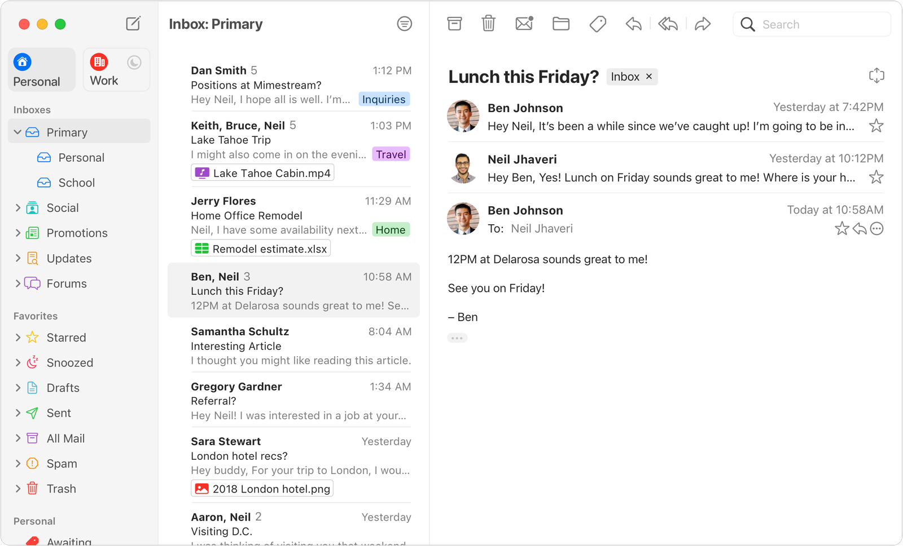

*Mimestream 1.10: profile tiles, category inboxes and Favorites in the sidebar, label and attachment chips in the list, threaded reading pane.*

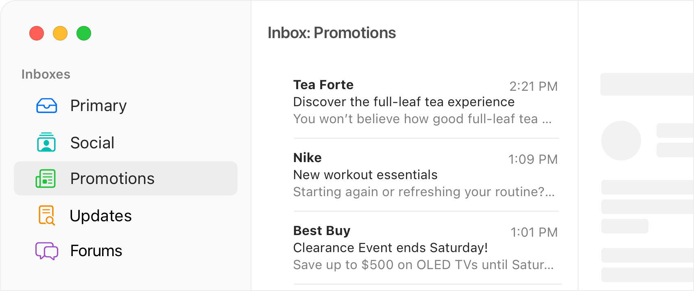

*Gmail's five categories rendered as separate sidebar inboxes, with Promotions selected.*

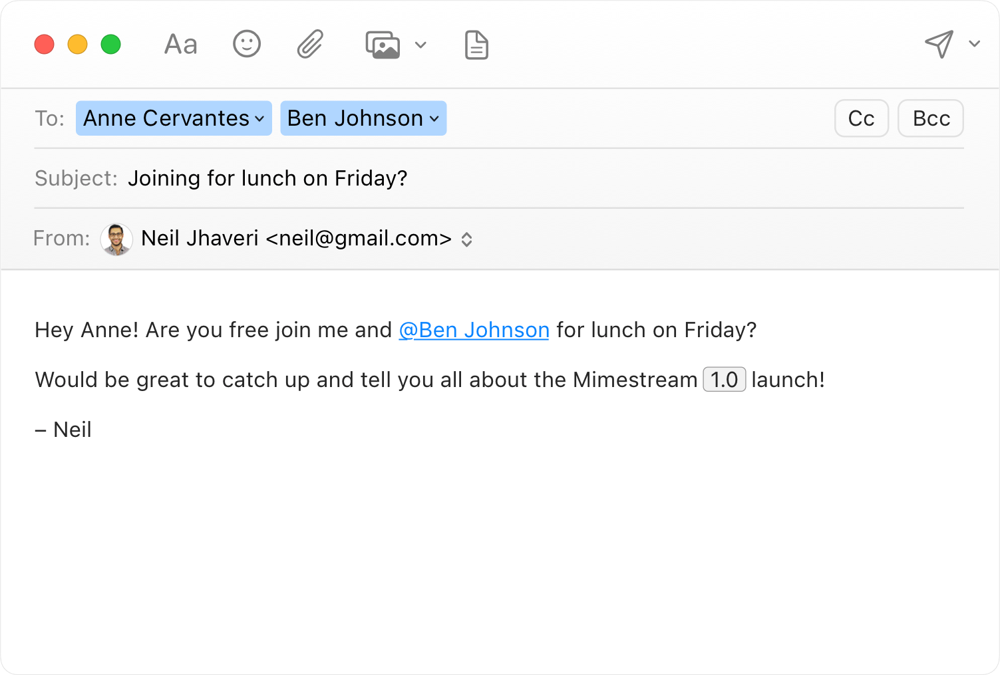

*Compose: recipient tokens, From with avatar, and an @mention rendered inline.*

Worth stealing:
- Labels as first-class Gmail labels with two-way colour and visibility sync, and categories as views over `CATEGORY_*` labels.
- Three shortcut sets with a Gmail single-key mode; fuzzy Go to Folder.
- Profiles: grouped accounts, each a unified inbox, an "All" escape hatch, per-profile quiet hours.
- Private Push: `users.watch` plus a relay that only ever sees a historyId, tokens never leave the device.
- Streaming sync with per-label windows, server search merged with a small local index, offline action queue.
- Tracking-pixel blocking on by default for a maintained list of services.

Not for us:
- The Apple Mail layout and list density; a calm client needs a quieter row than bold sender, preview, coloured chips and attachment chips.
- Client-only snooze that lies to every other Gmail client.
- Shipping without scheduled send for six years; a tiny opt-in `gmail.send` service is the answer and they know it.
- No command palette, no shortcut customisation.

Sources: https://mimestream.com, https://mimestream.com/pricing, https://mimestream.com/faqs, https://mimestream.com/releases, https://mimestream.com/blog/1.10-released, https://mimestream.com/blog/casa-verified, https://mimestream.com/trust/private-push, https://mimestream.com/help/user-guide/inbox-categories, https://mimestream.com/help/user-guide/keyboard-shortcuts, https://mimestream.com/help/user-guide/snoozing, https://mimestream.com/ios-beta, https://portal.productboard.com/mimestream/1-mimestream-roadmap, https://news.ycombinator.com/item?id=24422434, https://news.ycombinator.com/item?id=24423314, https://news.ycombinator.com/item?id=36033184, https://twitter.com/neil_jhaveri/status/1355787069155631105, https://www.macstories.net/reviews/mimestream-the-perfect-email-app-for-gmail-users-on-the-mac/, https://sixcolors.com/post/2021/10/mimestream-a-native-mac-app-with-proper-gmail-support/, https://thesweetsetup.com/mimestream-is-a-great-reliable-gmail-app-for-the-mac/, https://www.cultofmac.com/reviews/mimestream-mac-mail-app-review, https://email-tools.me/posts/mimestream-review/, https://techcrunch.com/2023/05/23/former-apple-engineers-mimestream-app-is-a-nifty-gmail-client-for-mac/

## Shortwave

Shortwave is a Gmail API client (Gmail and Workspace only; Microsoft has "no timeline") delivered as a web app with macOS and Windows desktop wrappers and iOS and Android apps. Its founders came from Google (the Firebase team) and the product reads as Inbox by Gmail's bundles and pins rebuilt around an AI assistant. Pricing is per seat per month with no free tier: Business $30, Premier $45, Max $120 (annual $24, $36, $100), after a 14-day trial. The tiers differ only in AI quota (model, requests per day, number of "AI filters"), which tells you what the company thinks it is selling. Several reviews still list a free tier and an $18 Pro plan; those are stale. The founders' attention has visibly moved to a separate product, Tasklet, which the homepage now leads with.

The triage model is the strongest part and is documented as "The Shortwave Method": the inbox is a list you clear. Done (`D` or `E`) archives and auto-advances, Snooze (`B` or `H`) handles date-bound items, Star (`S`) drops a thread into a Starred section pinned at the top of the list, and Todo (`T`) turns one or more threads into a named task in a Todos tab. Pin was removed in 2024 in favour of stars and todos. The list itself is sectioned Todos, Starred, Last 7 days. Bundles are not automatic classification: you enable them, per label (built-in Newsletters, Promotions, Travel, Updates, or any custom label) or per contact, and a bundle collapses to one compact row with a count and sender avatars that expands in place; one keystroke marks the whole bundle done. Splits are tabs across the top of the inbox, each defined by Gmail importance, labels, senders or an arbitrary search query, with drag-and-drop between them and bundling toggleable per split.

Layout is a setting: Default, Side panel (list and thread side by side) or Fullscreen (one thread at a time). Shortcuts are Gmail-style single keys plus a Cmd-K command palette and Cmd-J for the assistant. Undo send is server-side (10 seconds by default, the message still goes out if you close the app) and scheduled send takes natural-language times. On the receiving side it proxies images and blocks tracking pixels with an indicator; on the sending side it sells read statuses, link click tracking and a "recent opens" feed, which is the same tracking it blocks for you. Multiple accounts switch with Ctrl-1/2/3 but there is no unified inbox; the official workaround is Gmail forwarding. The AI layer is everywhere: a right-hand assistant sidebar, natural-language search, a one-line summary on every thread, Ghostwriter drafts trained on your sent mail, plain-English "AI filters" that label, star or archive, and MCP integrations.

Criticism from reviewers is consistent: Gmail-only is a hard wall, the price has roughly doubled since launch, the per-day AI caps on the cheapest tier feel restrictive, and your mailbox is indexed on Shortwave's servers and sent to third-party models, which one XDA reviewer called a dealbreaker for drafting replies. Nobody complains about speed.

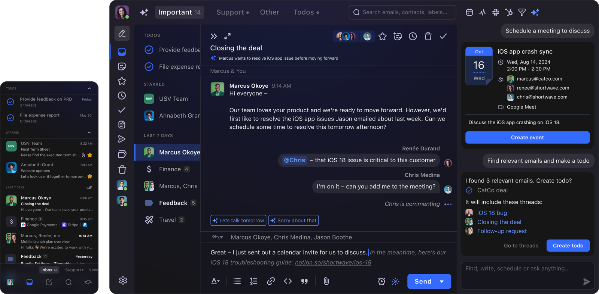

*Shortwave: split tabs (Important, Support, Other, Todos) across the top, list sectioned Todos, Starred, Last 7 days, thread in a side panel with an AI summary line, assistant in the right sidebar.*

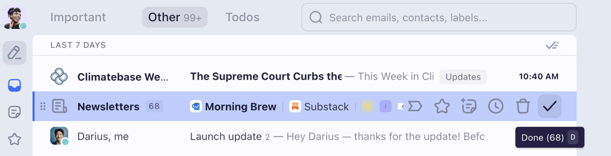

*A "Newsletters 68" bundle collapsed to one row with sender avatars; the tooltip shows a single keystroke marks all 68 done.*

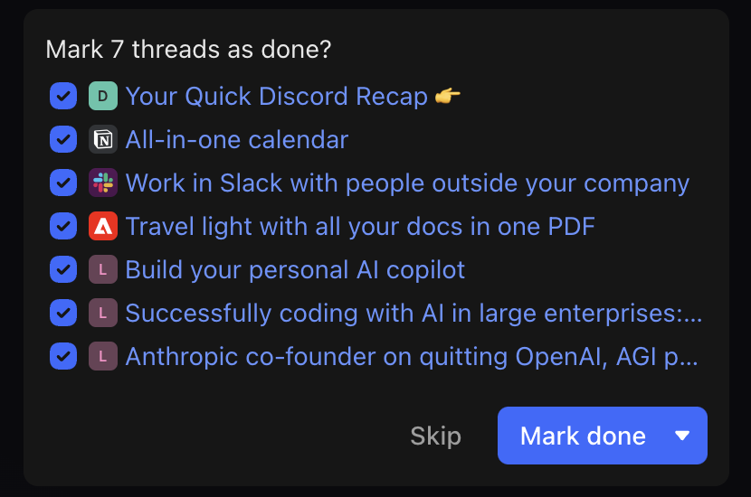

*The assistant proposing to mark seven threads done. This is how much of the product surfaces: as a dialogue rather than a keystroke.*

Worth stealing:
- Done, Snooze, Star, Todo as a single-key vocabulary with auto-advance; Starred section pinned at the top of the list.
- Bundle rows: one collapsed line per label or sender with a count, expand in place, whole bundle actioned with one key. On Gmail the labels already exist.
- Splits as tabs defined by label, sender or query; per-split bundling toggle.
- Server-side undo send that fires with the app closed; layout as a plain three-way setting.

Not for us:
- The AI-first frame: the sidebar, per-thread summaries, autocomplete and AI filters are why the cheapest seat is $24 and why reviewers raise privacy.
- Read statuses and link tracking on send.
- "Multi-account" without a unified inbox.
- Web app in a desktop wrapper.

Sources: https://www.shortwave.com, https://www.shortwave.com/pricing, https://www.shortwave.com/features/, https://www.shortwave.com/docs/guides/method/, https://www.shortwave.com/docs/guides/bundles/, https://www.shortwave.com/blog/split-email-inbox-by-importance/, https://www.shortwave.com/blog/todos-and-stars/, https://www.shortwave.com/docs/references/shortcuts/, https://www.shortwave.com/docs/guides/customize-your-shortwave-settings/, https://www.shortwave.com/blog/announcing-scheduled-send-and-undo-send/, https://www.shortwave.com/blog/read-statuses-email-tracking/, https://www.shortwave.com/docs/how-tos/unified-universal-inbox-support/, https://www.shortwave.com/docs/how-tos/microsoft-outlook-exchange-other-sign-in-support/, https://email-tools.me/posts/shortwave-review/, https://cmdk.email/post/shortwave-review/, https://www.xda-developers.com/replaced-gmail-with-an-email-app-that-finally-makes-inbox-zero-feel-realistic/, https://9to5google.com/2024/06/05/shortwave-adds-inbox-splits/

## Notion Mail

Notion Mail is being shut down on 22 September 2026, announced 25 June 2026, seventeen months after its 15 April 2025 launch. Notion's stated reason is that "more than half of Notion Mail users manage emails without ever opening their inbox", so they are "going all in on using agents to run your inbox". Users can export drafts, scheduled mail, snippets and auto-label instructions; views and reminders are lost; the mail itself was always in Gmail. The product page already redirects. It is still worth studying because the "views" idea was the one genuinely new inbox primitive of the last two years, and because its footprint (Gmail only, macOS plus web plus a thin iOS app, Windows "soon" for its whole life, never Android, never a unified inbox) is a warning.

It was Gmail and Workspace only. The client was free with any Notion account, but the headline features (auto-label, AI drafting, AI-configured views) needed paid Notion AI, in practice the Business plan at $20 per seat a month annual ($24 monthly), which is where the "free but not really" reviews came from. One review also reports mail retention caps of 7 days on Free and 30 days on Plus, unverified.

Views live in a "Views" section of the left sidebar, as entries rather than tabs. Each view is a saved combination of filters, groups and properties, deliberately modelled on a Notion database view. Filters cover unread, read, attachment, calendar event, from, to, cc, bcc, subject, date and `label:` (nested labels unsupported). Group by date, starred, important, sender or domain, priority, label or unread, and the groups render as inline section headers in the list. Properties are user-defined columns on emails, for example a Select "Owner". A new view can be described in natural language (AI configures it), built manually, or picked from a template; default views were generated from your existing Gmail labels. Views only filter; they never label anything. Auto-label is a separate feature: a button top-right of the inbox where you type a plain-English instruction, it labels incoming mail, and it learns from you accepting or crossing out its suggestions. Everything else is competent and conventional: snippets with slash shortcuts and `{{variables}}`, meeting scheduling links through Notion Calendar, "all Gmail shortcuts" (`j`/`k`, `e`, `h` for snooze which it calls Set reminder, `l`, `#`, `z`, Ctrl-1 to 9 for accounts) plus a Cmd-K command menu, scheduled send with an explicit timezone, and a thread-style setting of side peek, centre peek or full page. Remote images were proxied but tracking pixels were not blocked; the help page said "we hope to block read receipts in the near future". Undo send was never documented.

Reviewers called it a pretty wrapper with shallow Notion integration (you could @-mention a page but not turn an email into a task or a database row), said view setup was manual and slow with no useful presets, found the AI drafts generic, and listed the platform gaps. The iOS app lacked snippets, scheduling, AI, schedule send and any view editing. Then the company killed it.

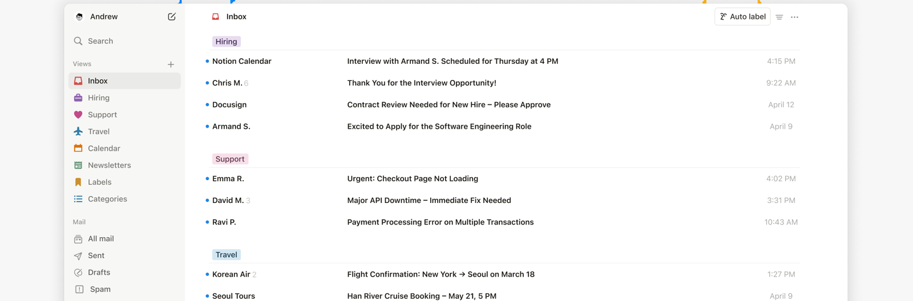

*Inbox grouped by label (Hiring, Support, Travel headers), Views list in the sidebar, Auto label button top right.*

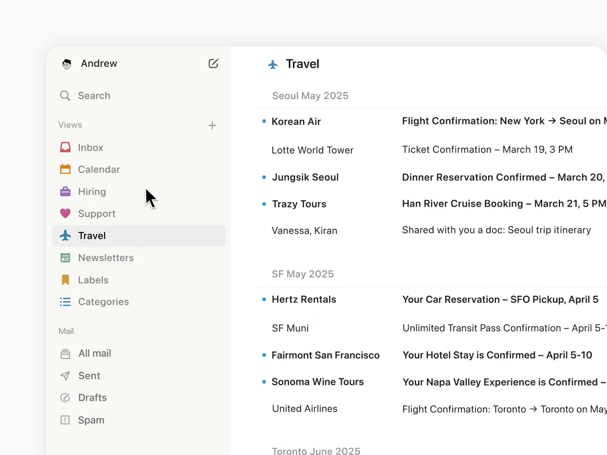

*A "Travel" view grouped by trip; each group is an inline header, the sidebar lists views above mail folders.*

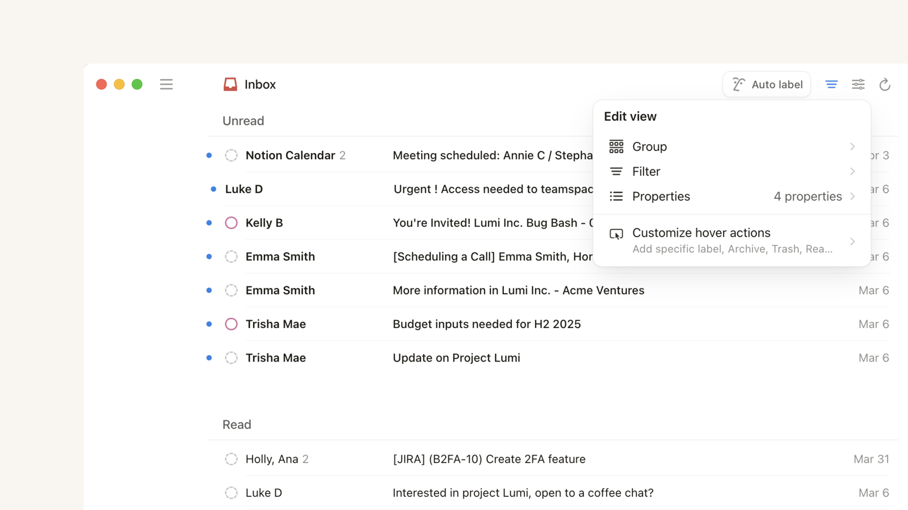

*The "Edit view" popover: Group, Filter, Properties and hover actions, the Notion database vocabulary applied to mail.*

Worth stealing:
- Views as saved filter-plus-group definitions in the sidebar, with group headers inline in the list. Grouping by label, sender domain or date calms an inbox without any AI.
- Thread-style toggle (side peek, centre peek, full page).
- Gmail shortcuts by default plus a Cmd-K menu that doubles as the shortcut reference.
- Snippets with slash shortcuts and variables; scheduled send with a visible timezone.

Not for us:
- AI auto-label as the organising primitive; it needed a $20 seat and is exactly what is being deleted.
- Properties and columns on emails; the database metaphor never connected to anything.
- The footprint: Gmail-only, Mac plus web, no unified inbox, a mobile app missing half the features.

Sources: https://www.notion.com/help/notion-mail-inbox-is-going-away-what-to-do-next, https://www.notion.com/blog/introducing-notion-mail, https://www.notion.com/help/get-started-with-notion-mail, https://www.notion.com/help/views-groups-filters-and-properties, https://www.notion.com/help/navigate-your-inbox, https://www.notion.com/help/guides/organize-your-inbox-with-notion-ai-auto-labeling, https://www.notion.com/help/notion-mail-keyboard-shortcuts, https://www.notion.com/help/notion-mail-security-practices, https://www.notion.com/help/notion-mail-for-mobile, https://www.notion.com/pricing, https://www.androidauthority.com/notion-mail-is-shutting-down-3681674/, https://www.theregister.com/ai-and-ml/2026/06/26/notion-kills-its-gmail-client-after-ai-agents-keep-humans-from-troubling-inbox/5263024, https://efficient.app/apps/notion-mail, https://clean.email/blog/email-clients/notion-mail-review, https://www.eesel.ai/blog/notion-mail-reviews, https://matthiasfrank.de/en/notion-features/notion-mail/

## Spark

Spark, by Readdle, is the mass-market "smart inbox" client: Gmail, iCloud, Exchange, Outlook, Yahoo and generic IMAP on macOS, Windows, iOS, iPadOS and Android, no web client. Gmail connects through Google OAuth; whether the transport is the Gmail API or IMAP with XOAUTH2 is not documented, and Readdle's troubleshooting page about enabling IMAP for Gmail suggests IMAP, unverified. What is documented is that Readdle's servers hold an OAuth token for Gmail, Outlook and Yahoo and the actual password for Exchange, AOL and custom IMAP, because "Spark requires the server-side processing to send you push notifications". Send Later mail, including attachments, sits on their servers until sent, and "recent emails" are held for four hours. Spark +AI runs on Azure OpenAI and email content is shared with it. This credential relay has been criticised continuously since 2016. The desktop app has been an Electron rewrite since Spark 3 in October 2022; the launch dropped the reading pane, the persistent sidebar and separate windows, added a subscription and a paid-to-remove "Sent with Spark" signature, and drew a public response from Readdle's co-founder. Most of the gaps were patched back over 2023. Pricing today: Free, Plus $10 per user a month ($8.25 annual), Pro $20 ($16.58 annual). Gatekeeper, Priority, mute, templates, read statuses and AI are all paid.

Gatekeeper is the reason Spark is on this list. The first time a sender emails you, you decide: a horizontally scrolling row of cards labelled "New senders" sits above the inbox, each with avatar, address, latest subject and thumbs-up Accept or thumbs-down Block, plus a full-screen grid with bulk actions. Three modes per account: screen before the inbox (default), decide inside the message when you open it, or off. Blocking hides rather than deletes: blocked mail sits in a "Blocked" section of the sidebar and you unblock by opening a message there. It blocks addresses and domains, the sender is never notified, it is per account, it is not retroactive, and it is Spark-side rather than pushed into Gmail as a filter, so it only holds inside Spark. If your subscription lapses, existing blocks remain and you can only accept.

The Smart Inbox has a fixed order: People first, then Notifications, then Newsletters, each a card that can be unified, grouped per address, or per account. Spark 3 added two views on top, Focused List (chronological with priority items floated) and Unread Cards (unread mail grouped into People, Notifications, Newsletters), beside the plain Simple List; Notifications and Newsletters collapse into a single row of sender chips. Priority is manual (`I`, or per contact) and paints the row light orange with a lightning glyph. Set Aside (`G`) moves a thread to a bubble in the bottom-left corner that acts as a visible shelf; Pin (`D`) keeps it in a Pins section; Snooze (`S`) hides it until a time; Done (`E`) archives, with a toggle to show done items inline. Mute is paid and, per the help page, not currently available on Mac or Windows. Send Later is server-side, undo send waits five seconds by default, follow-up reminders go up to two months out, and Read Statuses (Pro) are ordinary tracking pixels. On the receiving side Spark blocks 1x1 pixels by default and only 1x1. Keyboard presets include Spark, Spark Classic, Apple Mail, Gmail, Superhuman and custom; the default set has no `j`/`k`. Cmd-K opens a Command Center that lists actions with their shortcuts. A "Home Screen" wallpaper greeting appears after idle time with counts of people, newsletters and notifications.

Reviewers describe the current app as heavier and busier than the 2019 version, with settings sprawling across dozens of screens and AI upsell on every surface; the free plan is thin after a seven-day trial; threading has caused missed mail; and the credential relay is the objection that never goes away.

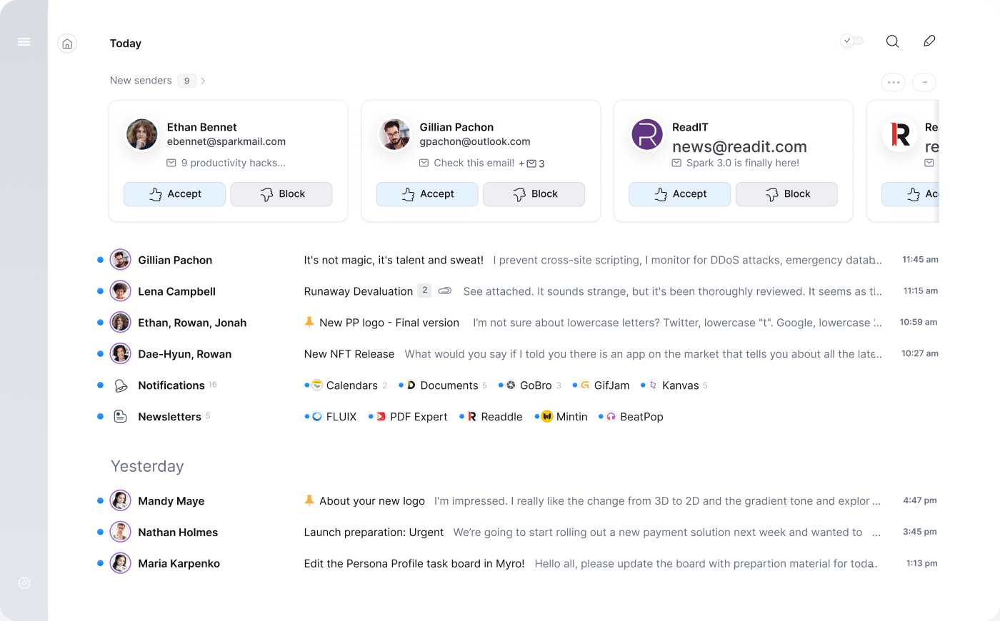

*Gatekeeper: the "New senders" card row above the inbox with Accept and Block; below it Notifications and Newsletters collapsed into sender chip rows.*

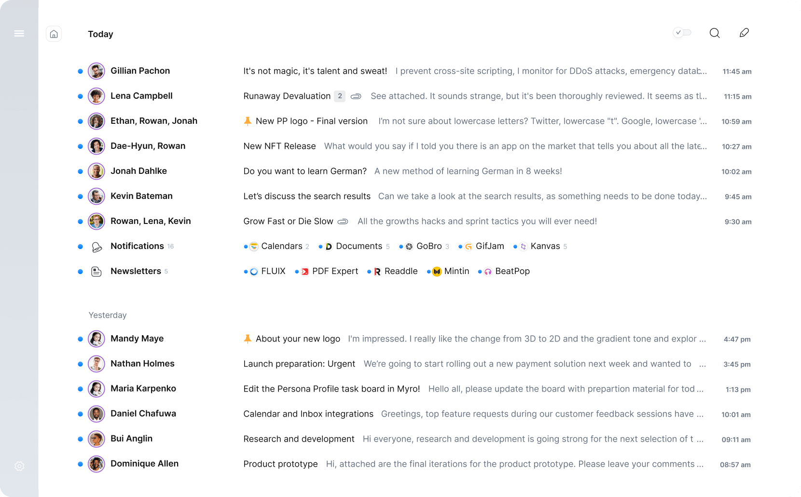

*The Focused List: avatar rows, pinned items, Today and Yesterday sections, bundles as chips.*

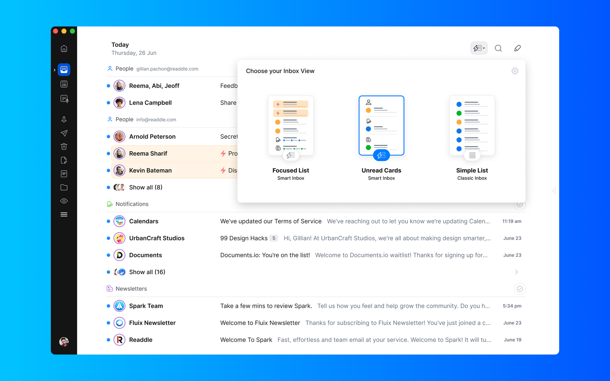

*The view picker (Focused List, Unread Cards, Simple List) over an Unread Cards inbox grouped per account; orange rows are Priority.*

Worth stealing:
- Gatekeeper's interaction: a first-contact strip above the inbox, sticky per sender and per domain, silent to the sender, with a visible Blocked bucket instead of deletion. Implement it as Gmail filters and labels so it holds outside our client.
- Done as the archive verb and Set Aside as a visible shelf distinct from snooze.
- Cmd-K palette that teaches the shortcuts; shipping a Gmail preset and a Superhuman preset.

Not for us:
- The credential relay for push and Send Later.
- Fixed People, Notifications, Newsletters ordering with bundles collapsed into chip rows; it hides subjects and the classification is opaque.
- Electron, the Home Screen wallpaper, AI upsell everywhere, a "Sent with Spark" signature.

Sources: https://sparkmailapp.com, https://sparkmailapp.com/pricing, https://sparkmailapp.com/features, https://sparkmailapp.com/privacy, https://support.readdle.com/spark/privacy/privacy-explained, https://support.readdle.com/spark/spark-onboarding/accept-or-block-new-senders, https://sparkmailapp.com/help/set-up-focus/accept-or-block-new-senders, https://sparkmailapp.com/help/manage-your-inbox/customize-your-inbox, https://support.readdle.com/spark/personalization/customize-your-smart-inbox, https://sparkmailapp.com/help/set-up-focus/set-aside-vs-pin-vs-snooze, https://sparkmailapp.com/help/set-up-focus/mark-as-done, https://sparkmailapp.com/help/sending-emails/pin-and-priority, https://sparkmailapp.com/help/spark-for-teams/read-statuses, https://sparkmailapp.com/help/tips-tricks/use-keyboard-shortcuts, https://sparkmailapp.com/help/set-up-focus/spark-command-center, https://sparkmailapp.com/help/tips-tricks/how-to-enable-split-view-in-spark, https://sparkmailapp.com/features/spark-ai, https://support.readdle.com/spark/troubleshooting/enable-the-imap-protocol-for-gmail-and-g-suite-accounts, https://mjtsai.com/blog/2016/12/01/spark-mail-stores-credentials-in-cloud/, https://mjtsai.com/blog/2022/10/04/spark-switches-to-electron-and-subscriptions/, https://forums.macrumors.com/threads/popular-email-client-spark-gets-major-redesign-for-mac-moves-to-subscription-model.2363830/, https://appleinsider.com/articles/23/01/13/spark-mail-211-review-e-mail-organizer-with-gatekeeper-smart-inbox, https://cmdk.email/post/spark-mail-review/, https://thebusinessdive.com/spark-review

## Apple Mail categories

Apple's categorisation shipped in iOS 18.2 (December 2024) and reached the Mac in macOS 15.4 (31 March 2025). macOS 26 and iOS 26 added nothing to it beyond Liquid Glass toolbars; Apple's own "What's new in Mail" page for Tahoe still lists only Categories. The model is four buckets. Primary: "personal messages and time-sensitive information". Transactions: "confirmations, receipts, and shipping notices". Updates: "news, newsletters, and social updates". Promotions: "coupon and sales emails". The one rule that makes it survivable: a message in Transactions, Updates or Promotions that contains time-sensitive information is also shown in Primary. Classification is on-device machine learning, does not need Apple Intelligence hardware, and runs on every account in Mail including Gmail over IMAP, ignoring Gmail's own `CATEGORY_*` labels and classifying locally. Priority messages (time-sensitive mail floated to the top of Primary) and the one-line summaries under unread rows do need Apple Intelligence.

On iOS the categories are four icon pills under the Inbox title; the selected one expands with its label and colour (blue, green, purple, red), and swiping the row reaches All Mail. On macOS the same pill row sits at the top of the message list column in a standard three-column window, with "Show Mail Categories" in the More menu and the View menu; clicking the selected category again returns to All Mail. Inside Transactions, Updates and Promotions, messages from the same sender are grouped into a digest row showing the sender's logo and bulleted recent subjects; tapping opens a digest view with bulk actions. Primary is never grouped. Group by Sender can be switched off, and iOS 18.5 moved the Categories, Group by Sender and Show Contact Photos toggles into Settings. The override is "Categorize Sender" (control-click on Mac, swipe then More on iPhone): all current and future messages from that sender move to the chosen category, and the override syncs across devices.

The rest of Mail on macOS is relevant mainly as a floor. There is no snooze; Remind Me (1 hour, tonight, tomorrow, later) resurfaces a message at the top of the inbox. Send Later exists but needs the Mac awake with Mail open. Undo Send defaults to 10 seconds. Shortcuts are modifier chords only (Ctrl-Cmd-A archive, Shift-Cmd-D send, Ctrl-Cmd-M move to predicted mailbox), no single-key mode. Mail Privacy Protection hides your IP and prefetches remote content in the background so senders cannot see when or whether you opened a message.

Criticism landed fast. Six Colors titled its review "iOS 18.2 Mail is a misfire": Informed Delivery in Transactions, same-day delivery alerts not urgent enough for Primary, its own newsletter in Promotions, unread badge counting only Primary, a digest header that wastes space on a giant avatar while "the subject is crammed together and truncated", and no way to collapse an expanded digest. Macworld's line was that dozens of messages "could go unread for hours or even days". MacRumors readers: "now I've got six inboxes to check instead of one". AppleInsider, after months on the Mac, found "not a single reason to disagree with the automatic categorization". Both are true; it depends on your mail.

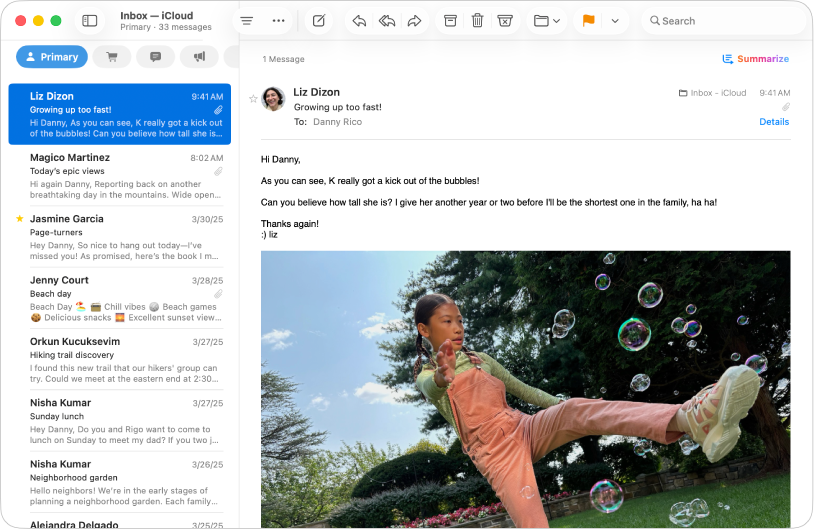

*macOS Tahoe Mail: the Primary pill row above the message list in a three-column window, Summarize button in the message header.*

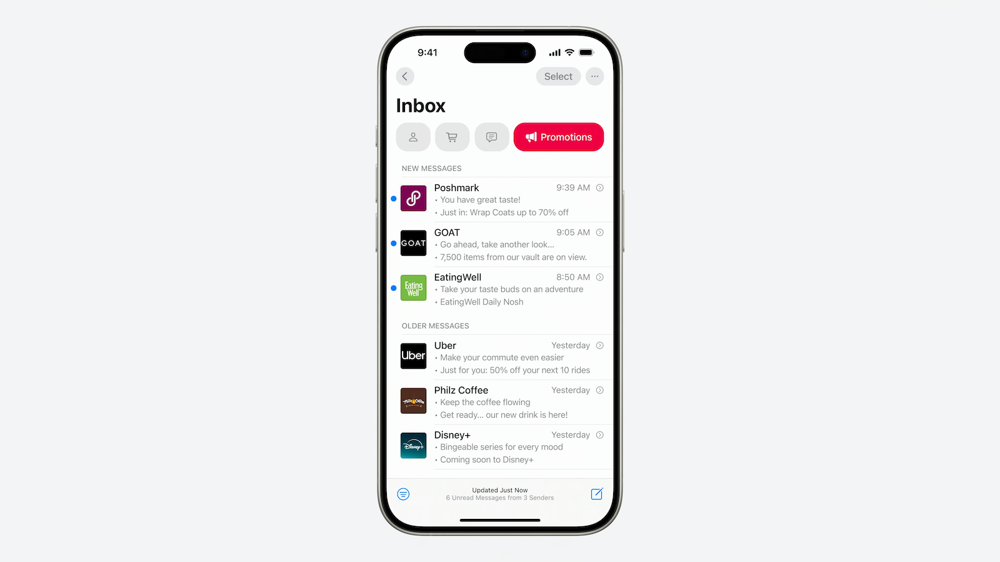

*iOS Mail with Promotions selected: senders grouped into digest rows with bulleted recent subjects.*

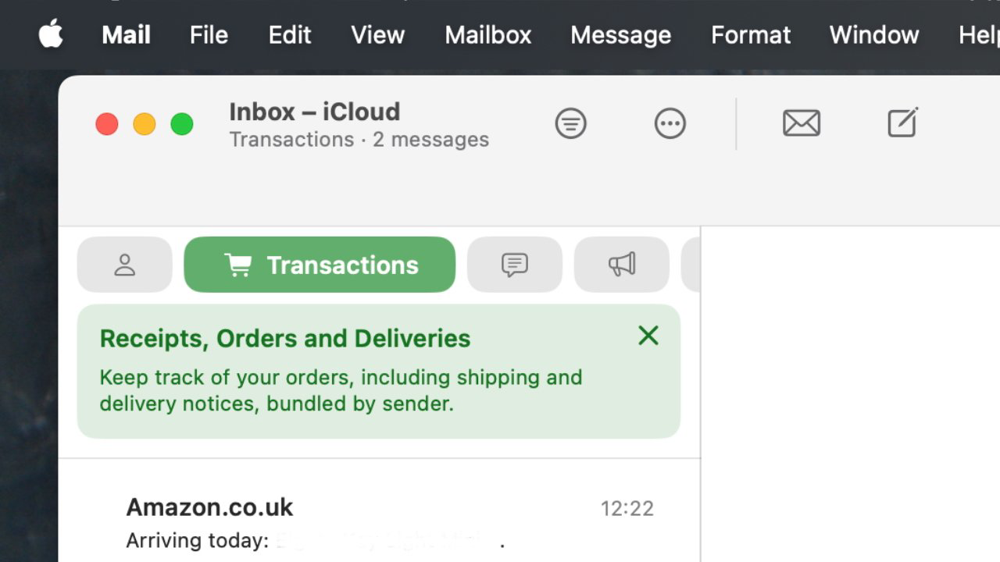

*macOS 15.4 with Transactions selected and the first-run "bundled by sender" explainer banner.*

Worth stealing:
- The four-bucket taxonomy seeded from Gmail's `CATEGORY_*` labels, with no ML needed, and the rule that time-sensitive mail from any bucket also appears in Primary.
- Categorize Sender as a sticky per-sender override with an immediate visible move; All Mail one keystroke away.
- Classification on the client; remote content handled privately by default.

Not for us:
- The sender digest as built: truncated subjects, oversized logos, no collapse, no keyboard path.
- Primary-only badge counts; categories on by default with the exit buried.
- Modifier-only shortcuts, no snooze, Send Later that needs the machine awake.

Sources: https://support.apple.com/guide/mail/mlhlp1190/mac, https://support.apple.com/guide/iphone/use-categories-iphfe4a36baf/ios, https://support.apple.com/guide/mail/whats-new-cpmlwn/mac, https://support.apple.com/guide/mac-help/use-apple-intelligence-in-mail-mchlb2dbea8f/mac, https://support.apple.com/guide/mail/keyboard-shortcuts-mlhlb94f262b/mac, https://support.apple.com/guide/mail/protect-email-privacy-mlhlp1205/mac, https://support.apple.com/en-us/122868, https://appleinsider.com/articles/25/03/31/macos-sequoia-154-arrives-with-apple-mail-categories-password-timers-and-more, https://appleinsider.com/articles/24/06/25/apples-on-device-email-categorization-is-a-feature-years-in-the-making, https://sixcolors.com/post/2024/12/ios-18-2-mail-is-a-misfire/, https://www.macworld.com/article/2585948/how-to-ios-18-macos-15-change-mail-categories-list-view.html, https://forums.macrumors.com/threads/ios-18-2-heres-how-mail-categories-work.2445355/, https://9to5mac.com/2026/03/23/apple-mail-has-a-hidden-feature-that-solved-my-biggest-inbox-problem/, https://www.techradar.com/phones/ios/apples-first-ios-18-5-beta-makes-it-easier-to-get-the-old-style-apple-mail-back

## Fastmail and Proton Mail

These are hosted mail services with their own clients, not clients over someone else's mailbox, so they matter here for two things: what a no-ads, privacy-forward inbox looks like, and a couple of specific mechanisms.

Fastmail is an Australian company (since 1999, servers in New York) whose native protocol is JMAP, which their web, mobile and desktop apps all speak; IMAP, SMTP, CalDAV and CardDAV are also available and a public JMAP API takes bearer tokens. Individual is $6 a month or about $5 annual, Duo $10, Family $14, business tiers $4 to $10 per user, 30-day trial. It finally shipped a desktop app for Mac, Windows and Linux in October 2025, and it is a wrapper around the web app (reported as Electron by third parties; Fastmail's own post does not say). The useful idea is the per-account "labels or folders" switch: pick Labels and existing folders convert, a message can carry many labels, Archive becomes All Mail as the only place an unlabelled message lives, and the Archive button just removes the Inbox label. That is Gmail's model, and Fastmail chose it deliberately. Shortcuts are Gmail-style (`j`/`k`, `o`, `u`, `c`, `r`, `a`, `f`, `d`, `y` archive, `!` spam, `l`, `m`, `/`, `g` then a folder name) and not remappable. Snooze, scheduled send (with a Scheduled folder), undo send, pin and mute conversation all exist; Pinned, Snoozed and Scheduled are visible mailboxes. Read receipts can be requested but incoming requests are never answered. There is no pixel detection: every remote image is fetched through Fastmail's servers so the host never sees your IP, and you can block remote images by default for all senders or only unknown ones. No end-to-end encryption by design, and the Five Eyes jurisdiction argument against it is real. Masked Email, built as a JMAP extension and wired into 1Password and Bitwarden, is the other idea worth noting.

Proton Mail is Swiss, OpenPGP end-to-end between Proton users and zero-access encrypted at rest for everything else, with no IMAP except through the paid Bridge daemon. Web, iOS, Android, and Electron desktop apps for Windows, macOS and Linux. Free (1 GB), Mail Plus $4.99 a month or $3.99 annual, Unlimited $12.99 or $9.99 annual, Duo $14.99, Family $29.99. The mechanism to copy is "enhanced tracking protection": on by default, it strips known tracking pixels, loads remaining remote images through Proton's proxy, and on web rewrites links to remove known UTM-style parameters, then shows a shield badge in the message header with a count and a tooltip such as "Trackers blocked: 3, Links cleaned: 6". A separate "Confirm link URLs" modal, also on by default, intercepts external links. Snooze, scheduled send, undo send and requestable read receipts exist. Shortcuts are on by default but non-standard (arrows to move, `a` archive, `t` trash, `.` star, `g` then `i`/`d`/`s`/`a`/`x`/`t` to jump, Shift-Space for a command palette, no `j`/`k`), and there is a long-standing user request for a Gmail-compatible set plus an unofficial browser extension that exists purely to remap them. Layout is Column (list beside reading pane, default) or Row (message replaces list, no preview). Proton Scribe, the writing assistant, can run fully on-device after a 4 GB model download on web and desktop, which is the right way to offer AI. Criticism: Bridge makes every third-party client second-class, encrypted bodies mean search needs a local index the web app builds slowly, and the desktop app is a web wrap with settings that do not sync between devices.

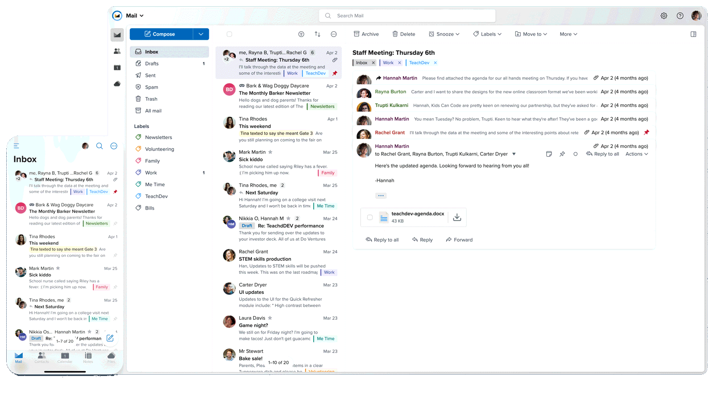

*Fastmail web app: labels sidebar, label chips on rows, a pinned thread, conversation view with collapsed messages.*

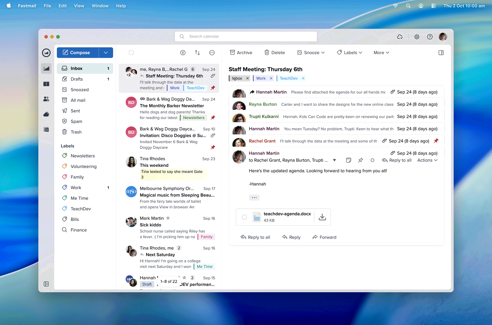

*The October 2025 Fastmail desktop app for Mac: the same web UI in a native window with a Snoozed folder visible.*

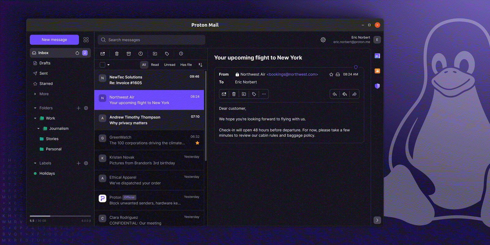

*Proton Mail desktop app on Linux: three-pane with folders and labels in the sidebar.*

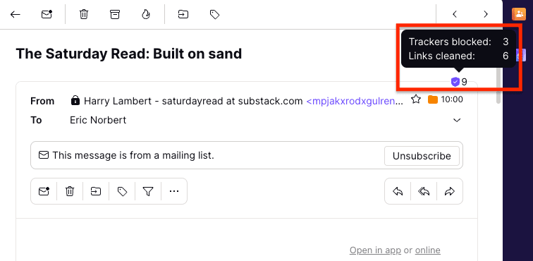

*Proton's tracker shield in the message header: "Trackers blocked: 3, Links cleaned: 6", plus the mailing-list Unsubscribe banner.*

Worth stealing:
- Fastmail's labels model spelled out plainly: Archive removes Inbox, All Mail is ground truth, many labels per message.
- Fastmail's `j`/`k`/`y`/`g`-jump key set and Pinned, Snoozed, Scheduled as visible mailboxes.
- JMAP's state-token-plus-changes mental model for our local sync layer even though we talk to Gmail.
- Proton's tracker count badge and link cleaning, shown per message; the mailing-list banner with one-click unsubscribe from `List-Unsubscribe` headers.
- On-device AI as an explicit optional download, never a cloud default.

Not for us:
- Image proxying as the only tracker defence (a native client can strip pixels locally and say what it stripped).
- Non-standard shortcut sets; Row layout with no preview.
- Electron desktop apps from companies that own the protocol; being genuinely native is the differentiator.

Sources: https://www.fastmail.com/pricing/, https://www.fastmail.com/features/, https://www.fastmail.com/blog/desktop-app/, https://www.fastmail.com/for-developers/integrating-with-fastmail/, https://www.fastmail.help/hc/en-us/articles/360058753554-Setting-up-and-using-labels, https://www.fastmail.help/hc/en-us/articles/360058753534-Keyboard-shortcuts, https://www.fastmail.help/hc/en-us/articles/1500000278102-Blocking-remote-images, https://www.fastmail.help/hc/en-us/articles/1500000278162-Read-receipts, https://www.fastmail.com/blog/how-and-why-we-built-masked-email-with-jmap-an-open-api-standard/, https://coywolf.com/news/productivity/fastmail-launches-native-desktop-apps-for-mac-windows-and-linux/, https://cyberinsider.com/email/reviews/fastmail/, https://proton.me/mail, https://proton.me/mail/pricing, https://proton.me/support/proton-plans, https://proton.me/support/email-tracker-protection, https://proton.me/blog/tracking-links-protection, https://proton.me/support/link-confirmation, https://proton.me/support/keyboard-shortcuts, https://proton.me/support/change-inbox-layout, https://proton.me/support/read-receipts, https://proton.me/blog/proton-scribe-writing-assistant, https://proton.me/blog/proton-mail-desktop-app, https://github.com/ProtonMail/inbox-desktop, https://protonmail.uservoice.com/forums/284483-proton-mail/suggestions/38545198-improve-keyboard-shortcuts-gmail-like

## Open-source Gmail API clients

Zero (Mail-0/Zero, 0.email) is the visible one: "An Open-Source Gmail Alternative for the Future of Email", MIT licensed, 10.8k stars, a YC Spring 2025 company of three people, public beta May 2025. The company has since pivoted: 0.email now says "0.email is now Orchid", an executive-assistant product over iMessage and SMS, and the Zero repo's default branch last moved on 31 August 2025 with three commits to `main` in May 2026 titled "fix build", "idk atp" and "ugh". Issues are auto-closed by a stale bot after three days. It is a hosted web app you self-host, not a desktop or mobile app. The README still says Next.js and Node; `wrangler.jsonc` says otherwise. The real stack is a React front end deployed as a Cloudflare Worker, a Hono plus tRPC server on Workers, six Durable Object classes (ZeroAgent, ZeroMCP, ZeroDB, ZeroDriver, ThreadSyncWorker, ShardRegistry), Cloudflare Workflows for initial sync, three Queues, R2 for thread bodies, Vectorize for embeddings, Workers AI, Drizzle with Postgres, Better Auth, and the googleapis SDK, plus a Microsoft Graph driver. Self-hosting therefore needs a Google OAuth client, a GCP service account with Pub/Sub admin rights, the whole Cloudflare stack, a billing SDK key, Twilio credentials and model provider keys.

Its Gmail usage is worth reading because it is the textbook pattern. Scopes are `https://mail.google.com/` plus `gmail.modify`. Initial sync pages `threads.list` at 100 per page and calls `threads.get` with `format=full` for each, writing into a per-connection Durable Object with SQLite, bodies to R2, embeddings to Vectorize. Incremental sync creates a Pub/Sub topic per connection, grants `gmail-api-push@system.gserviceaccount.com` publish rights, subscribes to a push URL, and calls `users.watch` on INBOX; the handler reads the historyId, queues it, and a consumer calls `history.list` and re-syncs the affected threads; a cron renews expiring watches. Rate limiting retries 429 and 403 `userRateLimitExceeded` and `quotaExceeded` up to ten times with a fixed 60-second delay. Features: a unified inbox with category tabs (Primary, Important, Personal, Updates, Promotions), "ask anything about your emails" chat, AI summaries and labels, AI compose, snooze, scheduled send, pinned threads, Cmd-K, an MCP server. The one Show HN comment was from a Superhuman user: "until Zero has real keyboard navigation, i'll have to wait". Issue 1839, "[oauth]: This app is blocked" (Google refusing sign-in to the unverified client), was closed by the stale bot unanswered, which is the self-hosting problem in one line: with a full-mailbox scope every self-hoster is either stuck in Testing mode (100 users, tokens expire after 7 days) or doing restricted-scope verification themselves.

lieer (gmi) is the feasibility reference nobody talks about: a Python tool, GPL, maintained since 2017 and still pushed to in April 2026, that pulls Gmail through the API into a maildir and mirrors Gmail labels as notmuch tags, two-way. It stores the last historyId and uses `history.list` for partial pulls, falls back to a full resync, pushes local tag changes back with `gmi push`, and sends over the API with thread matching on In-Reply-To. Its invariants are the ones any Gmail-API client ends up with: a message may carry only one of inbox, spam or trash; drafts and sent are read-only from Gmail's side; archive means removing the inbox tag; muted cannot sync because the API has no mute. It runs at million-message scale, ships a shared public OAuth client or takes your own, and its README is candid: "You don't need to verify your application, you'll just get a scary warning about unverified applications."

The closest technical comparators are two Tauri apps. Velo (Apache-2.0, 701 stars, created February 2026, quiet since June 2026) is Tauri v2 with a Rust backend and a React front end, Gmail via the REST API with historyId sync, OAuth PKCE where the user supplies their own client ID, SQLite with FTS5, a command palette, split-inbox tabs, offline, remote-image blocking, sandboxed rendering, and optional cloud AI; the caveat is that the Gmail sync logic lives in TypeScript inside the webview, not in Rust. Pebble (AGPL, 583 stars, created April 2026, active in August 2026) is Tauri 2 plus Rust with rusqlite and Tantivy full-text search, but talks to Gmail over IMAP, and the UI is Chinese-first. Beyond those, every established open-source client goes through IMAP: Thunderbird and Betterbird (IMAP plus OAuth, labels become duplicated folders, All Mail duplicates everything), Geary (Vala, last release May 2024), Evolution, KMail, Mailspring (Electron UI over a C++ mailsync engine, stalled 2022 to 2024 with draft-deletion and locked-database complaints, then twelve releases between January and July 2026), and the Rust and Go terminal clients Himalaya, meli and aerc. Nylas Mail, the last well-funded open-source attempt, depended on Nylas's cloud sync and was sunset in 2017.

What they collectively got wrong is easy to state. Nobody shipped a good native desktop client on the Gmail API: Zero is a Cloudflare web app whose company pivoted, Velo put its sync in a webview, and everyone else inherited IMAP's labels-as-folders mess. What they show is feasible: history-based delta sync, labels as tags, two-way label push, API send, and watch plus Pub/Sub for push have all been done in the open for years, and Velo shows PKCE with bring-your-own client ID works for a desktop app without a secret. The constraints to plan for, from Google's current pages: every mailbox-reading scope is restricted (`gmail.modify`, `gmail.readonly`, `mail.google.com`), so brand verification, domain verification, a privacy page, a scope justification and a demo video are unavoidable and must be repeated every 12 months. The security assessment (CASA, now Assurance Levels AL1 and AL2, roughly $500 to $1,800 and about $4,500 respectively, 4 to 12 weeks end to end, annual) is triggered for apps that "have the ability to access data from or through a third-party server"; read plainly, a client that never routes mail through our servers needs scope verification but not CASA, unverified, and worth confirming with Google before betting the roadmap on it. Live quota: 1,200,000 units a minute per project, 6,000 units a minute per user, `messages.get` 20 units, `threads.get` 40, `messages.list` 5, `history.list` 2, `messages.send` 100, `users.watch` 100, and a watch must be renewed at least every 7 days. Threading is Gmail's: to land in an existing thread you set threadId and the RFC 2822 References and In-Reply-To headers and a matching subject; labels are per message, so "thread has label" is a client-side aggregate.

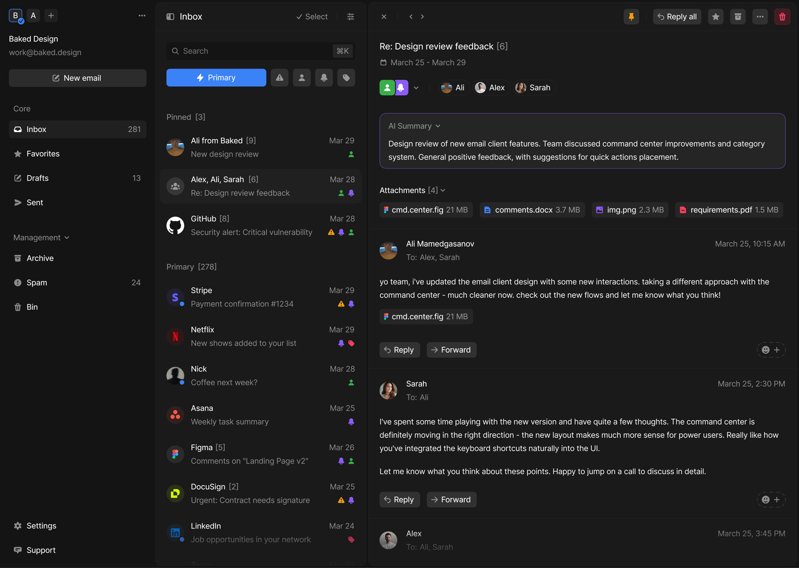

*Zero: sidebar, Primary list with a Pinned group, thread view with an AI Summary box.*

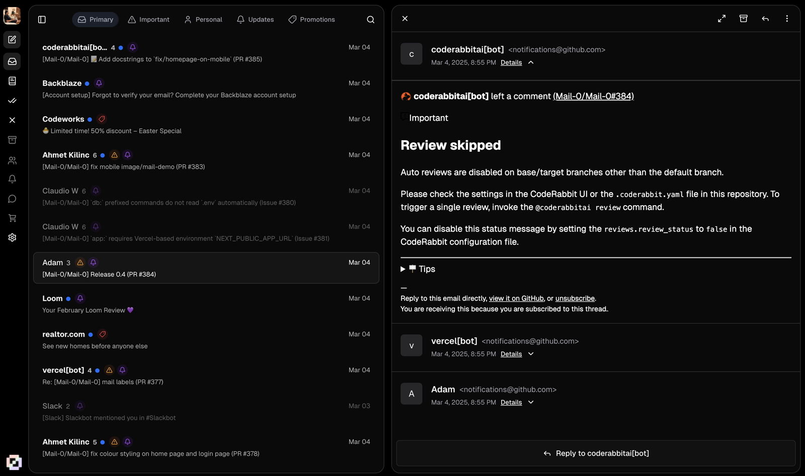

*Zero on a real Gmail account: Primary, Important, Personal, Updates and Promotions tabs over the list.*

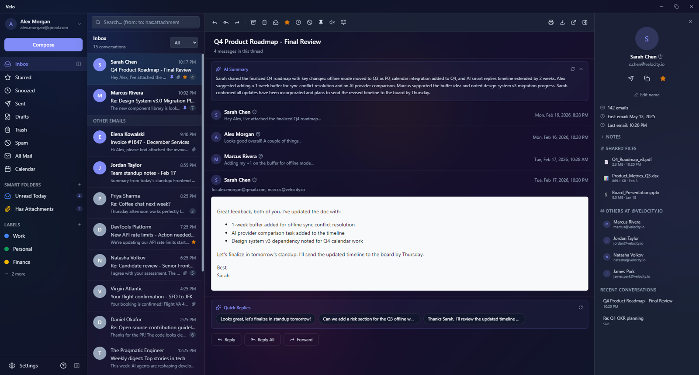

*Velo (Tauri plus Rust, Gmail REST API): dark inbox with AI Summary, Quick Replies and a contact side panel.*

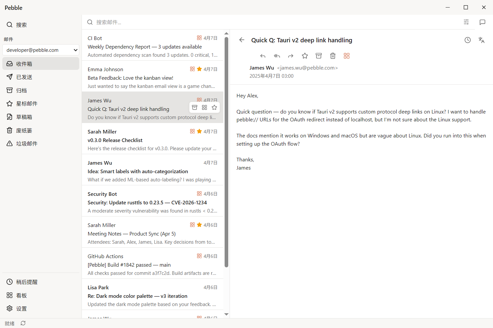

*Pebble (Tauri plus Rust, IMAP): three-pane inbox with hover actions.*

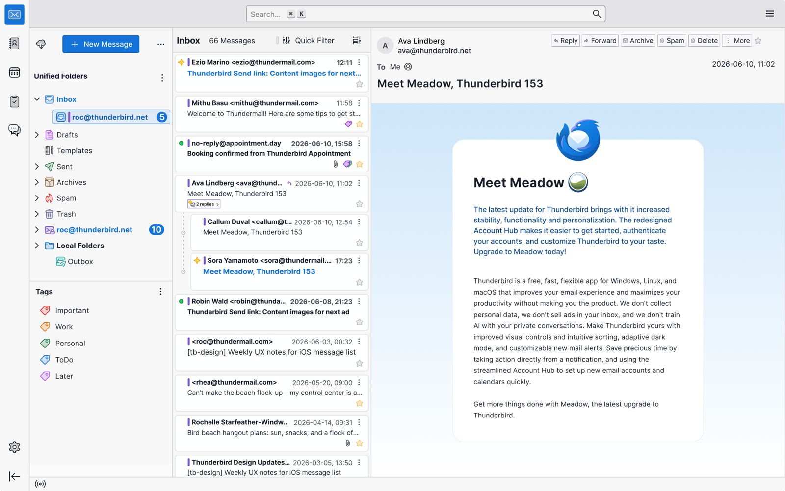

*Thunderbird: the IMAP baseline, unified folders, tags and a threaded list.*

Worth stealing:
- lieer's invariants verbatim: one of inbox, spam or trash; drafts and sent read-only; archive is drop INBOX; muted not syncable.
- The watch, Pub/Sub, historyId, `history.list` pipeline, and cron renewal of watches; Zero's code is a readable reference.
- Velo's PKCE-only OAuth with bring-your-own client ID as the fallback for people Google will not let in, and a local FTS index.
- Tantivy or SQLite FTS5 for local search, as Pebble and Velo do.

Not for us:
- Zero's architecture: server-side mailbox copies, six Durable Object classes and a service account with Pub/Sub admin rights to run an inbox. Local SQLite and `history.list` at 2 units a call need none of it and avoid the "third-party server" CASA trigger.
- Sync logic in a webview.
- The AI-chat-first inbox; the one keyboard user who showed up to Zero's launch walked away.

Sources: https://github.com/Mail-0/Zero, https://github.com/Mail-0/Zero/blob/staging/apps/server/wrangler.jsonc, https://github.com/Mail-0/Zero/blob/staging/apps/server/src/lib/driver/google.ts, https://github.com/Mail-0/Zero/blob/staging/apps/server/src/lib/factories/google-subscription.factory.ts, https://github.com/Mail-0/Zero/blob/staging/apps/server/src/lib/gmail-rate-limit.ts, https://github.com/Mail-0/Zero/issues/1839, https://0.email, https://www.ycombinator.com/launches/NTI-zero-ai-native-email, https://www.ycombinator.com/companies/orchid-ai, https://news.ycombinator.com/item?id=43862892, https://github.com/gauteh/lieer, https://github.com/gauteh/lieer/blob/master/docs/index.md, https://github.com/avihaymenahem/velo, https://github.com/QingJ01/Pebble, https://github.com/Foundry376/Mailspring, https://github.com/Foundry376/Mailspring-Sync, https://support.mozilla.org/en-US/kb/thunderbird-and-gmail, https://www.nylas.com/blog/sunsetting-nylas-mail-development/, https://developers.google.com/gmail/api/auth/scopes, https://developers.google.com/identity/protocols/oauth2/production-readiness/restricted-scope-verification, https://support.google.com/cloud/answer/15549945, https://developers.google.com/workspace/gmail/api/reference/quota, https://developers.google.com/workspace/gmail/api/guides/push, https://developers.google.com/gmail/api/guides/threads, https://deepstrike.io/blog/google-casa-security-assessment-2025, https://www.unipile.com/integrating-google-oauth-2-0-user-authentication-into-your-app/

## Big Mail, Canary, Missive, Front

Big Mail (bigmail.app, by Phillip Caudell; bigmail.com is an unrelated placeholder) was a native Mac and iOS IMAP and Gmail client launched February 2021 that sorted mail into "Scenes" (Conversations, Newsletters, Purchases, Events, Notifications), blocked trackers by default and had a HEY-style "Bouncer" for screening new senders, at $10 a month or $6.49 annual. A "Big Mail 2" rewrite never left TestFlight; the developer's last post is February 2024 and the forum's most recent thread is titled "Big Mail 2 TestFlight is dead" (March 2025). It is the closest anyone came to our product on native Apple frameworks, and it died as a one-person project; treat it as a warning about scope, not a competitor.

Canary Mail (canarymail.io) is a native macOS, iOS, Windows and Android client for Gmail (Google OAuth), Exchange, iCloud, Yahoo and IMAP, sold on PGP and password-protected "SecureSend" plus an AI copilot, with pixel-based read receipts and tracker blocking on by default. Annual or lifetime only: Free, Growth $36 a year (about $3 a month), Pro+ $100 a year (about $10). Three-pane, customisable shortcuts, snooze and undo on every tier, send later on Growth and up.

Missive (missiveapp.com) is a shared team inbox with chat over Gmail, Outlook and IMAP on web, macOS, Windows, iOS and Android (no Linux). Per user per month: Starter $18 or $14 annual, Productive $30 or $24, Business $45 or $36, no free plan. Gmail keyboard preset (`j`/`k`, `e`, `c`), Cmd-K command bar, snooze, send later, undo send, rules. It removed read receipts in September 2020 on privacy grounds and auto-blocks read trackers, which is the right call and rare in the team-inbox category.

Front (front.com) is the enterprise shared inbox and ticketing tool: web, Mac, Windows, iOS, Android; Gmail via Google OAuth two-way sync (API or IMAP not stated), Office 365, IMAP. Per seat per month: Starter $35 or $25 annual (up to 10 seats), Professional $85 or $65 (up to 50), Enterprise $105 annual. Snooze, send later, undo send, pixel-based "Seen receipts" per channel, Front and Gmail keyboard schemes with Cmd-K.

Sources: https://bigmail.app/, https://discuss.bigmail.app/t/big-mail-2-testflight-is-dead/211.json, https://discuss.bigmail.app/t/app-development-update/188.json, https://sixcolors.com/post/2021/06/big-mail-may-not-be-my-next-email-client-but-its-aiming-at-the-future/, https://9to5mac.com/2021/01/22/big-mail-email-radical-new-ui/, https://canarymail.io/pricing, https://canarymail.io/features/security, https://canarymail.io/help/read-receipts-mac-iphone, https://missiveapp.com/pricing, https://missiveapp.com/download, https://missiveapp.com/docs/advanced-features/shortcuts, https://missiveapp.com/blog/life-and-death-of-read-tracking, https://front.com/pricing, https://help.front.com/en/articles/2189, https://help.front.com/en/articles/2034, https://help.front.com/en/articles/2072

## Comparison table

Prices are USD per month; "annual" is the per-month rate when billed yearly. Reading pane: "optional" means the user can switch between a split pane and a full-page thread. Sender screening means HEY-style accept or block of first-time senders, not spam filtering. Keyboard-first: strong means full keyboard navigation with `j`/`k` and a command palette, ok means a decent shortcut set, weak means mouse-first. HEY and Superhuman appear here only for comparison; they have their own documents.

| App | Backend | Platforms | Price per month | Reading pane | Sender screening | Split or bundled inbox | Snooze | Send later | Undo send | Read receipts | Keyboard-first | Tracker blocking | Open source |
|---|---|---|---|---|---|---|---|---|---|---|---|---|---|
| HEY | Own service | Web, Mac, Windows, Linux, iOS, Android | $99 a year personal (about $8.25, no monthly); Domains $12 per user | No (page per thread) | Yes (The Screener) | Imbox, Feed, Paper Trail | Yes (Bubble Up) | Yes | Yes | No | Strong | Yes | No |
| Superhuman | Gmail API, Outlook | Mac, Windows, web, iOS, Android | Starter $30 ($25 annual); Business $40 ($33 annual); no free tier | Optional (split by default) | No | Split Inbox by filters and AI | Yes | Yes | Yes | Yes (Read Statuses) | Strong | Partial (opt-in pixel blocking) | No |
| Mimestream | Gmail API only | macOS (iOS in TestFlight) | $4.99 ($4.17 annual); 14-day trial; no free tier | Yes (three-pane) | No | Gmail category inboxes | Partial (client-only, Labs) | No | Yes | No | Ok (Gmail `j`/`k` set, no palette) | Yes (default on) | No |
| Shortwave | Gmail API only | Web, Mac, Windows, iOS, Android | Business $30 ($24 annual); Premier $45 ($36); Max $120 ($100); no free tier | Optional (side panel, fullscreen) | No | Splits as tabs plus label and sender bundles | Yes | Yes | Yes (server-side, 10 s) | Yes (paid, all tiers) | Strong | Yes (proxy plus pixels) | No |
| Notion Mail | Gmail API only | Web, Mac, iOS; shuts down 22 Sep 2026 | Free; AI needs Notion Business $20 per seat annual | Optional (side peek, centre peek, full page) | No | Views (saved filter and group) plus AI auto-label | Yes ("Set reminder") | Yes | Unverified | No | Strong | Partial (image proxy, no pixel blocking) | No |
| Spark | IMAP, Exchange, Gmail via OAuth (transport unverified); tokens held on Readdle servers | Mac, Windows, iOS, Android | Free; Plus $10 ($8.25 annual); Pro $20 ($16.58 annual) | Optional (Split View setting) | Yes (Gatekeeper, paid) | Smart Inbox: People, Notifications, Newsletters | Yes | Yes (server-side) | Yes (5 s) | Paid (Pro, pixel-based) | Ok (Cmd-K, presets, no `j`/`k` by default) | Partial (1x1 pixels only) | No |
| Apple Mail | IMAP, Exchange, iCloud | macOS, iOS, iPadOS | Free | Yes | No | Categories: Primary, Transactions, Updates, Promotions | No (Remind Me) | Yes (Mac must be awake) | Yes (10 s) | No | Weak (modifier chords only) | Yes (Mail Privacy Protection, opt-in) | No |
| Fastmail | Own service (JMAP, IMAP) | Web, iOS, Android, desktop wrapper for Mac, Windows, Linux | $6 ($5 annual); Duo $10; Family $14; no free tier | Optional | No | None (labels or folders, rules, pins) | Yes | Yes | Yes (15 s) | Request only | Strong (`j`/`k`, `y`, `g` jump; not remappable) | Yes (images proxied, no count) | No (open protocol) |
| Proton Mail | Own service (E2E; Bridge for IMAP, paid) | Web, Windows, Mac, Linux, iOS, Android | Free; Mail Plus $4.99 ($3.99 annual); Unlimited $12.99 ($9.99 annual) | Optional (column or row) | No | Categories rolling out in 2026 (unverified detail) | Yes | Yes | Yes (0 to 20 s) | Request only | Ok (non-standard keys, Shift-Space palette) | Yes (default on, count badge, link cleaning) | Yes (clients) |
| Zero / Mail-0 | Gmail API, Microsoft Graph; hosted or self-hosted web app | Web | Free (one account); Pro $20 (about $10 annual), unverified | Yes | No | Category tabs plus AI labels | Yes | Yes | Unverified | Unverified | Weak (Cmd-K exists, no real list navigation) | Unverified | Yes (MIT) |
| Big Mail | IMAP, Gmail | Mac, iOS, iPadOS; abandoned | $10 ($6.49 annual) in 2021 | Yes | Yes (The Bouncer) | Scenes by type | Unverified | Unverified | Yes | No | Weak | Yes (default on) | No |
| Canary | Gmail via OAuth, Exchange, iCloud, Yahoo, IMAP | Mac, Windows, iOS, Android | Free; Growth about $3 ($36 a year); Pro+ about $10 ($100 a year); no monthly billing | Yes | No | AI prioritisation | Yes | Yes (Growth and up) | Yes (5 s) | Yes (pixel-based) | Ok (customisable) | Yes (default on) | No |
| Missive | Gmail, Outlook, IMAP (Gmail transport unverified) | Web, Mac, Windows, iOS, Android | Starter $18 ($14 annual); Productive $30 ($24); Business $45 ($36) per user | Yes | No | Team inboxes, rules, filtered views | Yes | Yes | Yes | No (removed 2020) | Strong (Gmail preset, Cmd-K, remappable) | Yes | No |
| Front | Gmail via OAuth (transport not stated), Office 365, IMAP | Web, Mac, Windows, iOS, Android | Starter $35 ($25 annual); Professional $85 ($65); Enterprise $105 annual, per seat | Yes | No | Shared inboxes, tags, rules, views | Yes | Yes | Yes | Yes (Seen receipts) | Ok (Gmail scheme, Cmd-K) | Unverified | No |

## Patterns across the field

Everyone has converged on the same verbs. Archive is called Done and bound to `E` in Shortwave, Spark and Missive; snooze, send later and a 5 to 15 second undo are table stakes; and every client that takes keyboards seriously ships Gmail's `j`/`k`/`e`/`c`/`/`/`g`-then-letter set, as the default (Shortwave, Notion Mail, Fastmail) or as a preset (Mimestream, Spark, Missive, Front). Cmd-K is expected: seven of the fourteen have one, and the two serious clients without it (Mimestream, Fastmail) get asked for it in every review. Image proxying or pixel blocking is universal; the only variable is whether the client says what it blocked (Proton's count badge) or stays silent (Fastmail, Notion, Apple).

Layout has settled on a toggle, not a position. HEY is the only page-per-thread holdout; Superhuman, Shortwave, Notion Mail, Spark and Proton all make side pane versus full page a setting, and the rest are three-pane. Ship the toggle and pick a calm default.

The real fork is how mail gets sorted before you see it. One camp classifies automatically: Gmail's tabs, Apple's on-device buckets, Spark's People, Notifications, Newsletters, Notion's AI auto-label, Proton's new categories, Zero's AI labels. The other asks the human once per sender: HEY's Screener, Spark's Gatekeeper, Big Mail's Bouncer. Automatic sorting is what people complain about (Six Colors on Apple, the "six inboxes" thread, Spark's opaque chips); screening is what people who have it refuse to give up, and only Spark offers both, paid and through a credential relay. Beside that, labels (Mimestream), saved views (Notion, Front, Missive) and split tabs (Superhuman, Shortwave, Zero) are three names for a saved query over labels with a group-by. Notion was the only one to say so; Shortwave's collapsed bundle row is the only one that made the query a single object you can act on with one key.

The gaps are specific. No native desktop client on the Gmail API does sender screening; Mimestream is the only native Gmail-API client and it has no screening, no palette, no bundles and Apple Mail's row density. Nobody has solved snooze and scheduled send on the Gmail API without a server holding tokens: Mimestream refuses and ships neither honestly, the others run servers with mailbox access, and the obvious middle (snooze as remove-INBOX plus a label, woken by whichever device is on; a `gmail.send`-only service for scheduled send) is on Mimestream's roadmap and built by nobody. Shortwave, Notion Mail and Zero advertise multi-account and have no unified inbox. Linux has no native Gmail client at all. Gmail's category settings cannot be read through the API, so every client that shows categories guesses. List-Unsubscribe is surfaced well only by Proton and Gmail. Every open-source Gmail-API client is a web app or keeps its sync in a webview, and the one native attempt that came close, Big Mail, was one person and stopped. The combination we want (native, Gmail API, screening plus categories from existing labels, dense quiet list, `j`/`k` plus Cmd-K, tokens on device, no AI in the critical path) does not exist, but every piece of it has been proven separately by someone on this list.
