# Superhuman Mail: feature dossier

Research snapshot taken 3 September 2026 from superhuman.com, help.superhuman.com (Zendesk API), blog.superhuman.com, new.superhuman.com (changelog), the official v8 shortcut PDF, and a spread of independent reviews. Screenshots live in `screenshots/superhuman/`. Where the marketing site, help centre and shortcut PDF disagree, the help centre wins and the disagreement is called out. Anything I could not confirm from a primary source is marked "unverified".

## 1. Positioning

Superhuman describes itself as "the most productive email app ever made" and pitches on speed ("fly through your email twice as fast"), a claimed 4 hours saved per person per week, and an opinionated Inbox Zero workflow. The target user is a founder, executive, salesperson or investor handling well over 100 emails a day; reviewers consistently say the speed advantage does not show up below roughly 50 emails a day.

Grammarly acquired Superhuman in June 2025. The product is now sold as "Superhuman Mail" inside a suite that also contains Superhuman Go (an AI assistant), Superhuman Docs (the former Coda) and Grammarly. The email client itself is still the same product and still called Superhuman by users.

Price (from superhuman.com/plans/mail, September 2026):

| Plan | Price | Notes |
|---|---|---|
| Starter | $25 per member per month billed annually (about $30 monthly) | Email productivity, Superhuman AI (Write with AI, Instant Reply, Auto Summarize, Auto Labels, Auto Archive, Auto Reminders, Autocorrect, Autocomplete), team collaboration, calendar, Read Statuses, Snippets, Send Later, group coaching. Up to 25 seats. |
| Business | $33 per member per month billed annually (about $40 monthly), marked "Most popular" | Everything in Starter plus Auto Drafts, Ask AI, Custom Auto Labels with AI, Personalization, Knowledge Base, Superhuman Mail MCP, Smart Send, Recent Opens, HubSpot and Salesforce and Pipedrive integrations, private webinars. Up to 25 seats. |
| Enterprise | Custom | SSO, SCIM, BYOK, audit logs, admin controls, customer success manager, 1:1 priority coaching, unlimited seats. |

Annual billing is described as 17% off monthly. There is no free tier. Reviewers quote $300 to $396 per person per year. Subscriptions are "per human": one seat can log into as many of that person's own mailboxes as they like (Superhuman recommends no more than about ten).

Platforms: native Mac app (Apple silicon and Intel builds), native Windows app, web app in Chrome (delivered as a Chrome extension), iOS and iPadOS, Android. Superhuman's own line is "every combination of {Gmail, Outlook} x {Mac, Windows, Web} x {iOS, Android}". One 2026 review claims Windows is web only; that is out of date, the Windows native app shipped via the changelog and the help centre refers to the "Native Mac or Windows app".

Backends: Gmail (consumer Gmail and Google Workspace) and Microsoft 365 hosted Outlook. Consumer outlook.com support is unverified; the help centre only says "Microsoft 365 hosted accounts". No IMAP, no iCloud, no Yahoo. Gmail users must have "smart features and personalization" enabled in Gmail for the Important / Other split to work, which tells you Superhuman leans on Gmail's importance signal rather than its own classifier for that particular split.

Sources: https://superhuman.com/mail, https://superhuman.com/plans/mail, https://superhuman.com/products/mail, https://help.superhuman.com/hc/en-us/articles/46005777934733-Managing-Accounts, https://help.superhuman.com/hc/en-us/articles/46005742648077-Account-Structure, https://blog.superhuman.com/superhuman-now-works-wherever-you-do/, https://new.superhuman.com/superhuman-for-windows-265431

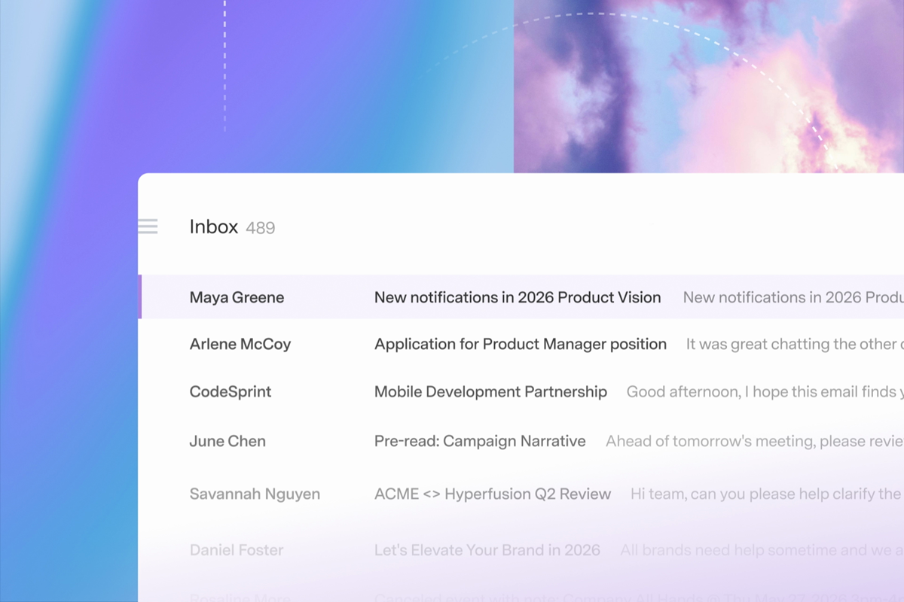

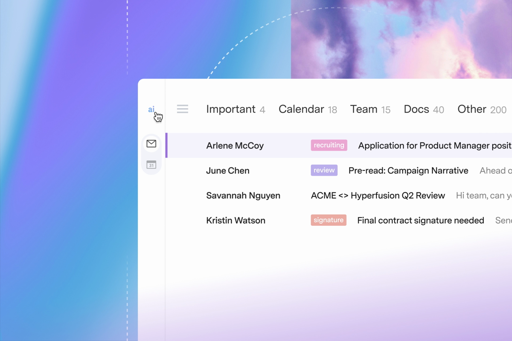

## 2. Feature catalogue

### 2.1 Superhuman Command (the Cmd+K palette)

Cmd+K (Ctrl+K on Windows) opens "Superhuman Command", a centred dark overlay with a text field. You type an action ("split", "remind", "dark") and get a fuzzy-matched list; each row shows its keyboard shortcut on the right, which is how Superhuman teaches shortcuts. Every setting, folder, account switch, feedback form and feature toggle is reachable from here, so there is almost no settings UI or menu bar to learn. The help centre calls it "your master control". On mobile the equivalent is pulling down from the top of the inbox then swiping right ("like you're making an L"), or a two-finger tap.

Shortcuts cannot be customised and only US QWERTY is properly supported; a help article lists workarounds per international layout (for example Shift+7 for search on French and German keyboards, Cmd+Ö for snippets).

Source: https://help.superhuman.com/hc/en-us/articles/46005701270541-Keyboard-Shortcuts-in-Superhuman-Mail, https://help.superhuman.com/hc/en-us/articles/46005789591693-Speed-Up-With-Shortcuts, https://help.superhuman.com/hc/en-us/articles/46005584339597-Shortcuts-for-International-Keyboards

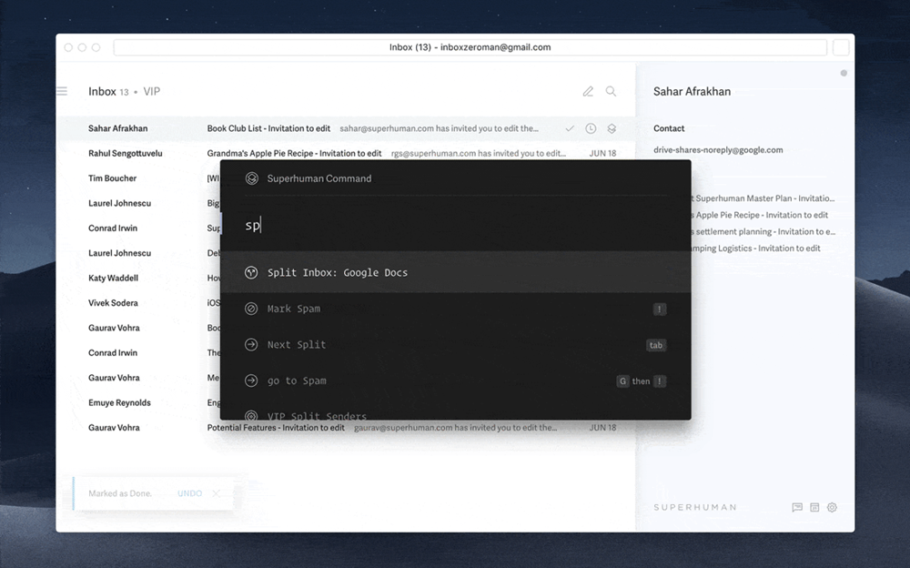

### 2.2 Split Inbox

Split Inbox is the core triage feature. Splits are tabs across the top of the inbox; each shows the total (not unread) conversation count beside its name, and the count is hidden when the split is at zero or over 999. Tab moves right, Shift+Tab moves left. G then I jumps to Inbox or Important, G then O to Other.

Default splits available from the "Split Inbox Library" (Settings, or Cmd+K then "Split Inbox Library"):

- Important and Other. Important holds person-to-person and high-priority mail; Other holds mailing lists, marketing, social and automated updates. On Gmail this depends on Gmail's smart features being on. Superhuman's own Auto Labels for Marketing, News, Pitch and Social also route to Other by default; you can uncheck "Always move Pitch conversations to Other" in Auto Label settings to keep cold pitches in Important.
- Calendar: mail from notifications@calendly.com and calendar-notification@google.com, plus anything with an .ics attachment.
- Shared: conversations shared with your team or carrying Team Comments.
- Team: everyone on your own domain. You choose whether these also appear in Important.
- VIP: addresses you mark as VIP. VIP mail also shows in Important by default.
- News: newsletters you have added.
- Starred (Gmail) or Flagged (Outlook).
- Reminders: returned reminders (see 2.6). A built-in template that cannot be renamed.
- Role-based presets for Collaboration, Leadership, Sales, and tool-based splits for Google Docs, Figma, Jira, Asana, GitHub, Notion, LinkedIn, DocuSign.

Custom splits ("Build Your Own") are defined either by search criteria (from:, to:, cc:, bcc:, subject:, combined with AND and OR, so a split can be `in:inbox AND -label:ops`) or by one or more Auto Labels, or both. Adding to an existing split is done from a selected conversation with Cmd+K then "Add to Split Inbox", which asks whether the rule should be the full address, the domain, a recipient, the subject, a label or an Auto Label. Moving a mis-sorted message uses Cmd+K then "Move to Important" (or "Move to Other") with the same single message / sender / domain choice.

Rules and behaviour:

- Each split has a checkbox "Also show conversations that match this Split Inbox in Important or Other". Off by default for custom splits, so a message normally lives in exactly one split. One reviewer notes the label on that checkbox is misleading.
- "Hide this Split Inbox when empty" is per split. Inbox, Important and Other cannot be hidden.
- Turning a split off moves its conversations back to Inbox / Important / Other and parks the split in an Inactive tab; a split must be off before it can be deleted.
- Splits are reordered by dragging.
- There is no hard limit; Superhuman recommends three to seven. Names can include emoji (type `:` then the emoji name).
- Superhuman explicitly says splits are not folders: "Split Inboxes should contain emails that still require action."
- Count cannot be switched to unread; use Cmd+K then "Filter Conversations" (Shift+U unread, Shift+S starred, Shift+I important, Shift+R no reply).

Sources: https://help.superhuman.com/hc/en-us/articles/46005619081101-Default-Split-Inbox, https://help.superhuman.com/hc/en-us/articles/46005636204941-Custom-Split-Inbox, https://help.superhuman.com/hc/en-us/articles/46005691544973-Split-Inbox-Library, https://help.superhuman.com/hc/en-us/articles/46005793275277-Structure-Your-Inbox, https://blog.superhuman.com/how-to-split-your-inbox-in-superhuman/, https://writing.arman.do/p/superhuman

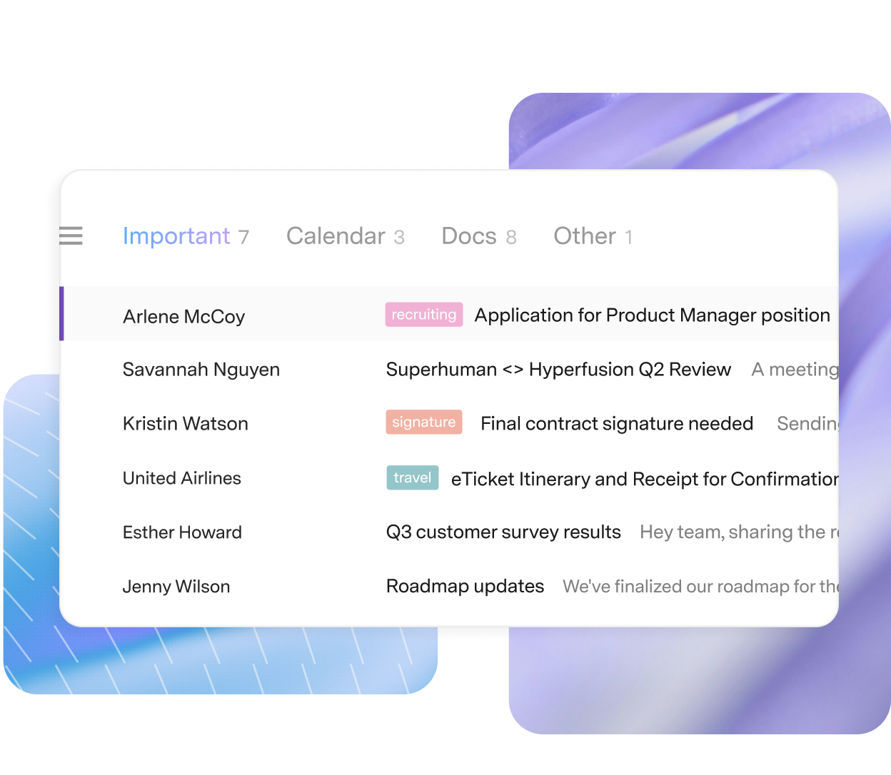

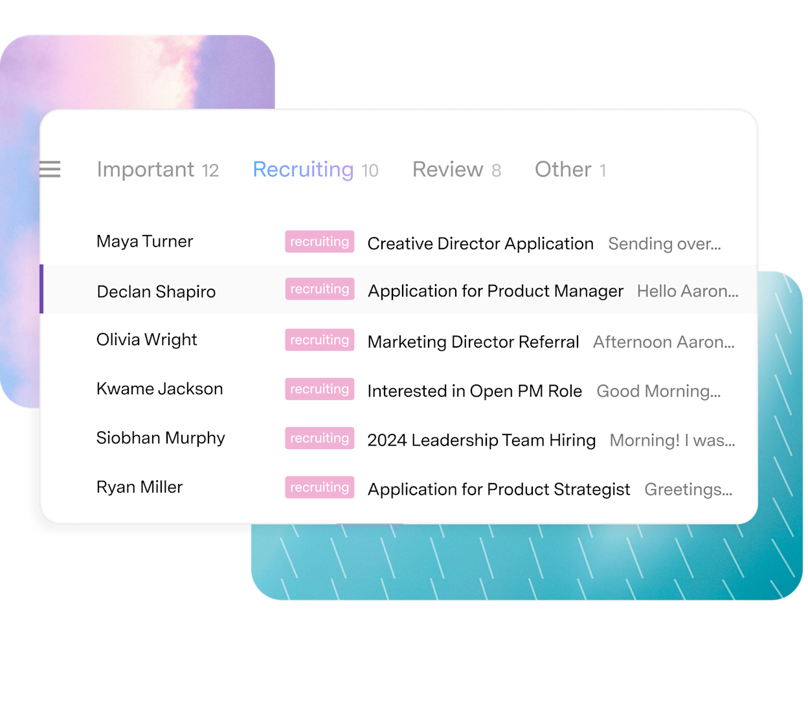

### 2.3 Mark Done, Archive, Trash, Move

E is "Mark Done (Archive)". Superhuman deliberately renames archive to Done to sell the inbox-as-task-list idea: "Done means handled, not gone." A Done conversation leaves the inbox, goes to the Done folder (G then E), stays searchable, and comes back to the inbox automatically if anyone replies. In Gmail, Done maps to archive (the thread stays in All Mail); in Outlook it moves to the Archive folder. Shift+E is Mark Not Done.

Three similar actions are kept distinct:

- Mark Done (E): archive to Done.
- Move (V): file into a folder or label and mark Done at the same time. Typing a new name in the picker creates the folder. A trailing slash makes a sub-folder.
- Trash (#): the only action that deletes. Trash cannot be emptied from Superhuman; you do that in Gmail or Outlook.

"Send + Mark Done" (Cmd+Shift+Enter) sends the reply and archives the thread in one go; there is a setting to make it the default. A bottom-left toast ("Marked as Done. UNDO") appears after each action, and Z undoes the last action. As soon as you action an open conversation you land on the next one rather than back in the list, which is central to the "flow" feeling reviewers describe.

Sources: https://help.superhuman.com/hc/en-us/articles/47439134613773-Mark-Done, https://help.superhuman.com/hc/en-us/articles/46005796611341-Clear-Your-Inbox, https://help.superhuman.com/hc/en-us/articles/46005732666253-Folders, https://help.superhuman.com/hc/en-us/articles/46005833597709-Achieve-Inbox-Zero

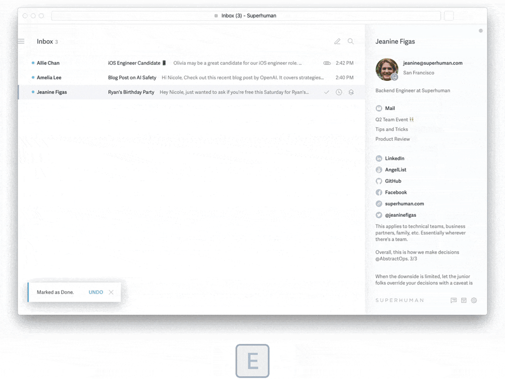

### 2.4 Get Me To Zero

A one-off bulk archive for people arriving with thousands of old emails. Cmd+K then "Get Me To Zero" opens a modal: "We'll move old emails from your Inbox to the Done folder. You can always find them again with search. What counts as old? Most people move emails older than 1 week." A dropdown sets the age threshold (default "1 week (most popular)"), and "More options" lets you keep Unread or Starred/Flagged conversations in the inbox. Buttons are "Do it later" and "Let's go". Superhuman suggests running it a second time to clear unread mail older than a month. It is reversible: the help centre says you have seven days to reverse it via Cmd+K then "Bulk Actions". The equivalent manual flow is scrolling to your "email horizon", Cmd+A ("Select All From Here") and E.

Superhuman reported clearing 46 million emails in the first 27 days after launch (March 2023).

Sources: https://help.superhuman.com/hc/en-us/articles/46005833597709-Achieve-Inbox-Zero, https://new.superhuman.com/get-me-to-zero-260284, https://blog.superhuman.com/inbox-zero-in-7-steps/

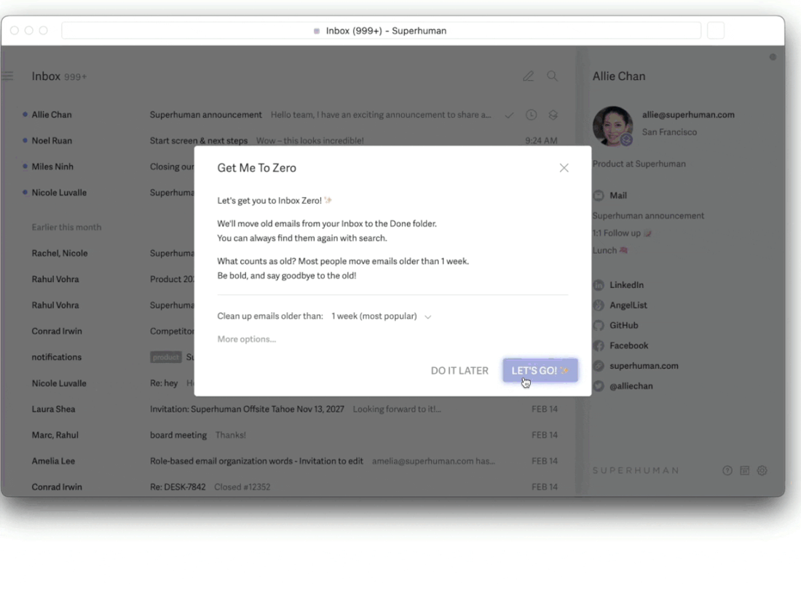

### 2.5 The Inbox Zero reward

When a split is empty Superhuman shows a full-bleed photograph (architecture, wildlife, landscapes) with the split title overlaid. A new image appears daily, plus a weekly streak counter. The blog explains they hand-set a focal centre per photo so the subject survives window resizing, and hand-tune a scrim per photo so the overlaid title stays legible. On iOS the whole UI chrome is hidden at Inbox Zero. One reviewer finds the high-contrast photos "punishing" rather than rewarding; most users like them.

Sources: https://blog.superhuman.com/how-superhuman-chooses-inbox-zero-images/, https://help.superhuman.com/hc/en-us/articles/46005833597709-Achieve-Inbox-Zero, https://afit.co/superhuman-email-review

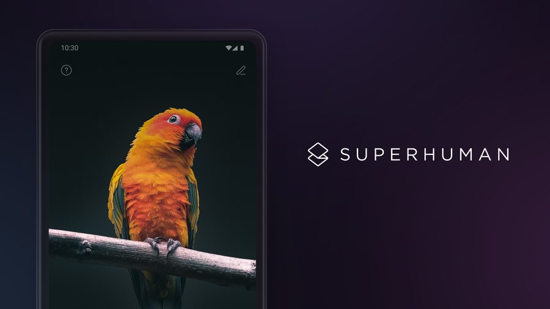

### 2.6 Remind Me (Snooze) and follow-up reminders

Superhuman merges snooze and follow-up reminders into one feature, "Remind Me", on the H key (the PDF labels it "Remind Me (Snooze)"; marketing still says Snooze). Behaviour:

- On a conversation, H opens a text field that accepts natural language: "tomorrow", "mon", "2d", "1w", "in 2 weeks", "someday", or a specific date and time. The conversation leaves the inbox and sits in the Reminders folder (G then H).
- Default is "if no reply": the thread comes back only if nobody responds. Tab in the picker switches to "regardless", which brings it back at the time no matter what, and you can make regardless the default. If a reply arrives on an "if no reply" reminder the reply lands in the inbox and the reminder is cancelled.
- Default return time is 8 AM; changeable under Cmd+K then "Reminder Settings".
- "Someday" never returns; it stays in the Reminders folder until removed.
- A returned reminder appears at the top of the inbox with a purple dot. With the Reminders Split Inbox on, a returned thread with no new messages appears only in that split (not in Important or Other); if it also has new messages it appears in both. The search `from:reminder@superhuman.com in:inbox` finds returned reminders.
- In compose, Cmd+Shift+H sets a reminder on the message you are about to send; the draft footer then shows "Reminder set: Monday July 10th if no reply" with an Undo. Reminders can be set on drafts in existing threads but not on brand-new drafts.
- Mobile: swipe right on a row to set a reminder, or tap the clock in the triage bar. Suggested chips ("later today", "tomorrow", "next week", "in 2 weeks") are reorderable, and there is an "on desktop" option that makes the thread return the next time you open the desktop app.

Auto Reminders (all plans) set follow-up reminders automatically. Settings, then Reminders lets you pick: "All messages that need a follow-up" (AI decides from your last outgoing message), "All messages with an external recipient", or "No messages"; there is a "Weekdays only" option so reminders do not fire at the weekend. A "Reminders folder" holds pending reminders; the "Reminders Split Inbox" holds returned ones. Superhuman is careful to say these are different things with the same name.

Sources: https://help.superhuman.com/hc/en-us/articles/46005666142733-Remind-Me, https://help.superhuman.com/hc/en-us/articles/46005658551053-Auto-Reminders-Auto-Drafts, https://new.superhuman.com/set-perfect-reminders-instantly-116271, https://new.superhuman.com/remind-me-regardless-30768, https://new.superhuman.com/automatic-reminders-306107

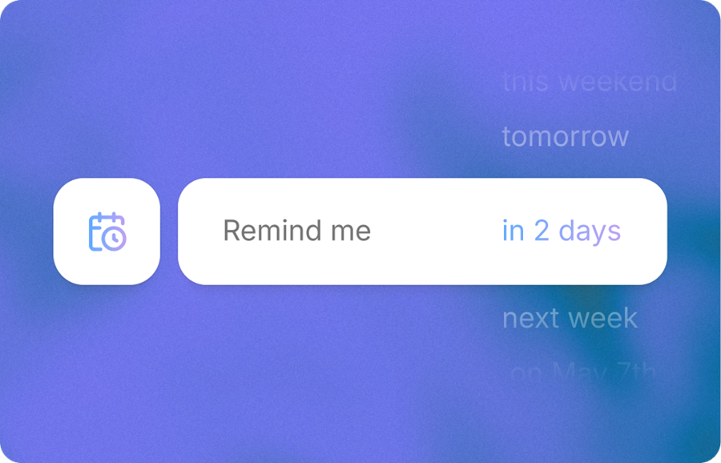

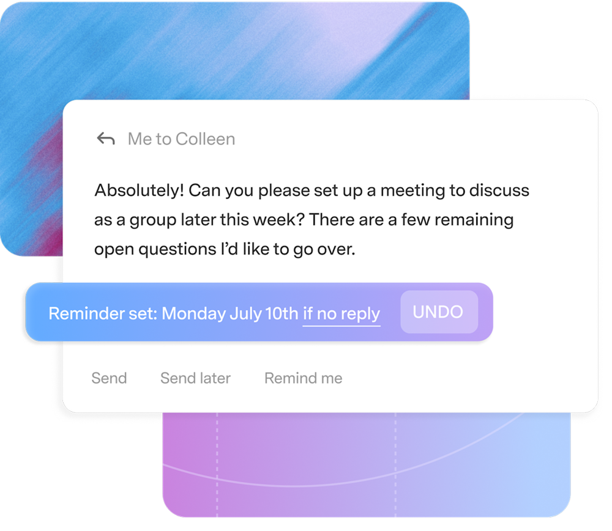

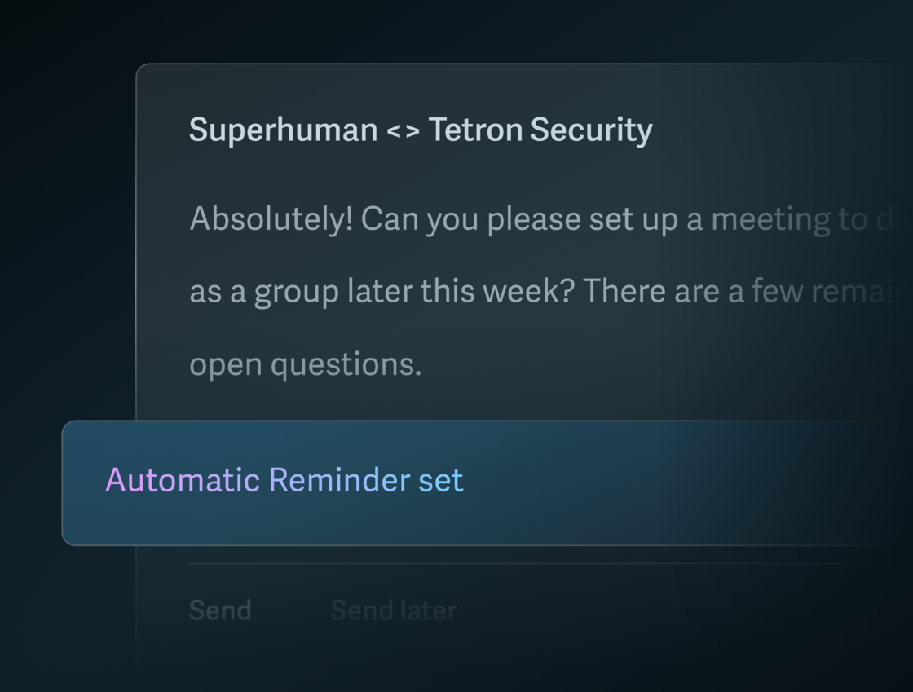

### 2.7 Send Later, Smart Send, Undo Send, Instant Send

- Send Later: Cmd+Shift+L in compose; the footer button reads "Send Wednesday at 10am" once scheduled. The picker accepts natural language like the reminder picker (unverified: I could not find a dedicated help article, the behaviour is inferred from the marketing image and the PDF).
- Smart Send (Business and Enterprise): when Superhuman has data it replaces the Send Later button with a recommended time based on when the recipient is usually active and their time zone. With multiple recipients it shows optimal times for each and you pick whom to optimise for.
- Undo Send: every send is delayed and Z within 10 seconds unsends. The window is fixed; the help centre says "There isn't a way to extend the Undo window at the moment."
- Instant Send: Cmd+Shift+Z sends immediately with no undo window; the toast warns "Please note: you cannot undo this". You can also hover the "Reply sent" toast and click Instant Send.
- Send is Cmd+Enter. Send + Mark Done is Cmd+Shift+Enter.
- Failed sends show a red "Send failed" badge on the thread with Edit Message / Discard options; offline sends queue as "Email delayed" and retry when the app reconnects.

Sources: https://help.superhuman.com/hc/en-us/articles/46005666743309-Undo, https://new.superhuman.com/instant-send-92984, https://help.superhuman.com/hc/en-us/articles/46005847972493-From-Guessing-to-Knowing, https://help.superhuman.com/hc/en-us/articles/46005543693581-Failed-Sends, https://download.superhuman.com/Superhuman%20Keyboard%20Shortcuts.pdf

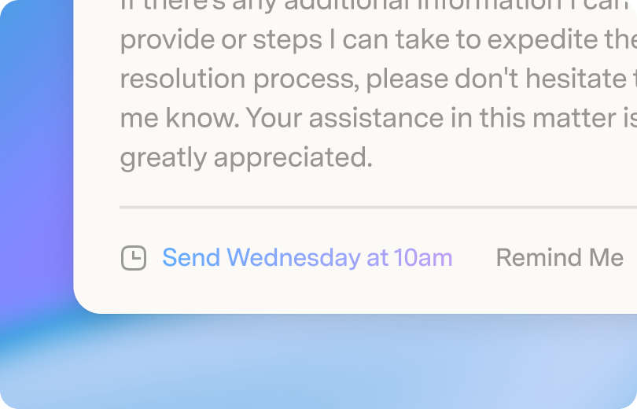

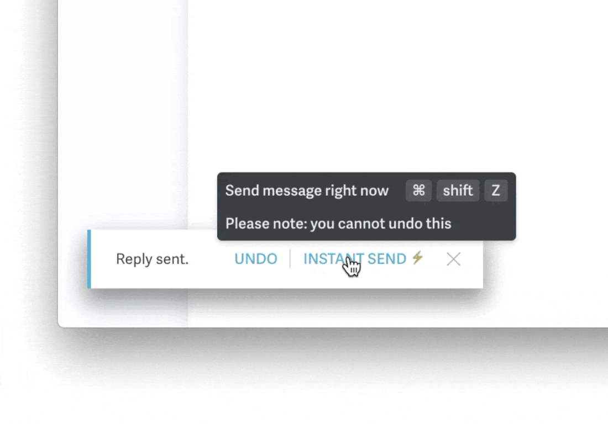

### 2.8 Read Statuses, Team Read Statuses, Recent Opens

Read Statuses are tracking pixels: a tiny remote image in each sent message; when the recipient's client loads it, Superhuman logs the open. In the UI, hovering the checkmarks beside a message header (or the bottom-right of the last message) shows "Opened 6 times" with a per-recipient list of name, device icon (laptop or phone) and timestamp. Read Statuses are on all plans.

Privacy history: in 2019 Superhuman shipped Read Statuses on by default and logged recipient location (state or country level). After public criticism (Mike Davidson's "Superhuman is spying on you"), Rahul Vohra announced five changes: stop logging location, delete historical location data, remove location from the apps, turn Read Statuses off by default, and build a remote-image blocking option. Today the help centre phrases it as opt-in ("hit Cmd+K then Enable Read Statuses") and there is Cmd+K then "Disable Read Statuses". The recipient is never told the message is tracked. Superhuman's deliverability guide even recommends disabling Read Statuses if your mail lands in spam. Cmd+K then "Images" lets a Superhuman user block remote images in received mail to protect themselves.

Team Read Statuses (team accounts) share opens across everyone on the team who is on the thread: if a colleague emails a lead and copies you, you see when the lead opened it. Enabled per account via Cmd+K then "Team Read Statuses".

Recent Opens (Business and Enterprise) is a live feed in the sidebar (Settings, then Recent Opens; on mobile "go to Opens") listing recently opened messages so a salesperson can follow up "when you're top of mind".

Sources: https://blog.superhuman.com/read-statuses/, https://help.superhuman.com/hc/en-us/articles/46005847972493-From-Guessing-to-Knowing, https://help.superhuman.com/hc/en-us/articles/46005718826125-Team-Read-Statuses-and-Team-Reply-Indicators, https://help.superhuman.com/hc/en-us/articles/46005520093453-Keeping-Your-Emails-Out-of-Spam, https://mikeindustries.com/blog/archive/2019/07/superhumans-superficial-privacy-fixes-do-not-prevent-it-from-spying-on-you

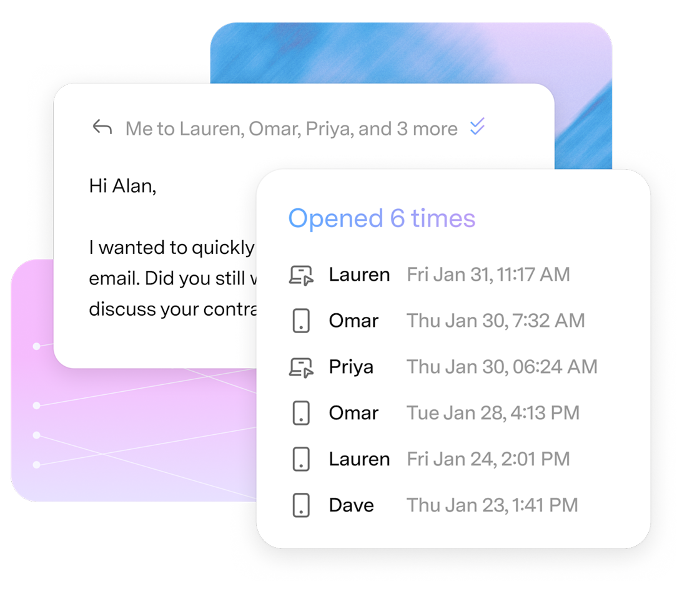

### 2.9 Team Reply Indicators

When a teammate on the same thread is drafting a reply, or has one scheduled, a line such as "Cameron is replying..." with their avatar appears at the bottom-left of the message. No setup; it works on team accounts. Marketing calls it "avoid collisions".

Source: https://help.superhuman.com/hc/en-us/articles/46005718826125-Team-Read-Statuses-and-Team-Reply-Indicators

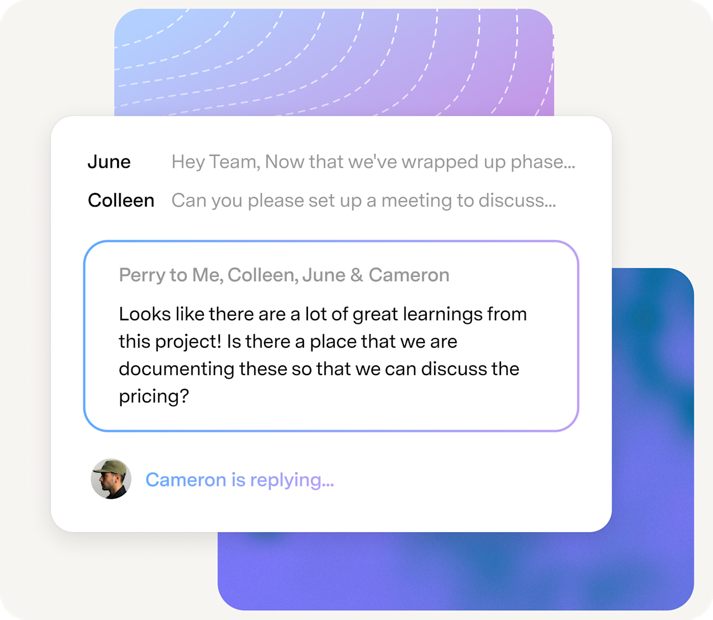

### 2.10 Shared Conversations and Team Comments

Shared Conversations: Cmd+S (or Cmd+K then "Share Conversation") opens a share modal; Cmd+S again copies a link you can paste into Slack. Whoever shares becomes the "Publisher" and their version of the thread, including sub-threads they are on and all future messages, is what everyone sees. Recipients do not need Superhuman; guests get an email and a browser view where they can read and comment. An avatar stack beside the subject shows participants. "Stop Sharing Conversation" ends it. Shared threads collect in the Shared split.

Team Comments: M jumps to the comment bar at the bottom of a conversation (Cmd+Shift+M from inside compose); @mention a colleague, Cmd+Enter to post. Comments are internal and invisible to the external recipients. @mentioning someone shares the conversation with them automatically. Superhuman shows a risk warning if a recipient is removed from a shared thread.

Shared Drafts appear in the pricing table as a team feature; the help centre has no article on it (unverified behaviour).

Sources: https://help.superhuman.com/hc/en-us/articles/46005593675917-Shared-Conversations-and-Team-Comments, https://help.superhuman.com/hc/en-us/articles/46005810472717-Collaborate-Without-the-Chaos, https://writing.arman.do/p/superhuman

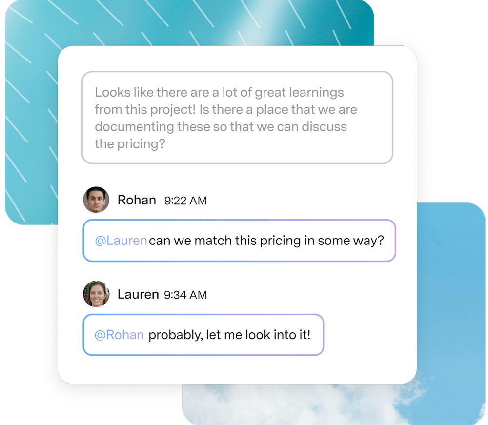

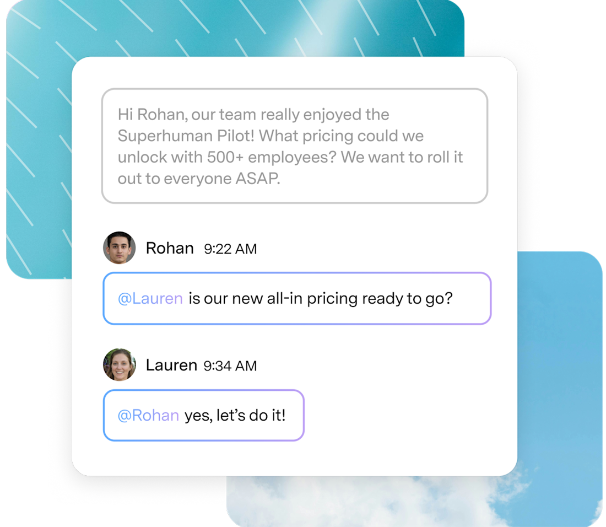

### 2.11 Snippets and Team Snippets

Snippets are templates. Create with Cmd+K then "Create Snippet", "Create Snippet from Draft", or "Create Snippet from Message" (desktop only; mobile can use but not create). In the Snippets view (G then ;) C creates a new one and Edit then Cmd+Enter saves. A snippet can contain body text, a subject, To/Cc/Bcc recipients and attachments, which is what makes them useful for "loop in the same people" workflows and for Auto Bcc-style CRM logging.

Insertion: Cmd+; opens the snippet picker from anywhere (type the name, arrow keys, Enter); ; inside a draft inserts inline; on mobile tap + then "Add Snippet".

Variables: `{first_name}`, `{last_name}`, `{full_name}` fill from the recipient. The blog also mentions `{sender_first_name}` and `{your_name}` (unverified against the current help centre, whose sidebar lists only the three recipient variables). Any other `{phrase}` in braces is a custom placeholder; Superhuman warns before sending if one is still unfilled.

Team Snippets: toggle "Share with team" and the snippet appears under Team Snippets with your name as author. Snippet metrics show sends, opens and replies per snippet (opens rely on Read Statuses). Enterprise adds a Snippet Manager. Snippets cannot be transferred between accounts.

Sources: https://help.superhuman.com/hc/en-us/articles/46005686571149-Snippets, https://help.superhuman.com/hc/en-us/articles/46005809939725-Your-Greatest-Hits-On-Demand, https://new.superhuman.com/variables-in-snippets-198344, https://blog.superhuman.com/snippets/

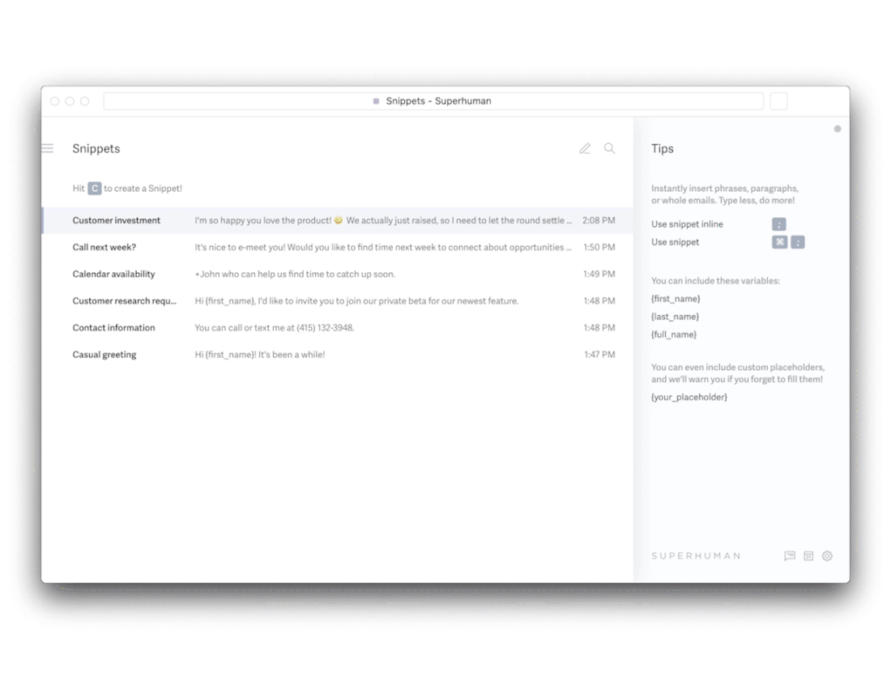

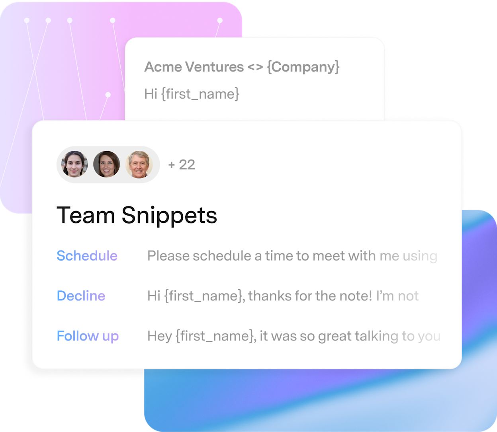

### 2.12 Instant Intro

For "please meet X" introductions. Cmd+Shift+I (or Cmd+K then "Instant Intro") starts a reply that thanks the introducer and moves them to Bcc; hitting it again toggles back. The one-line thank-you template is editable under "Instant Intro Settings" and can include `{first_name}`. Only one template is allowed; Superhuman suggests a Snippet for longer intros. iOS supports it from the + menu; Android does not.

Source: https://help.superhuman.com/hc/en-us/articles/46005674036877-Instant-Intro

### 2.13 Quick Quote

Select text in a message (or triple-click a line) and press R, Enter or F; the reply opens with the selection quoted so you can answer point by point. Desktop only.

Source: https://help.superhuman.com/hc/en-us/articles/46005692763661-Quick-Quote

### 2.14 Unsubscribe, Block, Mute, Spam

- Unsubscribe: Cmd+U. Three choices: "Unsubscribe", "Unsubscribe, and Mark Done all", "Unsubscribe, and Trash all" (the latter two act on every existing message from that sender). Superhuman either sends the list-unsubscribe email for you, sends it and opens the company page, or just opens the unsubscribe page.
- Block: Cmd+K then "Block", by sender or by domain, for mail without an unsubscribe link. A "Blocked Senders" list allows unblocking. Superhuman recommends Block over Spam for unwanted-but-legitimate mail so you do not pollute the junk filter.
- Mark Spam: ! with options to also block the address or the domain.
- Mute: Shift+M; muted threads stop notifying and skip the inbox (G then M lists them).
- Auto Archive (2.16) is the systematic version of all this.

Sources: https://help.superhuman.com/hc/en-us/articles/46005635358349-Dealing-with-Unwanted-Emails, https://help.superhuman.com/hc/en-us/articles/46005826285069-Stop-the-Inbox-Clutter

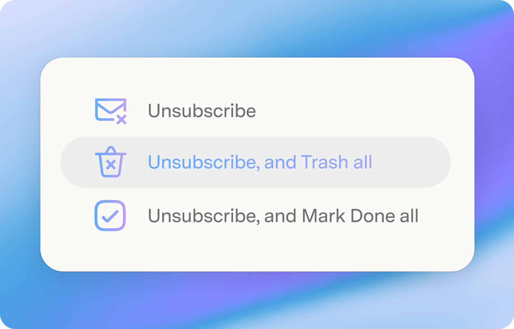

### 2.15 Auto Labels

Superhuman AI classifies conversations "based on their content, subject, sender, and recipients" and applies pastel label pills shown inline in the list before the subject. Built-ins: Marketing, News, Pitch, Social (all routed to Other by default). The Auto Label Library adds a dozen or so more one-click labels: needs response, invoices and bills, meeting scheduling, Travel, Respond, Meeting, and so on. Enabling one labels new mail plus the previous 14 days.

Custom Auto Labels (Cmd+K then "New Auto Label", "Build Your Own"):

- Deterministic criteria (From, To, Subject and so on) combined with AND or OR, plus an "Add exclusions" block. Available on all plans.
- AI prompt criteria ("job applications", "requests to review my work") on Business and Enterprise, capped at 10 AI-prompt labels. Superhuman tells you not to reference unread state, timestamps, attachments, frequency or CRM data in the prompt because the classifier does not see them.
- A live preview panel on the right shows matching conversations while you type; thumbs up and down on individual results refine the rule.
- Auto Labels feed Split Inbox definitions and Auto Archive.

A separate product, "Email Assistant by Superhuman Mail", applies a fixed set of six labels (Respond, Waiting, FYI, Notifications, Promotions, News) inside plain Gmail or Outlook with no client change. There each mail gets exactly one label, the set cannot be edited, and removing a label from a thread does not train anything.

Sources: https://help.superhuman.com/hc/en-us/articles/46005657758861-Auto-Labels, https://help.superhuman.com/hc/en-us/articles/46005680129933-Auto-Label-Library, https://help.superhuman.com/hc/en-us/articles/46005854346893-Email-Assistant-by-Superhuman-Mail-Gmail, https://new.superhuman.com/split-inbox-controls-321318

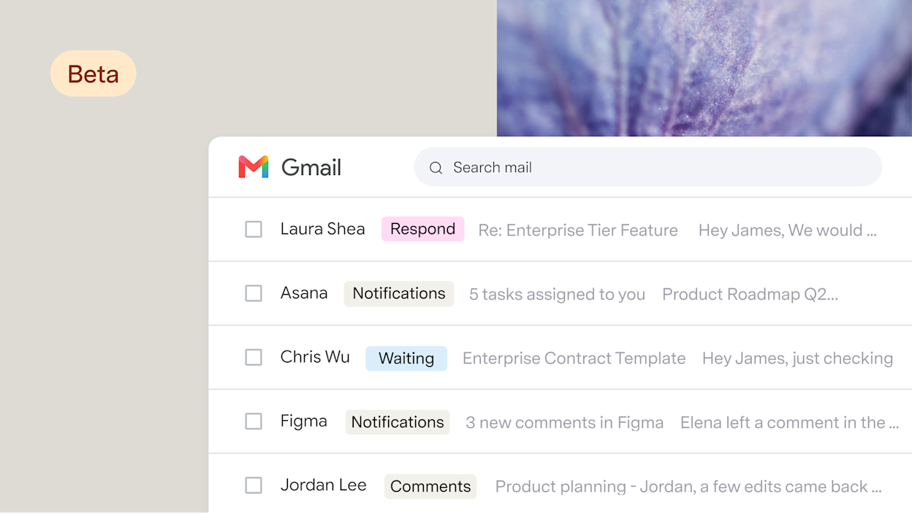

### 2.16 Auto Archive

Settings, then Auto Archive lists your Auto Labels with checkboxes; checked labels skip the inbox and land in the Done folder plus an "Auto Archived" view (Cmd+K then "go to Auto Archived"), with "Auto Archived" printed under the row. Two extra tabs, Always Archive and Never Archive, take addresses or domains and work regardless of labels; from an open conversation, Cmd+K then "Auto Archive" offers "Always/Never Auto Archive Sender/Domain".

Built-in exceptions so you do not lose real mail: a conversation is never auto-archived if you have previously emailed the sender, if the sender is on your own domain (generic domains like gmail.com excluded), or if it carries several Auto Labels and at least one is not set to archive. Never Archive beats a label rule; an existing Gmail filter or Outlook rule beats Never Archive. Superhuman does not create Gmail filters or Outlook rules; it acts client-side and the archive syncs back like any other action. Auto Archive settings only appear once Superhuman AI is activated.

Source: https://help.superhuman.com/hc/en-us/articles/46005662460813-Auto-Archive

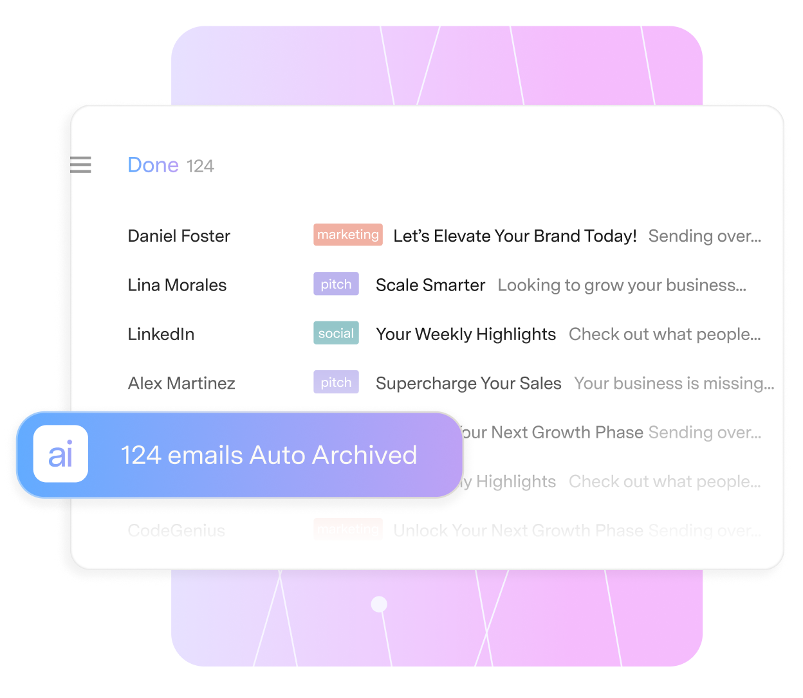

### 2.17 Instant Reply

With Superhuman AI activated (Cmd+K then "Activate Superhuman AI"), every eligible incoming email gets three short reply chips at the bottom of the latest message ("Reviewing", "Need Time", "Thank you"). Tab cycles and previews each full draft; Enter (reply all), R (reply) or F (forward) inserts it into a draft for editing. The drafts are written in your tone using your sent mail. Not shown for: calendar invites, Social or Promotion mail, SendGrid mail, mail from banks, mail that never hit the inbox, spam or trash, threads where you sent the last message, threads with an existing draft, and messages over roughly 20,000 words. Turning on Auto Drafts for Responses switches Instant Reply off. Queries and responses are stored for 90 days.

Sources: https://help.superhuman.com/hc/en-us/articles/46005583725709-Instant-Reply, https://blog.superhuman.com/superhuman-ai-instant-reply/, https://techcrunch.com/2024/02/27/superhuman-launches-an-ai-powered-instant-replies-feature/

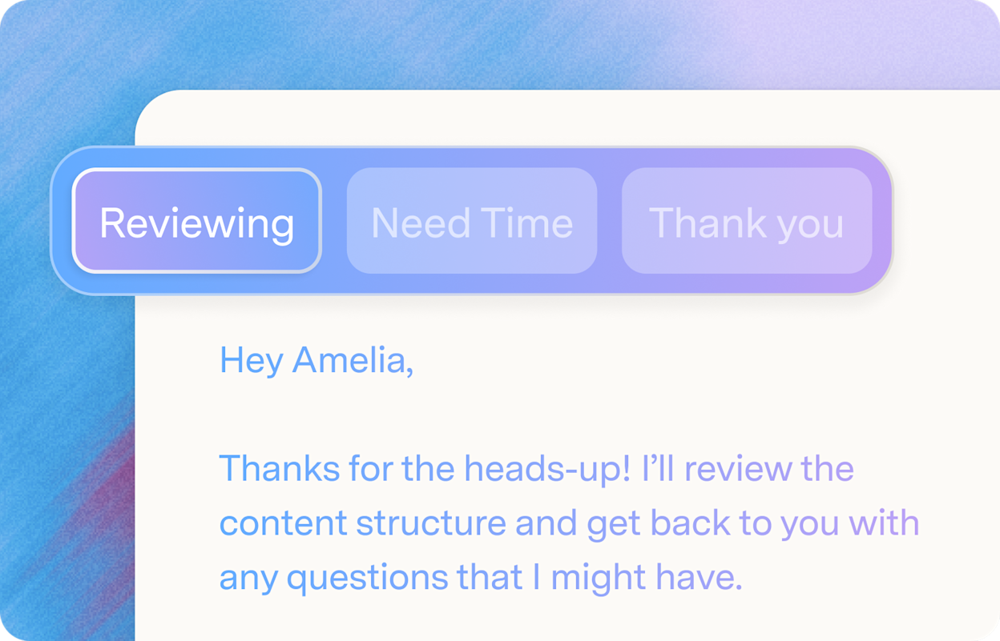

### 2.18 Auto Drafts (Business and Enterprise)

Auto Drafts write full replies before you open the inbox. Two kinds: Responses (for mail that needs a reply) and Follow-ups (drafted about an hour before a reminder is due to return). Details: multiple candidate versions appear as chips at the top of the draft; anything the AI cannot infer is left as a `{placeholder}` and Superhuman blocks sending until it is filled; drafts are refreshed once a day if context changes; editing turns one into a normal draft; they sync as ordinary drafts to Gmail and Outlook and are never sent automatically. Marking a thread Done does not discard its Auto Draft. Scheduling requests get drafts that check your calendars and can add a teammate on Cc. You can limit Response drafts to people you have emailed before.

Source: https://help.superhuman.com/hc/en-us/articles/46005658551053-Auto-Reminders-Auto-Drafts

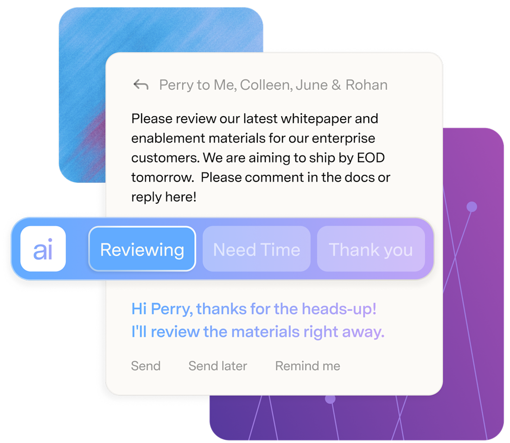

### 2.19 Auto Summarize

A one-line summary appears under the subject of every conversation once Superhuman AI is on, and updates as messages arrive. Press i to expand to a bullet summary. Not generated for mail outside the primary inbox, mail with a "smart link" (View Pull Request, Unsubscribe), SendGrid mail, or messages over roughly 20,000 words, but i still works manually on any thread. Reviewers single this out as the AI feature they actually use.

Source: https://help.superhuman.com/hc/en-us/articles/46005642123917-Auto-Summarize, https://nicklafferty.com/reviews/superhuman/

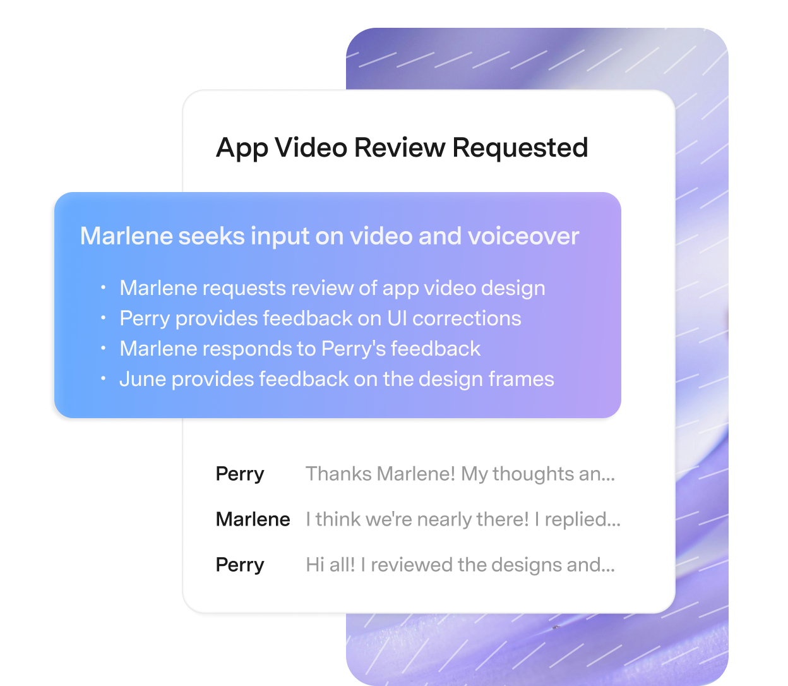

### 2.20 Ask AI (Business and Enterprise)

? (or Cmd+K then "Ask AI") opens an AI sidebar (a chat panel on the right, with a "Find, write, schedule, or ask anything..." field). It searches up to five years of mail (excluding Trash and Spam; indexing "can take up to a couple of days"), reads attachments when you identify the email, combines inbox, calendar and web, keeps 90 days of chat history, drafts and edits emails in your voice, creates events, analyses your calendar, and answers product questions. It also opens automatically when Write with AI needs clarification. Ask AI is all-or-nothing: you cannot enable other AI features and opt out of it. Superhuman states no vendor trains on your data and that Ask AI queries are stored for quality and debugging.

Source: https://help.superhuman.com/hc/en-us/articles/46005676610829-Ask-AI, https://help.superhuman.com/hc/en-us/articles/46005814266253-Search-in-Seconds

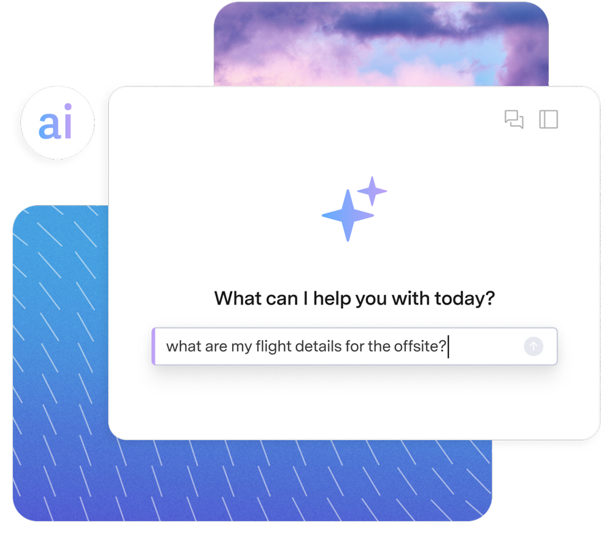

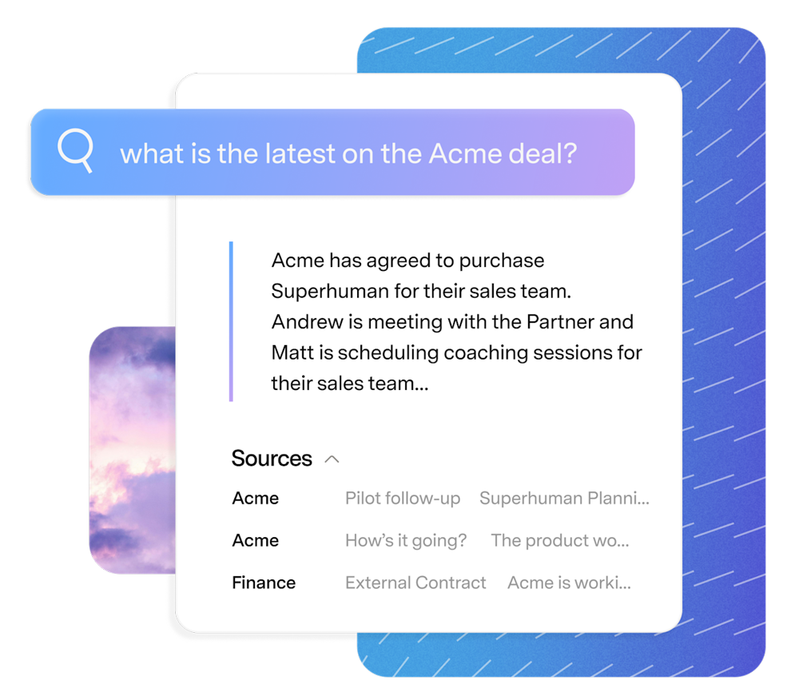

### 2.21 Write with AI, Write with Voice, Autocomplete, Autocorrect

- Write with AI: Cmd+J in a draft. Drafting mode takes a prompt and writes the email in your tone (it uses past mail with that recipient for context). Editing mode (Cmd+J on selected text, or right after drafting) offers Improve writing, Fix spelling and grammar, Shorten, Lengthen, Simplify, Rewrite in my voice, or a free-form instruction; it can also translate.
- Personalization (Business): Settings, then Personalization with tabs for Greeting and Signoff, Job Title and Company, Writing, Scheduling, Events, About me and Knowledge Base. Plain-language instructions such as "write in lowercase" or "keep Wednesday free". Settings are per account and sync to mobile.
- Knowledge Base (Business): upload files (50 MB max) or public URLs that Write with AI and Ask AI can reference; sources can be shared with the team.
- Write with Voice (mobile, all plans): tap the mic above the keyboard, talk, and get a polished draft in your tone rather than a transcript.
- Autocomplete: greyed inline suggestions; Tab or Right arrow accepts, Esc dismisses. A generic pre-trained phrase model, not trained on your mail.
- Autocorrect: fixes spelling, capitalisation and punctuation as you type in eleven languages; Cmd+Z reverts a correction and "Learn word" adds it to a personal dictionary. Superhuman claims a 30 to 50 percent typing speed boost.

Sources: https://help.superhuman.com/hc/en-us/articles/46005557122957-Write-with-AI, https://help.superhuman.com/hc/en-us/articles/46005802896781-Personalization, https://help.superhuman.com/hc/en-us/articles/46005666866829-Knowledge-Base, https://help.superhuman.com/hc/en-us/articles/46005685782669-Autocomplete, https://help.superhuman.com/hc/en-us/articles/46005640149389-Autocorrect

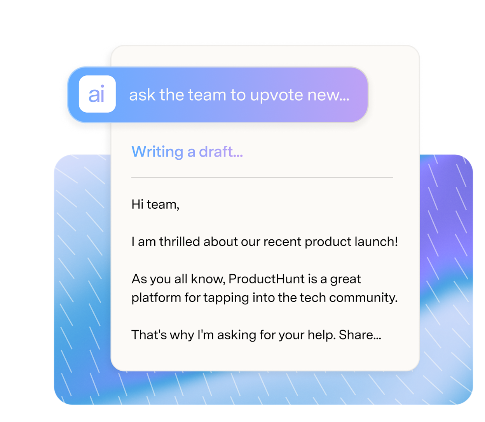

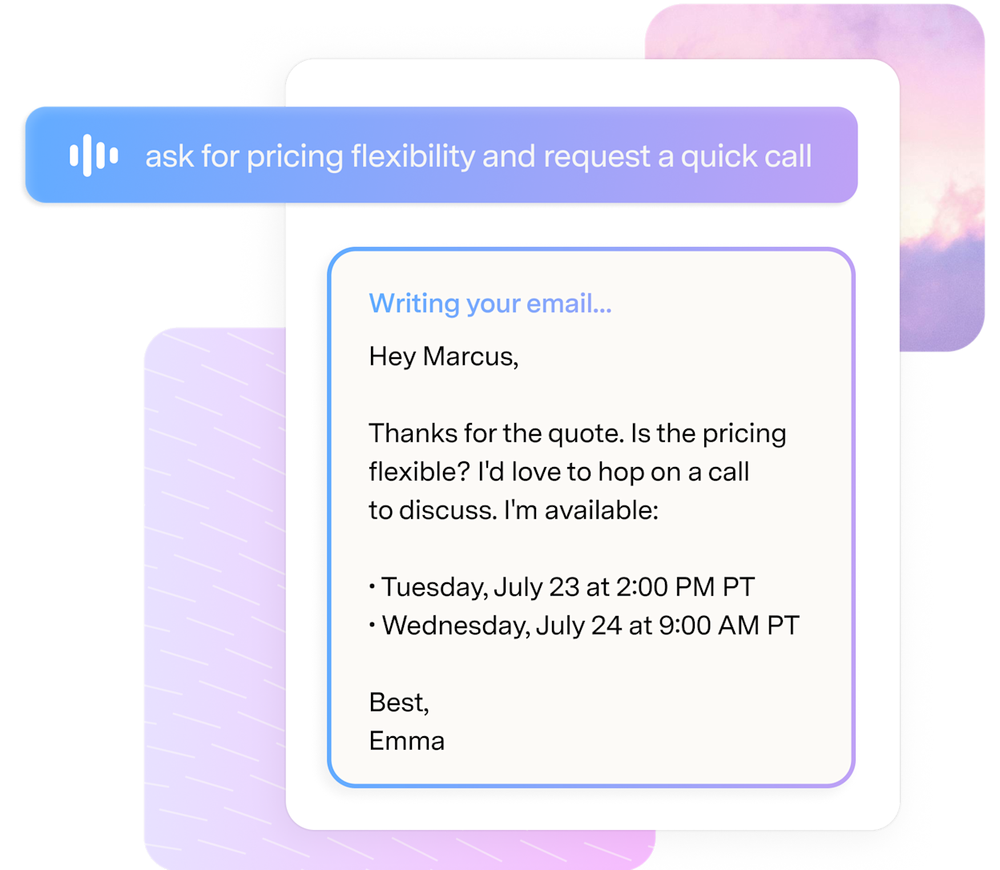

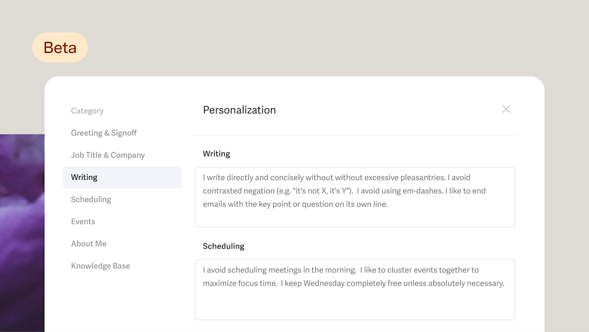

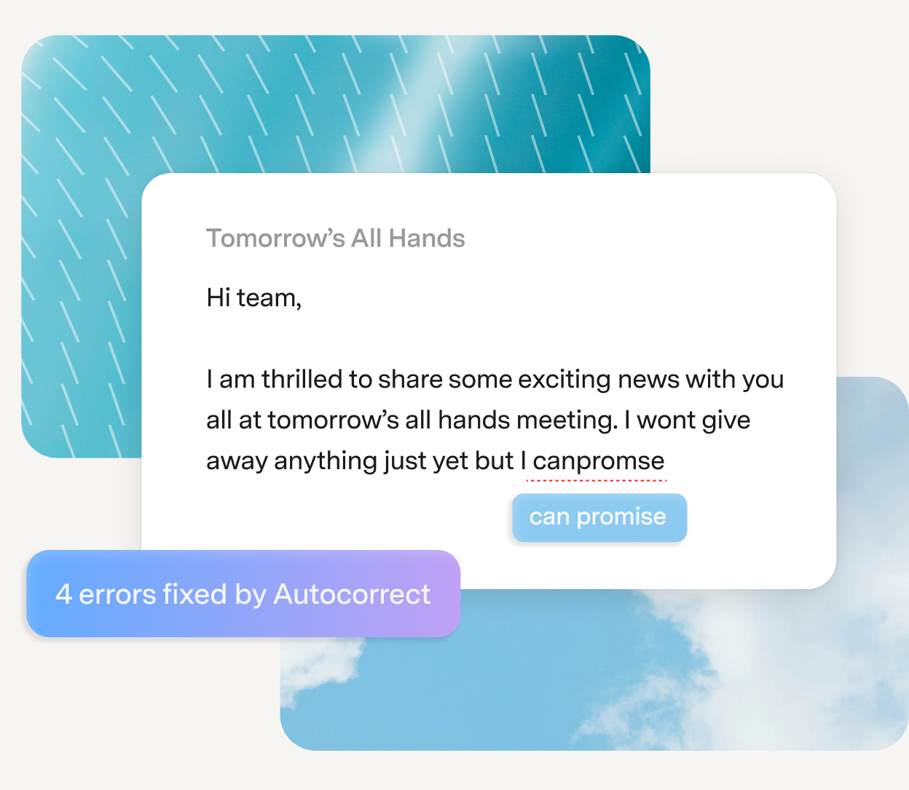

### 2.22 Calendar

The calendar lives in the right sidebar and in a full week view rather than as a separate app.

- 0 opens today in the sidebar (0 then 0, or 2, opens the week view); T returns to today; N or = next day/week, P or - previous. In the shortcut PDF the compose-time date nudge is Cmd+Shift+= and Cmd+Shift+-.
- Hovering a date in an email, or opening a calendar invite, shows that day in the sidebar automatically.
- B (or Cmd+K then "Create Event") is "Instant Event": from an open message the AI pre-fills attendees from the thread, a summary as description, your default meeting link, and proposes a time based on your and your team's availability. "Create Empty Event" is the manual version. Editing supports the usual "only this / this and following / all" for recurring events; colours mirror Google or Outlook and cannot be changed.
- Share Availability: Cmd+Shift+A in compose (this key used to be Attach in the v8 PDF; Attach is now Cmd+Shift+U) inserts chosen free slots as clickable times plus a booking link. Slots update live as your calendar changes and can ignore conflicts for internal meetings. Booking Pages are created from the week view with title, duration, video link, location, scheduling windows and conflict checking; the recipient sees times in their own zone. Desktop only.
- Find Time: in week view, M focuses the Meet field; type teammates and Superhuman overlays their calendars and proposes slots for the chosen duration.
- Multiple Google and Microsoft calendars side by side; per-calendar colours; a secondary timezone column; Meeting Link Settings auto-add Zoom, Google Meet or Teams links; event notifications with a chosen lead time.
- Mobile has a Calendar tab with 1, 2 or 3 day views and a month sheet for navigation (iOS), no week view, plus an iOS home screen widget.

Sources: https://help.superhuman.com/hc/en-us/articles/46005615985293-Calendar-Overview, https://help.superhuman.com/hc/en-us/articles/46005621734669-Create-Event, https://help.superhuman.com/hc/en-us/articles/46005831908877-Meetings-on-Your-Terms, https://help.superhuman.com/hc/en-us/articles/46005817503245-Team-Time-Simplified, https://help.superhuman.com/hc/en-us/articles/46005846114189-From-Chaos-to-Clarity, https://superhuman.com/products/mail/calendar

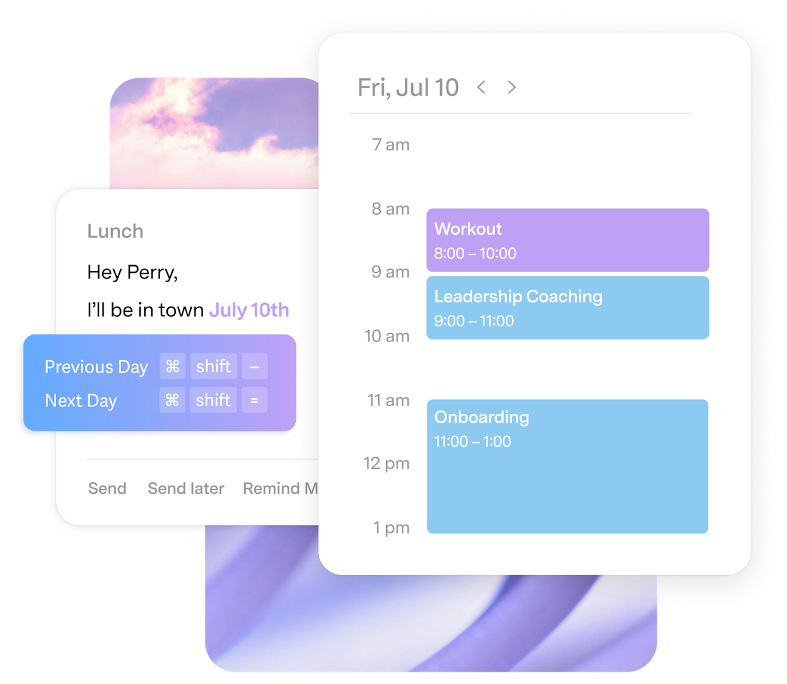

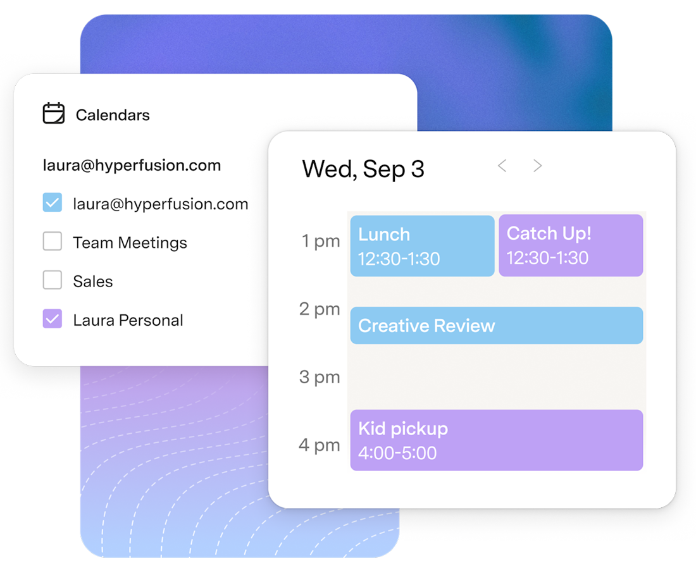

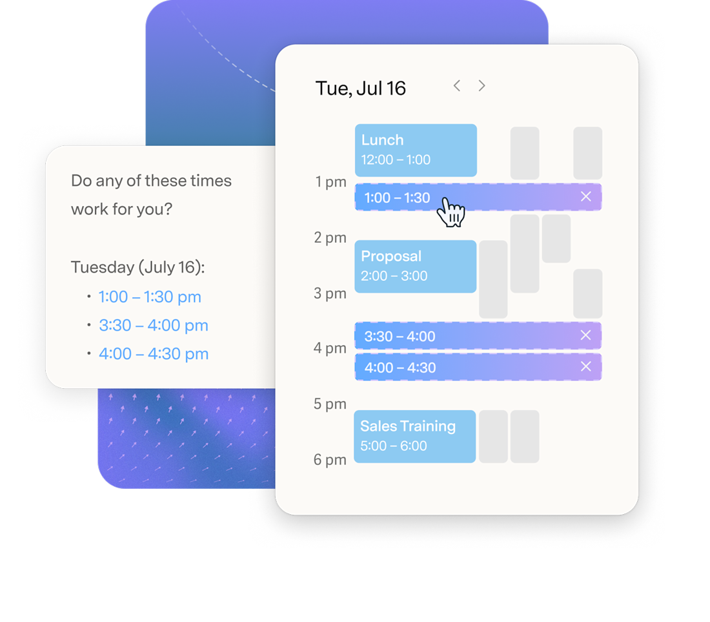

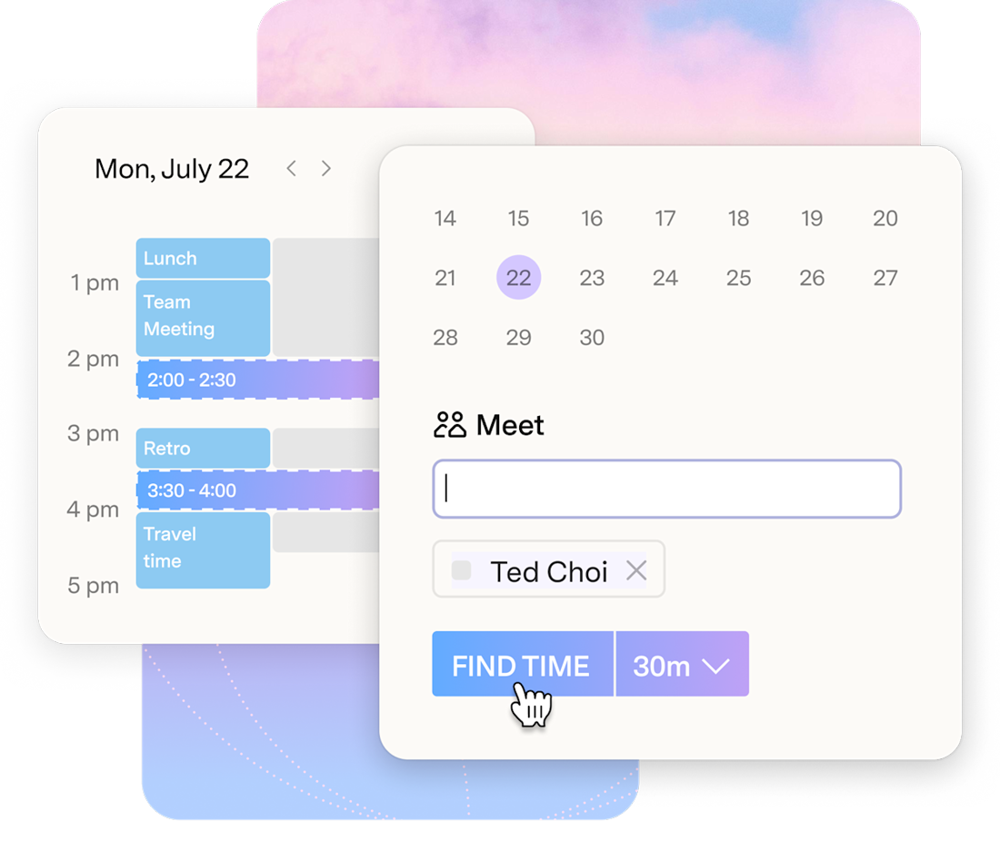

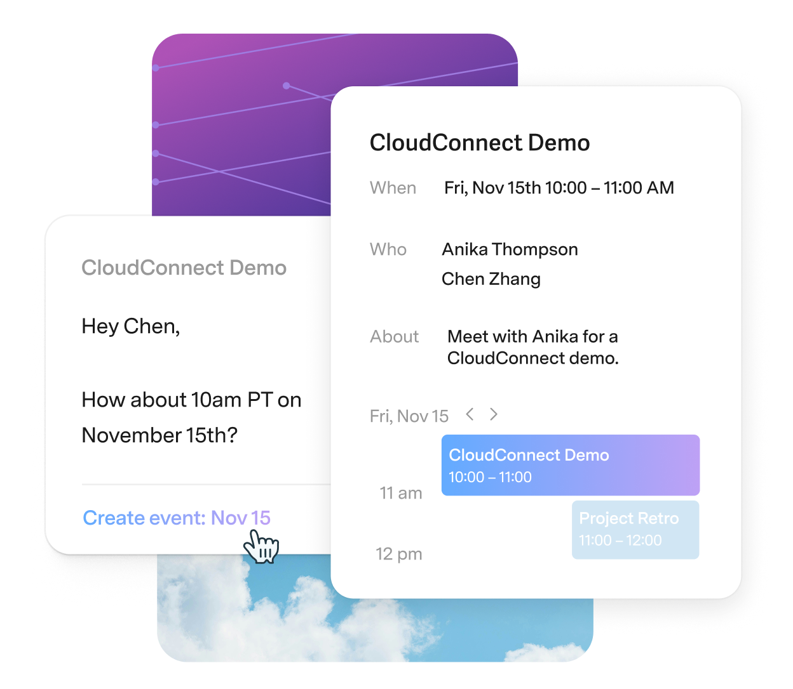

### 2.23 Contact Pane (Social Insights) and CRM

The right sidebar shows the person you are reading or writing to: name, photo, email, city, a short bio, links to the four most recent conversations with them, and social links (LinkedIn, X, GitHub, AngelList, personal site). Data comes from Clearbit, LinkedIn, AngelList and Gravatar; company addresses get nothing. Hovering any name or address in a header switches the pane. Clicking the name searches for their mail; clicking the address starts a draft. It cannot be turned off. 0 cycles the sidebar between contact, day and week. A "Refer" or "Invite to Team" button appears for people not yet on Superhuman.

CRM integrations (Business): HubSpot, Salesforce and Pipedrive contact, company and deal fields appear in the same pane; Auto Bcc logs sent mail to the CRM's bcc address with an exclusion list for internal domains.

Sources: https://help.superhuman.com/hc/en-us/articles/46005778939789-Contact-Pane, https://help.superhuman.com/hc/en-us/articles/46005654497549-Auto-Bcc, https://superhuman.com/products/mail/crm-integrations

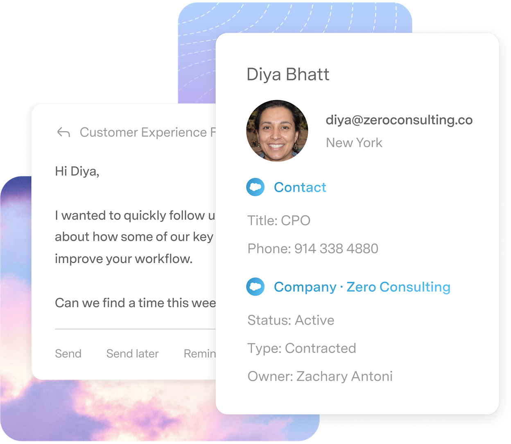

### 2.24 Search and filters

/ opens search. Terms are ANDed by default; OR and a leading hyphen for exclusion are supported; quotes force exact match. Common operators (from:, to:, has:attachment, in:inbox, label:, subject:, and so on) are listed in a Tips panel in the right sidebar while you type, and the same syntax defines custom splits. Recent mail is cached locally so search works offline. Cmd+K then "Filter Conversations" applies Shift+U (unread), Shift+S (starred), Shift+I (important) and Shift+R (no reply) to the current view. Ask AI (?) is the semantic alternative on Business.

Source: https://help.superhuman.com/hc/en-us/articles/46005672652301-Search

### 2.25 Attachments

Cmd+Shift+U opens the file picker (the v8 PDF still says Cmd+Shift+A, which has since been given to Share Availability); drag and drop works. Attached files show as chips under the composer. Cmd+O opens links and attachments; Tab cycles through links and dates in a message. PDFs preview in-app, PNGs show a quick preview, MOV, MP4 and DOCX download first; Word, Excel, HTML and Google Drive links have no in-app preview; cloud attachments are not supported. Downloads that take longer than eight seconds fall through to the Downloads folder without preview. Forwarding (F) carries attachments automatically; replying does not unless you run Cmd+K then "Include Original Attachments".

Source: https://help.superhuman.com/hc/en-us/articles/46005568142989-Attachments

### 2.26 Labels, folders, Star, Important

Gmail labels: L adds or removes a label and keeps the thread in the inbox; V "Move" labels and marks Done in one step; Y removes the current label; [ and ] remove the label and move to next or previous; Shift+Y removes all labels and archives. The Left arrow from the inbox opens the folder and label list; G then L goes to a label. Labels cannot be deleted in Superhuman. Outlook accounts get folders instead of labels and Flag instead of Star; Auto Labels work on both. S stars a thread; Starred (or Flagged) is a folder (G then S) and an optional split. "Important" as a filter (Shift+I) refers to Gmail's importance marker.

Sources: https://help.superhuman.com/hc/en-us/articles/46005736546061-Labels-Gmail-Accounts, https://help.superhuman.com/hc/en-us/articles/46005732666253-Folders, https://download.superhuman.com/Superhuman%20Keyboard%20Shortcuts.pdf

### 2.27 Multiple accounts, no unified inbox

Cmd+K then "Add Account" adds Gmail or Microsoft 365 accounts; Ctrl+1 through Ctrl+9 (Alt on Windows) switch between them and the order is draggable in Account Settings. There is no unified inbox; the official workaround is the native app's tabs (Cmd+T, then Cmd+K "Switch Account", Cmd+1..9 or Cmd+Shift+[ and ] between tabs). Tabs are titled "Split name, count, account" and cannot be renamed. Accounts added on desktop must be added again on mobile. Executive assistants are told to use two tabs and Gmail delegation, which Superhuman supports (draft labels set in Gmail sync).

Sources: https://help.superhuman.com/hc/en-us/articles/46005722297229-Unified-Inbox-Workaround, https://help.superhuman.com/hc/en-us/articles/46005777934733-Managing-Accounts, https://help.superhuman.com/hc/en-us/articles/46005779957261-Executive-Assistants-Working-in-Superhuman-Mail

### 2.28 Notifications

Desktop: Cmd+K then "Notifications" toggles push. With Important / Other enabled you are notified only for mail Superhuman deems high priority ("mostly overlaps with the Important split"); otherwise for everything. Mobile offers All, High Priority, Split Inbox (choose which splits) or Off, per account. Quick Reply from a notification (long-press on iOS, button on Android) sends a reply-all with your signature; undo within 30 seconds on iOS or 20 on Android. Muted threads never notify.

Sources: https://help.superhuman.com/hc/en-us/articles/46005802618765-Email-Notifications, https://help.superhuman.com/hc/en-us/articles/46005712692877-Reply-to-Email-on-Mobile

### 2.29 Signatures and theme

Superhuman uses your Gmail signature as-is (Outlook users paste theirs in via Cmd+K then "Signature"); only one signature per account, so multiple signatures are done with Snippets. A "Sent via Superhuman" referral link is added by default and must be switched off. Theme: Cmd+K then "Dark Mode", "Light" or "Match MacOS".

Sources: https://help.superhuman.com/hc/en-us/articles/46005771841933-Signatures, https://help.superhuman.com/hc/en-us/articles/46005763646093-Theme

### 2.30 Superhuman Mail MCP (Business)

An MCP server that lets Claude, ChatGPT or any MCP client search mail across accounts, summarise threads, draft and send replies (send requires approval), read Read Statuses, and manage the calendar. Marketing shows scheduled agent tasks ("every weekday at 9am summarise newsletters, Slack me, archive them").

Sources: https://superhuman.com/mail/features/email-mcp, https://help.superhuman.com/hc/en-us/articles/47980187419149-Drive-Superhuman-Mail-from-Claude-and-ChatGPT

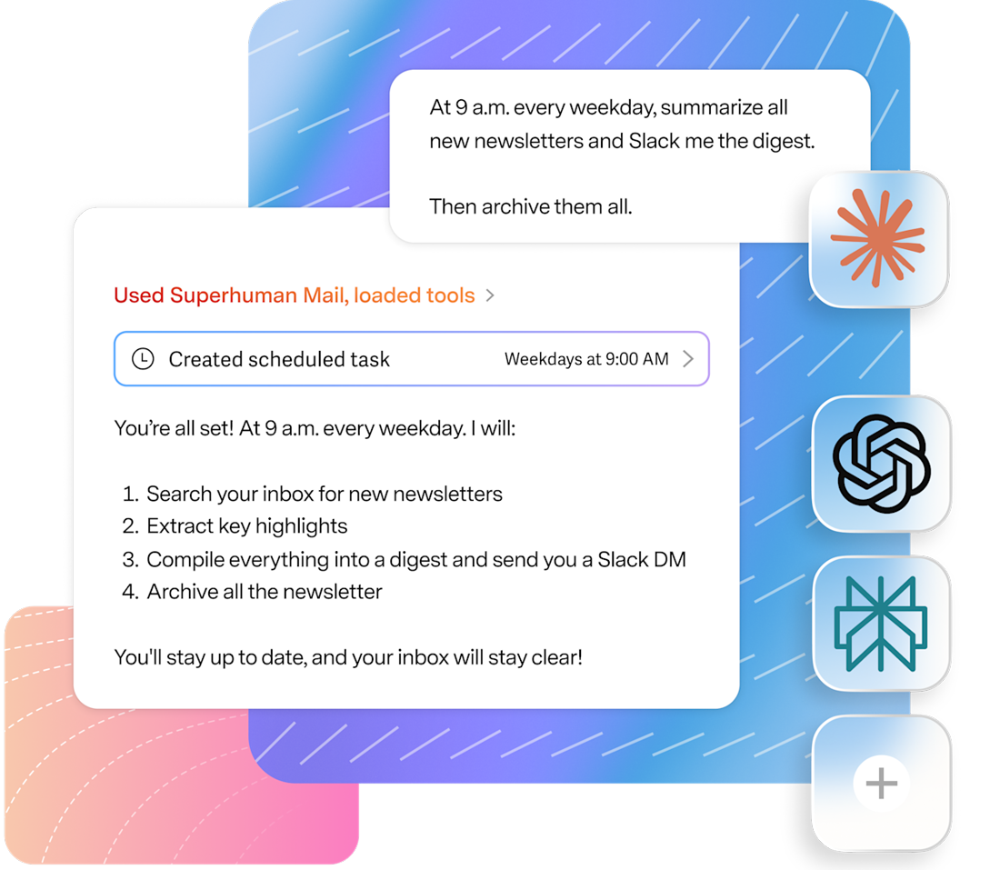

### 2.31 Superhuman for Outlook

Shipped May 2022 after a rebuild ("Gmail and Outlook have completely different APIs"). Microsoft 365 hosted accounts only. Differences: folders and Move instead of labels, Flag instead of Star, Done maps to the Archive folder, no L-labels (Auto Labels still work), Gmail-style delegation "coming soon". Everything else (splits, reminders, snippets, AI) is the same. You can mix Gmail and Outlook accounts in one app.

Sources: https://blog.superhuman.com/superhuman-for-outlook/, https://help.superhuman.com/hc/en-us/articles/46005736546061-Labels-Gmail-Accounts

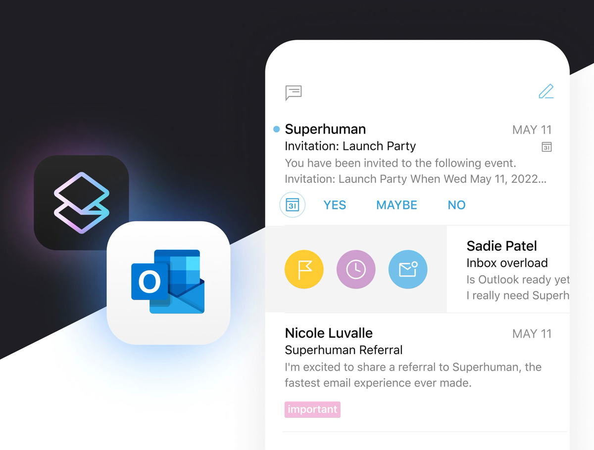

### 2.32 Offline

Native apps cache recent mail; reading, triage and search work offline and sends queue until reconnected ("Email delayed"). Offline support is listed as a Starter-plan feature.

Source: https://help.superhuman.com/hc/en-us/articles/46005543693581-Failed-Sends, https://superhuman.com/plans/mail

## 3. Keyboard shortcuts

Model: single unmodified keys when focus is in the list or a conversation (Gmail-style), two-key chords prefixed with G for navigation ("G then E"), Cmd+Shift combos inside compose, and Cmd+K as the universal fallback. Ctrl replaces Cmd on Windows, Alt replaces Ctrl for account switching. Arrow keys drive "Superhuman Focus" (Left opens the folder list, Right returns). Nothing is remappable. Source for the whole table: the official "Superhuman Mail Keyboard Shortcuts v8, Mac Edition" PDF, cross-checked with help centre articles (differences noted).

Navigation

| Action | Key |
|---|---|
| Superhuman Command | Cmd+K |
| Search | / |
| Ask AI | ? |
| Next / previous conversation | J / K |
| Open conversation | Enter |
| Back | Esc |
| Next / previous message in thread | N / P |
| Expand message / expand all | O / Shift+O |
| Scroll down / up | Space / Shift+Space |
| Jump to top / bottom | Cmd+Up / Cmd+Down |
| Next / previous split | Tab / Shift+Tab |
| Folders and labels list | Left arrow |
| Go to Inbox or Important | G then I |
| Go to Other | G then O |
| Go to Starred | G then S |
| Go to Drafts | G then D |
| Go to Sent | G then T |
| Go to Done | G then E |
| Go to Reminders | G then H |
| Go to Muted | G then M |
| Go to Snippets | G then ; |
| Go to Spam / Trash / All Mail | G then ! / G then # / G then A |
| Go to Label | G then L |
| Switch accounts | Ctrl+1 to Ctrl+9 |
| New tab / close tab / switch tabs | Cmd+T / Cmd+W / Cmd+1 to 9 |
| Next / previous tab | Cmd+Shift+] / Cmd+Shift+[ |
| Font size up / down / reset | Cmd+= / Cmd+- / Cmd+0 |
| Copy page link | Ctrl+/ |
| Shortcuts list | Cmd+K then Shortcuts (older builds: ?) |

Triage

| Action | Key |
|---|---|
| Mark Done (archive) | E |
| Mark Not Done | Shift+E |
| Remind Me (snooze) | H |
| Star | S |
| Mark read or unread | U |
| Trash | # |
| Mark spam | ! |
| Mute | Shift+M |
| Unsubscribe | Cmd+U |
| Add or remove label | L |
| Remove label | Y |
| Remove label, next / previous | [ / ] |
| Remove all labels (and archive) | Shift+Y |
| Move to folder | V |
| Select conversation | X |
| Add to selection | Shift+J / Shift+K |
| Select all from here / select all | Cmd+A / Cmd+Shift+A |
| Clear selection | Esc |
| Undo last action (incl. send, 10 s) | Z |
| Filter unread / starred / important / no reply | Shift+U / Shift+S / Shift+I / Shift+R |
| Comment (team) | M |
| Share conversation | Cmd+S |
| Expand summary (Auto Summarize) | i |

Compose and reply

| Action | Key |
|---|---|
| Compose | C (Shift+C pops out) |
| Reply | R (Shift+R pops out) |
| Reply all | Enter (Shift+Enter pops out) |
| Forward | F (Shift+F pops out) |
| Send | Cmd+Enter |
| Send and Mark Done | Cmd+Shift+Enter |
| Instant Send (no undo) | Cmd+Shift+Z |
| Send Later | Cmd+Shift+L |
| Remind Me on this message | Cmd+Shift+H |
| Discard draft | Cmd+Shift+, |
| Focus To / Cc / Bcc / From / Subject / body | Cmd+Shift+O / C / B / F / S / M |
| Move contacts to Bcc (Instant Intro) | Cmd+Shift+I |
| Attach file | Cmd+Shift+U (help centre); PDF v8 says Cmd+Shift+A |
| Share Availability | Cmd+Shift+A (help centre) |
| Use Snippet / inline snippet | Cmd+; / ; |
| Write with AI | Cmd+J |
| Insert emoji | :smile style colon codes |
| Pop draft in or out | Cmd+Shift+P |
| Switch to or from a draft | Cmd+D |
| Pop out a draft and search | Cmd+/ |
| Open links and attachments | Cmd+O |
| Cycle through links and dates | Tab |
| Bold / italic / underline | Cmd+B / Cmd+I / Cmd+U |
| Hyperlink | Cmd+K (inside compose) |
| Colour | Cmd+O (inside compose) |
| Strikethrough | Cmd+Shift+X |
| Numbered / bulleted list / quote | Cmd+Shift+7 / 8 / 9 |
| Indent / outdent | Cmd+] / Cmd+[ |

Calendar

| Action | Key |
|---|---|
| Open day (sidebar) | 0 |
| Open week | 0 then 0, or 2 |
| Today | T |
| Next / previous day or week | N or = / P or - |
| Create event (Instant Event) | B |
| Meet field (Find Time) | M in week view |
| Nudge date in compose | Cmd+Shift+= / Cmd+Shift+- |

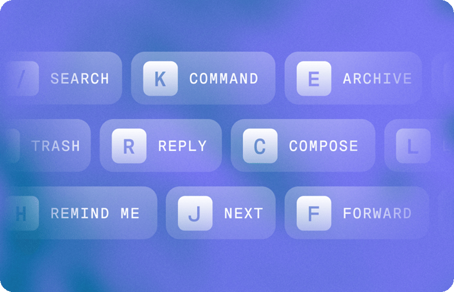

Sources: https://download.superhuman.com/Superhuman%20Keyboard%20Shortcuts.pdf, https://help.superhuman.com/hc/en-us/articles/46005701270541-Keyboard-Shortcuts-in-Superhuman-Mail, https://nickgray.net/superhuman/, https://help.superhuman.com/hc/en-us/articles/46005568142989-Attachments, https://help.superhuman.com/hc/en-us/articles/46005831908877-Meetings-on-Your-Terms

## 4. Interaction and UI design notes

Layout. Superhuman is a two-region layout, not a three-column client. The left region is either the message list or the open conversation, never both at once: opening a thread replaces the list, and a slim rail on the far left holds a close button and up/down chevrons to move to the adjacent conversation without going back. The right region is a persistent sidebar of about 260 px that shows the Contact Pane by default, or the day calendar, week view, Ask AI chat, search tips, shortcut list or snippet tips depending on context. There is no always-visible folder tree; a hamburger icon or the Left arrow slides in folders and labels. The newest builds add a thin icon rail on the far left (AI, Mail, Calendar). One long-term reviewer misses a permanent sidebar for mouse browsing; that is the trade-off Superhuman made for focus.

Message list rows. Single line, no avatars, no checkboxes until you select something. Columns from left: an unread dot (blue), sender name in a fixed-width column, optional Auto Label pill, subject in dark text, snippet in grey running to the edge, then the time. Hovering a row swaps the time for three quick-action icons (Done checkmark, Remind clock, and a third). The selected row gets a purple left bar in the current design (a blue fill in older builds for multi-select). Date group headers such as "Earlier this month" split the list. Dots are colour coded: blue unread, purple returned reminder, and a yellow dot for a third state (hover to see; unverified which). Row height is roughly 32 px at 1x; the list is dense but not cramped.

Split tabs. Rendered as a header line "Inbox 13 * VIP" in older builds and as a tab row "Important 4, Calendar 18, Team 15, Docs 40, Other 200" in current builds, with the count in lighter grey. Counts are totals, deliberately, so the split reads as a to-do list.

Conversation view. Subject as a large title; small caption under it for state ("Remind me if no reply") and the Auto Summarize line; each message has a compact header "Conrad to Me" with the time, expanding on click into To / Cc / Bcc / From / Re rows. Quoted text is collapsed behind an ellipsis. Attachments show inline as thumbnails or chips. Instant Reply chips sit under the last message; the comment bar sits below that. Read Status checkmarks sit in the header. Long threads scroll as one document with N and P to hop between messages and Shift+O to expand all.

Compose. Replies open inline at the bottom of the conversation; a new compose (C) takes over the main region. Shift plus the key (Shift+C, Shift+R, Shift+Enter, Shift+F) pops a draft out into a floating window, and Cmd+Shift+P toggles pop-out. The draft footer is a row of text buttons ("Send", "Send later", "Remind me") rather than icon buttons, and states such as "Send Wednesday at 10am" or "Reminder set: Monday July 10th if no reply" replace the button labels in place. Formatting appears in a floating bar on text selection. One reviewer complains the compose column is fixed at roughly 90 characters wide regardless of monitor size.

Typography and density. The marketing site preloads custom "SuperSans" and "SuperSerif" variable fonts; the in-app face is a similar humanist sans (unverified name). Text is small with tight spacing and ignores system font size; Cmd+= is the only remedy. A frequent complaint is "I have to squint to read SH". Whitespace is generous around the list and there is nearly no chrome: no toolbar, no ribbon, icons appear on hover only.

Colour and dark mode. Light theme is white and cool greys with a purple accent (the 2019 to 2023 builds used blue for selection). Dark theme, per Superhuman's own design write-up: five greys, no pure black (darkest is #010101) and no pure white; body text is white at 90 percent opacity, secondary text 65 percent; accent colours are darkened and saturated rather than lightened; surfaces closer to the user (modals, overlays) are lighter than the background; large colour washes such as the pink Remind Me backdrop were removed in dark mode. Theme can follow macOS.

Feedback and animation. Every action produces a bottom-left toast with an Undo link (white card with a coloured left edge in light mode). The Cmd+K overlay is dark and translucent over a dimmed inbox. Superhuman's stated performance rule is that every interaction responds within 100 ms; reviewers consistently describe it as "instantaneous" and one older review mentions occasional beachballs. Transitions are short slides; nothing bounces.

Empty state. The Inbox Zero photograph described in 2.5, with the split title overlaid on a per-photo scrim, a daily rotation and a weekly streak.

Onboarding. Historically a mandatory 30-minute 1:1 video call (cut down from 90 minutes in early years): a two-minute survey, then 28 minutes of screen-shared setup in which the specialist configures splits and teaches J, K, E, H and Z, with the curriculum branching by persona (founders get Auto Labels, Split Inbox and Remind Me; salespeople get Write with AI, Snippets and Send Later). First Round reports over 65 percent of new customers fully switched after the call. Today the call is still bookable (Cmd+K then "Book 1:1 Onboarding"), but the pricing table shows Starter gets group coaching and public webinars, Business private webinars, Enterprise 1:1. In-app, shortcuts are taught by the palette showing keys beside every command, by hover tooltips, and by a series of 15-minute self-paced guides. A red dot in the sidebar flags product updates.

Mobile. iOS and Android were rebuilt natively rather than ported. The inbox is a list with sender, subject and two snippet lines; split names are a scrollable bar at the bottom of the screen with a bottom tab bar (Mail, Calendar, Search, account avatar). Swipe left is Done, swipe right is Remind Me, both customisable with ordered action lists. An open message has a "triage bar" at the bottom (star, remind, done, Reply All, reply, forward) that is deliberately cut off at the edge to hint it scrolls, and is customisable on iOS. Superhuman Command is the pull-down-then-swipe-right "L" gesture or a two-finger tap. Snippets, Auto Labels with deterministic rules, Booking Pages, Share Availability, Autocomplete and Autocorrect are desktop only. Quick Reply from notifications, Write with Voice, a month sheet and 1 to 3 day calendar views are mobile only. Reviewers like the black Undo pill positioned for the thumb.

Sources: https://blog.superhuman.com/how-to-design-delightful-dark-themes/, https://blog.superhuman.com/how-superhuman-chooses-inbox-zero-images/, https://review.firstround.com/superhuman-onboarding-playbook/, https://help.superhuman.com/hc/en-us/articles/46005742942861-Customizing-Swipes-and-Triage-Bar, https://help.superhuman.com/hc/en-us/articles/46005789591693-Speed-Up-With-Shortcuts, https://afit.co/superhuman-email-review, https://bakerontech.com/superhuman-email-a-refreshing-new-way-to-deal-with-email-part-ii/, https://blog.superhuman.com/superhuman-for-android/

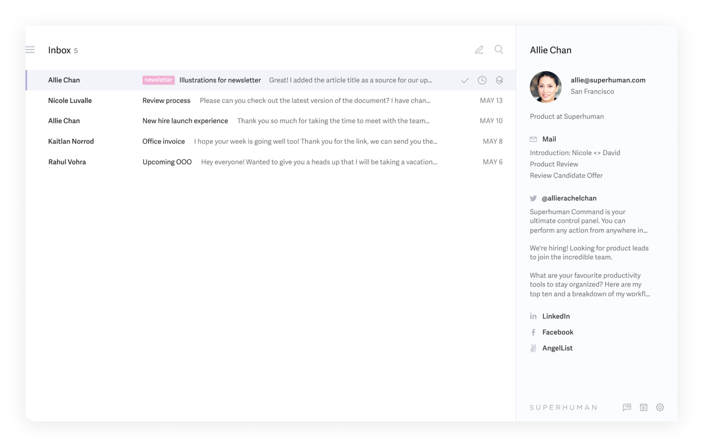

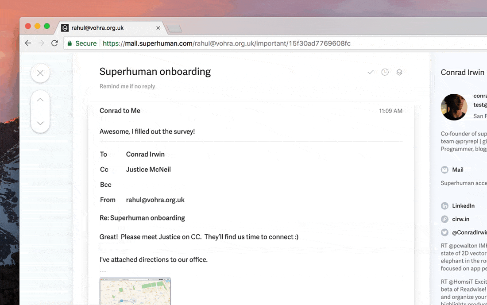

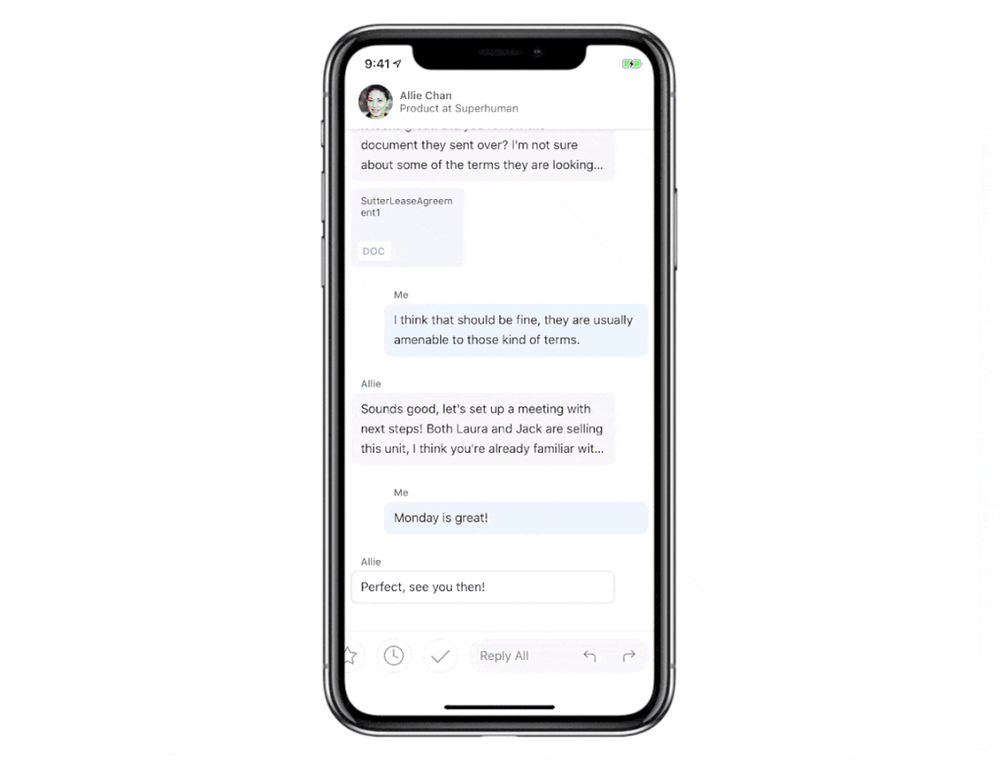

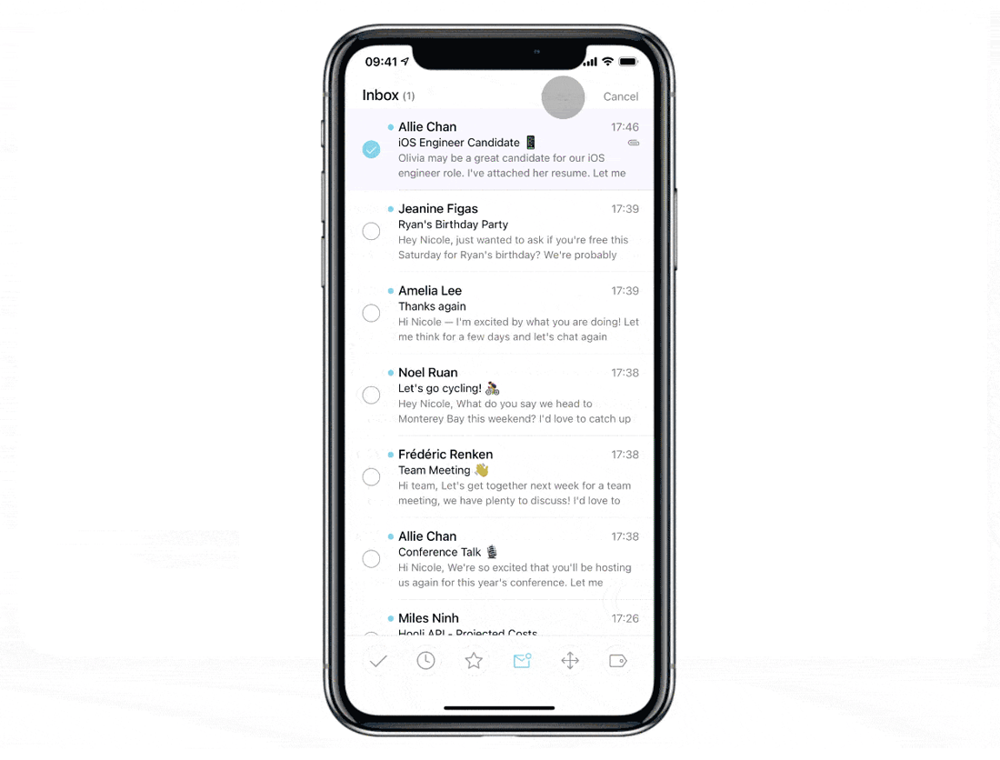

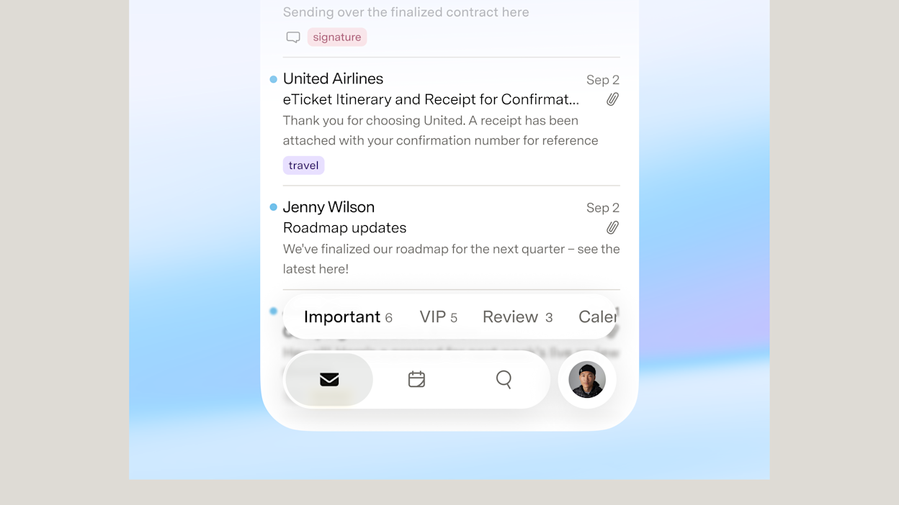

## 5. What people praise and what they criticise

Praise, from reviews spanning six years of use:

- Speed. "Processing 100 emails in Superhuman feels like 15 minutes of work; the same pile in stock Gmail feels like 40." Sub-100 ms interactions and instant search, online or offline.
- Split Inbox is the most-cited single feature; several reviewers call it better than Gmail's tabs because it is fully user-defined.
- The Cmd+K palette teaching shortcuts as you go; people who never learned Gmail shortcuts learn Superhuman's in a week.
- Reminders with natural language and the "if no reply" default; Snippets with attachments and recipients; Team Comments as "much cleaner than forwarding".
- Auto Summarize and Instant Reply are the AI features people actually keep using; Ask AI is praised for search.
- Design quality: "No other app I use on a daily basis is more thoughtfully and beautifully designed."
- The onboarding call, "worth the price of admission" for some.

Criticism:

- Price. $300 to $396 a year with no free tier, for a client on top of an email account you already pay for, and now bundled with tools you may not want.
- Gmail and Microsoft 365 only. No IMAP, no unified inbox.
- Steep switching cost: you must adopt Superhuman's workflow wholesale, and the muscle memory is worthless if you cancel.
- Privacy: Read Statuses are pixel tracking that recipients are never told about, and the 2019 location-logging episode still colours coverage; all mail is processed on Superhuman's servers, and AI features require indexing five years of mail with a third-party vendor.
- Typography too small and non-standard; a narrow compose column; window focus state indistinguishable on macOS; inconsistent ordering of actions between list and reading views.
- No custom rules or automations beyond Auto Labels and Auto Archive, no bulk unsubscribe report, no multiple signatures, no shortcut remapping, no international keyboard support, cannot empty Trash or delete labels in-app.
- Some find the Inbox Zero photographs and the gamified streak twee; others find the pressure to hit zero stressful.
- Value only appears at high volume: "if you process fewer than 50 emails daily, Gmail's native AI is good enough".

Sources: https://efficient.app/apps/superhuman, https://cmdk.email/post/superhuman-review/, https://layersignal.com/superhuman-email-review/, https://www.computerworld.com/article/1635565/superhuman-email-app.html, https://nicklafferty.com/reviews/superhuman/, https://afit.co/superhuman-email-review, https://bakerontech.com/superhuman-email-a-refreshing-new-way-to-deal-with-email-part-ii/, https://www.getinboxzero.com/best-superhuman-alternative, https://writing.arman.do/p/superhuman, https://dailydot.com/superhuman-email-privacy-scandal-explained

## 6. Takeaways for a new client

Worth stealing, for a calm, keyboard-first, Gmail-backed desktop client:

1. The command palette as the primary settings and discovery surface, with the shortcut printed beside every command. It removes almost all menus and teaches the keyboard without a tutorial. This is the single highest-value idea in the product.
2. Single-key triage in the list (J, K, E, H, S, U, #), G-chords for navigation, Cmd+Shift for compose. Copy the Gmail-compatible bindings so migrating users keep their hands.
3. "Done" instead of "Archive", with threads returning on reply, plus "action moves you to the next conversation". These two rules are what make the inbox feel like a queue rather than a pile.
4. Reminders with an "if no reply" default and natural-language input. It replaces snooze, follow-up tracking and starring in one primitive, and it composes with sending (Cmd+Shift+H on an outgoing message).
5. Splits defined by search queries and labels, counts as totals, hide-when-empty, and a hard nudge toward three to seven. The "also show in Important" toggle is the right escape hatch. Do not ship a classifier-driven Important / Other split unless you can explain and correct it; Superhuman leans on Gmail's importance signal for a reason.
6. Get Me To Zero as a first-run bulk archive with an age threshold, keep-unread and keep-starred options, and a reversal window.
7. Snippets with variables, placeholders that block sending, and the ability to carry subject, recipients and attachments.
8. A persistent right sidebar that changes purpose (contact, calendar day, search tips) instead of a second column of chrome.
9. The dark-theme rules (no pure black, layered greys getting lighter toward the user, 90 percent white text) are cheap to adopt and look right.

Not worth copying, or worth doing differently:

1. Tracking pixels. Read Statuses are Superhuman's most controversial feature and add nothing to a "calm" client. If you must, make it per-message and off by default, and consider blocking remote images on receipt by default instead.
2. The mandatory human onboarding call. It worked as a growth tactic at $30 a month; it is not a product feature. Put the same curriculum in an in-app 15-minute guide.
3. Total absence of a folder tree. The Left-arrow slide-in is fine for keyboard users but the reviewer complaints about mouse discoverability are real; a collapsible sidebar costs little.
4. The Inbox Zero photograph and streak. Pleasant for some, noisy for a calm product. A quiet empty state does the same job.
5. The AI surface area (Auto Drafts, Ask AI, Auto Reminders, Personalization, Knowledge Base) requires shipping mail to a vendor and indexing years of history. Auto Summarize and the one-line summary are the only AI features reviewers consistently value; if anything, start there and keep it local.
6. Small, non-standard type at a fixed size. Respect the system font size and give the compose column room.
7. No unified inbox and no IMAP are product-scope choices, not design insights. A Gmail-only client can still show several Gmail accounts in one list.
8. Unremappable shortcuts and US-only layouts. Ship a keymap file from day one; Superhuman's international workaround article is a list of embarrassments.
