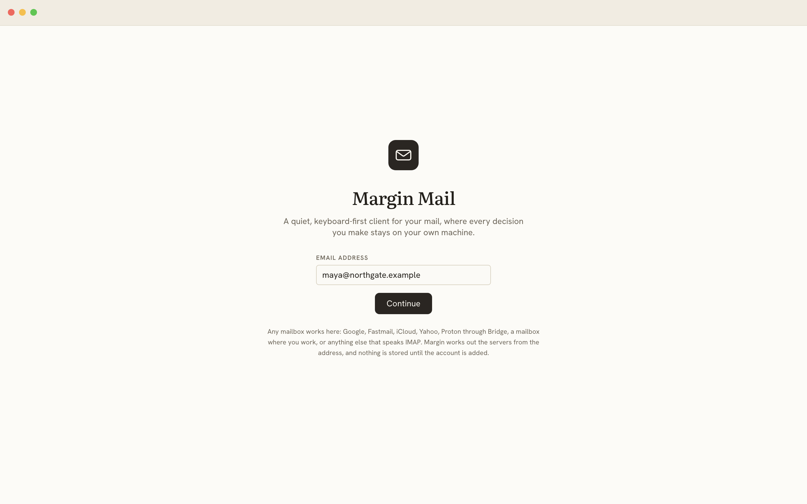
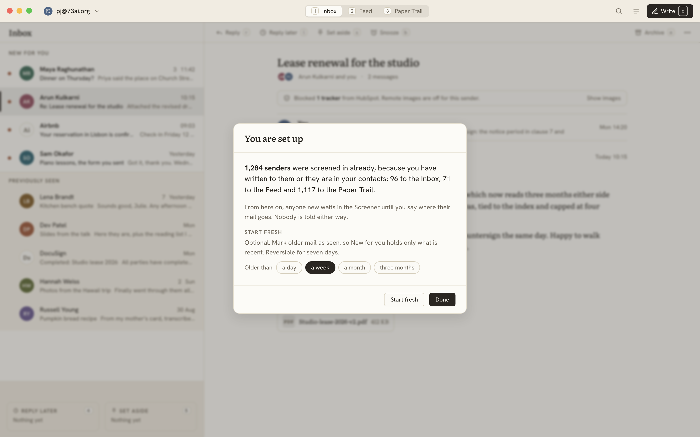
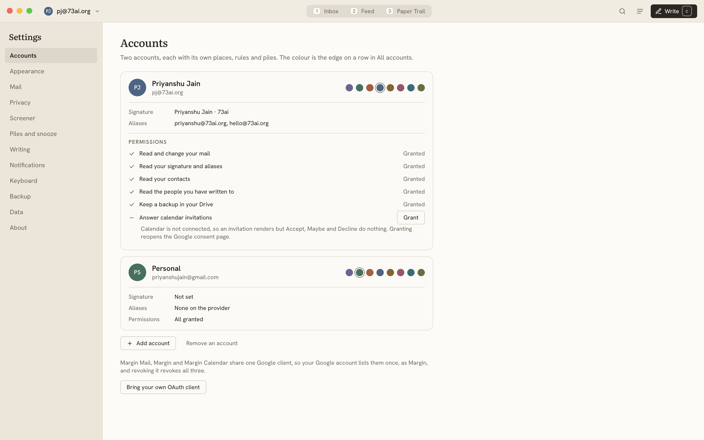

# Screens

What each screen is made of, in the order a user meets them. The images are renders of the
HTML mockups in [mockups/src/](mockups/src/), built on the real token set, so they are the
target rather than an impression of it; `mockups/render.sh` regenerates them. Behaviour is
specified in [features.md](features.md), keys in [keyboard.md](keyboard.md).

## Connecting

The first screen, and the only one that is not the app. The wordmark, a sentence under it, one
field for the address, and Continue. No provider is named as a button, because a person knows
their address and does not always know who runs the mailbox behind it, and a screen that opens with
a Google button and an "anything else" button under it has already decided who it was built for.
Under the field, in the faint ink, the sentence that says what works: Google, Fastmail, iCloud,
Yahoo, Proton through Bridge, a mailbox where you work, or anything else that speaks IMAP.

Continue reads the domain and works the rest out. The button says "Looking up northgate.example"
while it does, the field is held, and Stop sits beside it, so a press never looks like nothing
happened and a lookup that was never going to answer is not a wait anybody is held to. Under the
faint sentence, quieter still, is Enter the servers myself, for somebody who already knows nobody
publishes theirs. Four things can come next.

A Google address, whether gmail.com or a work domain whose mail is delivered to Google, goes to the
browser. The screen becomes Waiting for Google, with Open link again and Copy link below it,
because the browser that opened is not always the browser in front of you, and the sentence that
says what the sign-in means sits under them:

> Sign-in happens in your browser with Google. Margin never sees your password. The key Google
> hands back is stored only on this device, and you can revoke it any time from your Google
> account.

The consent page opens on the address that was typed rather than on Google's chooser. Closing it
comes quietly back to the address, still in its field.

Every other address goes to a sign-in step headed with the provider's own name: "Sign in to
Fastmail". Its first sentence says where the servers came from, before the password is typed into
them, because a configuration the provider publishes and one guessed by trying the usual server
names are different promises. Under it, the two servers in one line each, then Your name and
Password. Where the provider is one that refuses the password you sign in with, the hint under the
field says so and names the place in that provider's settings where an app password is made; that
is the single most common way a mail setup fails, and it is said before it can. Add account tests
both servers and, if they answer, adds the account and goes straight to the mail. A refusal is
explained on the same panel, with the server's own sentence and what to do about it. Change the
servers opens the sheet with both halves editable; a certificate nobody vouches for is a question
of its own, with the fingerprint to check it by.

An address nobody publishes settings for lands on the same sign-in step with a different first
sentence and Enter the servers in place of Add account, which opens the sheet with the usual names
already typed in as a starting point.

Between the account being written and its mail arriving there is one question, on the welcome
stage and in the panel alike: how far back this device holds. The same five spans as the Storage
window row in Settings, a month chosen already, one Start button. It is asked rather than assumed
because the first sync reads the answer, and a year of a busy mailbox is a wait somebody should
have chosen. The progress that follows is named after the answer: "Bringing in the last month",
"Bringing in the last year", "Bringing in everything".

An account added while the app is already up, from Settings or from the sign-in step for a
password account, does not land quietly. The moment it is written, "Bringing in the address" takes
the window as a panel: the question first, then the engine's line ("Listing your mail", "Fetching
the newest mail first"), a bar the width of the panel, and "1,204 of 4,812 messages" under it.
There is no close control that works, no Escape and no way through the scrim, because there is
nothing to do but wait and the wait is short. When the pass ends the panel goes, Settings goes
with it, and the window is that account's Inbox with the first-run panel over it. A first pass
that stops turns the panel into the provider's own sentence with Try again and Go in anyway, the
same two ways on the welcome screen offers.

An Outlook, Hotmail or Microsoft 365 address, recognised from the domain or from where the mail is
delivered, is told plainly that Microsoft turned off password sign-in and that the sign-in it wants
instead needs a registration Margin does not have yet. A HEY or Tuta address is told that there is
no IMAP behind it at all. Neither asks for a password that would only fail, and both offer the way
back to the address.

Then the screen becomes progress: "Bringing in the last month", a thin bar, and a count of what
has arrived. Nobody should have to watch it, so it turns into the Inbox as soon as the first page
of threads lands and the rest fills in behind.

The first-run panel arrives over that Inbox once the pass over senders has finished. It says how
many senders were screened in and where they went, offers Start fresh with its age picker (a week
by default), and ends with Done. Skipping is Done. Start fresh is the only bulk write the app ever
proposes, and the panel says so in a line rather than in a warning.

The tour follows it, whichever way it ended: nine slides on what this app does that the last one
did not, with Skip as the first control on them. It runs for every account that is added, and
[help.md](help.md) says why that is not the same as running it at every launch.

## The window

One header row, then the stage. The header carries the account chip on the left (name, a
chevron, the switcher and All accounts behind it), the three boxes as a segmented switch in the
centre with their number keys printed, and on the right search, the places button (which opens
the palette on its Places group) and Write. On macOS the traffic lights float over the left lane.
Nothing else is persistent: no sidebar, no folder tree, no toolbar. Sync says what it is doing in
the account chip's lane and nowhere else: a note when something is wrong ("Offline", "Signed out",
"Sync trouble", "Paused"), in the engine's own word since only it knows the kind of failure,
and otherwise one faint line naming the work and its progress while there is any ("Caching recent
mail, 340 of 1,412"). A toast is raised only for the pause, for a refused token or a missing
permission, and for a write the provider refused for good; everything else the chip carries and the
next poll answers. It goes when the work does. Nothing about it can be pressed, and it is in the
chip's lane rather than the centre so that a line growing and shrinking never moves the boxes.

A mailbox is readable long before it is complete, so the alternative to that line is an app that
looks finished while it is still working, and a first impression of mail that is missing rather
than mail that is on its way.

The stage is the list column, 420 px, and the reading pane. The list column has a head (the
place's name in the text face and, in the Inbox, the Screener pill), the list, and the two piles
at the foot. With the pane hidden the list takes the width and a thread opens in place. A list
that has run out of what is on the device closes with one faint line saying so: in Everything it
reads "Showing the last month. Older mail is on Gmail.", and in search results it is the button
that runs the provider's search instead.

### Rows

Two lines at 46 px. Left gutter for the new-mail dot, a 30 px avatar (initials on one of the
eight muted hues, or a bordered brand mark for companies), then sender and time on the first
line and subject and snippet on the second. Unseen mail: sender and subject at 600 weight in the
full ink. Seen mail: regular weight, subject in the soft ink. That weight is the only read
indicator there is, no dot, no band and no count, which is Superhuman's rule and the one signal that
cannot lag behind another. A message count sits between sender and time when the thread
has more than one. A note shows as one line under the row on the note surface. In All accounts
the row has a 2 px coloured left edge for its account. The selected row has a 2 px accent edge
and a wash; hover is a lighter wash. There are no chips, no icons on hover, and no checkboxes
until `x` is pressed, at which point the gutter shows one.

### Groups

The Inbox is one list in time order, with Back above it when a snooze has returned. There is no New
for you and no Previously seen: HEY splits by read state and Superhuman does not, and this app went
with Superhuman once it had tried carrying both. Other places group by age (Today, This week, This
month, Earlier) and Sent by recipient. Group headings are small uppercase labels with a rule, the
same as every section label in the family; nothing carries a count. Mark all as seen is a palette
row and a key.

### The piles

Two stacks of cards on the shell surface at the foot of the list, Reply later left and Set aside
right. Each stack shows its label, its key, the top thread's subject and sender, and one or two
card edges behind it to read as a pile. An empty pile is a dashed outline with its label. While a
selection exists the piles give way to the action bar.

### The reading pane

A bar of verbs with keys (Reply, Reply later, Set aside, Snooze, then Archive and More on the
right), then the thread. More, or `.`, drops the rest of the thread's verbs with their keys in the
order the keyboard table lists them, and leaves out any that mean nothing where you are. Then the thread: subject in Literata at 22 px, a participants line with stacked avatars,
the tracker banner when anything was stripped, then messages. Each message has an avatar, the
sender's name and address, "to you", and the time; older messages collapse to a preview line.
Bodies are Literata at 15 px on a 46 em measure for text mail, and the sanitised HTML for
HTML mail. Quoted text is a pill. Attachments are chips with a type mark. A note is a block on
the note surface with a small label. The reply box sits last with its own foot: Send with its
key, Remind me if no reply, and attach and note icons.

## Dark

Driven by `data-theme` with the shared dark palette, and the one thing that needs stating
precisely is what happens to a message body.

A message renders on a light page when the sender painted one, and on the app's own surface when
they did not. That is the whole rule, and what decides it is paint rather than `Content-Type`. A
newsletter lays out a page: a wash behind a 600 px card, a header band, a footer in grey. It keeps
that page in both palettes, because it is a design and taking it apart loses more than it saves.
A colleague's mail composed in a client that happens to send HTML carries bold runs, a list, four
links and a signature, and no colour and no surface at all. There is nothing in it that wants a
white page, so it reads like the rest of the app. Either way the pane's own chrome goes dark
around the body.

This used to say "a message that arrived as HTML stays on the paper surface", and that was wrong.
Most HTML mail is somebody typing to you. Pinning all of it to white put a slab of white in the
middle of a dark window for every ordinary message anybody was sent, which is a much bigger loss
than the newsletter case it was protecting.

The hazard the old rule existed for is real, and it is handled on the other side. A sender who
sets a text colour without setting a background is dark ink on a dark page, so on the theme
surface Rust takes off, before the body is ever cached, any author colour that would not read on
our own paper: what survives is the mid-tone band a brand red or a heading grey lives in, and what
goes is the near-black that would vanish on our dark page and the near-white that would vanish on
our light one. A background the sender painted under their own text is judged with it, and it is
what gives way first.

The document inside the frame is told which of the two it is, with `color-scheme`. On a painted
page that is `only light`, without which the browser puts its own dark canvas and its own dark
form controls under a page we have just finished painting white.

The decision is made once, in the sanitiser, and stored on the body row, because opening a thread
is a local read and is not allowed to grow a walk over the markup. Every heuristic misses, so a
message head in dark carries one quiet control that overrules it for that message, for as long as
the app is open.

## The Screener

The whole stage. A centred title and one sentence of explanation, then a card per sender:
avatar, name and address, subject, snippet, and a pill with the reason and the suggested box.
On the right, three buttons with their keys: Yes to the suggestion, Elsewhere, No. The focused
card has a faint ring. Under the list, one faint sentence about how long screened-out mail stays
and how to reverse a decision. Clear all is a ghost button at the top right.

## The Feed

The whole stage, one column of cards on a 720 px measure. Each card: brand avatar, sender and
address, time, the subject as a title in the text face, then the body. A long card fades out
after 300 px with Read more; an open card shows See less. A hairline with "You left off here"
marks the last visit. Card feet carry Read more, Save clip, then Unsubscribe and Move on the
right. A banner at the top of the column says images load through Margin and how many trackers
were stripped today.

## The Paper Trail

The list column and the pane, with This week and Earlier as the only groups and no dots. A
bundled sender shows a count between its name and the time. Transactional mail renders in the
interface face rather than the text face, because it is data rather than prose. The pane bar
adds Move to Inbox.

## Focus & Reply

The whole stage. A centred title and a sentence, a right-aligned hint line with the three keys,
then one item per Reply later thread: the latest message on the left, a reply box on the right,
in one bordered card. The active item has a faint ring. A sent item collapses to a single "Sent
to" line with a check. Items you skip stay.

## Compose

A 600 px card floating bottom right over the stage, with the list still usable behind it. Head:
"New message", expand, close. Fields: From (the account as a chip), To (chips, with Cc and Bcc
revealed on demand), Subject. Body in Literata. Foot: Send with its key, Remind me if no reply,
then attach and the undo delay stated plainly. After a send, a toast at the foot of the window
says who it went to and offers Undo with `z` for the delay.

Replies do not use the card; they are the box at the end of the thread in the pane.

## The palette

`Cmd+K`. A panel at 12 vh from the top over a scrim, with a single field and a list grouped into
Places, Labels, Other, Actions, People, Settings. Every row prints its key. Typing filters across
groups. It is the only menu in the app and the way every setting is reached; the places button in
the header opens it on the Places group. The shortcut sheet behind `?` is generated from the same
data.

Other is Screened out, Spam and Trash, and it is last of the three place groups on purpose: none
of them has a number key, and a menu that put them beside the Inbox would be claiming they are
somewhere you go daily. Their rules are in [features.md](features.md) section 12.

## Settings

The whole stage, and a place rather than an overlay. A rail of section names down the left with
one selected, and that section on the right at a 640 px measure. No tabs and no nesting: a section
is a column of labelled controls with a sentence under any control that needs one.

Accounts is the section it opens on. Each account is a card with its colour, its name and address,
its signature and aliases, and under them the permissions it granted, one line each. A permission
that is missing says what it costs in a sentence and carries a Grant button. Add account sits at
the foot of the list. Every section is specified in [settings.md](settings.md).

## Help

A small round question mark fixed in the bottom right corner, the only permanent chrome outside
the header, opening three rows: the tour, the guide, and the keyboard shortcuts with its key. It is
not drawn while the compose card is open, since they share that corner, nor under an overlay, nor
on a phone.

The guide is a panel over the whole window: a search field across the full width, then a rail of
sections down the left and one article on the right at a reading measure. Search has the keyboard
the moment it opens, and a query nothing answers offers to file the question against the
repository. An article leads with its answer and then shows it: a drawn figure, a screenshot, or a
table of the key beside the verb, and the last section is the questions. The app is dimmed behind
it and none of it can be pressed, and closing puts back the place, the open thread and the scroll.
[help.md](help.md) has the whole of it.

## Thread details

Four things on one screen. The subject shows its rename with "renamed · was …" in small faint
text beside it. A muted banner says the thread was merged from two and offers Unmerge. A calendar
invite renders as a card with the date in a box, the title, the time and place, and Accept, Maybe
and Decline with their keys, plus Open in Margin Calendar. The contact card is a popover hanging
from the sender's name: avatar, name, address, then Delivers to, Notify, Screened, Note, Recent
threads, Files. The pane bar shows Notify as a verb with its key.

## On a phone

Top bar: search, the place's name in the text face, places. Then the list, with the Screener as
a full-width strip at its top, then the two piles, then the tab bar with the three boxes and the
write button. Rows grow to 68 px with 36 px avatars and stack subject over snippet. There are no
keycaps anywhere. A thread is a page with a back chevron in the top bar and a floating action
bar at the bottom: Reply (filled), Reply later, Set aside, Snooze, More. No inline reply box on a
phone; Reply opens the editor as a sheet. Overlays are bottom sheets. Swipes: right for Reply
later, left for Set aside, both changeable in settings.

## Empty states

Every empty list says one quiet thing in the text face and nothing else: "Nothing here" in an
empty place; "No one is waiting" in the Screener;
"Nothing due" in Snoozed. No illustration, no photograph, no streak.

A place that is empty because its account has not arrived yet is not empty, and does not say it
is. While the first sync is bringing the mailbox in, from the welcome screen or from Settings, the
list shows the engine's own line ("Listing your mail", "Fetching the newest mail first"), the thin
bar the welcome screen uses, and the count under it. "Nothing here" waits until the crawl has
finished, and so does the Screener pill in the Inbox, because until the seed has run the number on
it is every sender the account has met so far.

## Motion

Transitions name explicit properties and use the family's one easing curve, 120 ms for hovers
and 180 ms for panels and sheets. Rows do not animate when they leave for a pile or an archive;
the toast is the acknowledgement. The compose card slides up; the palette fades. Nothing bounces.

## Not in the mockups

Search results (the list column with a query in the head and the provider's search offered at
its foot), All files (a card grid with a filter row), Clips (a list of passages), Contacts (a list
with the same row anatomy), the snooze picker (a small popover with the six choices and their
keys), and the selection action bar (the piles' footprint filled with verbs). All of them are
compositions of the pieces above and need no new visual vocabulary.
