# Screens

What each screen is made of, in the order a user meets them. The images are renders of the
HTML mockups in [mockups/src/](mockups/src/), built on the real token set, so they are the
target rather than an impression of it; `mockups/render.sh` regenerates them. Behaviour is
specified in [features.md](features.md), keys in [keyboard.md](keyboard.md).

## The window

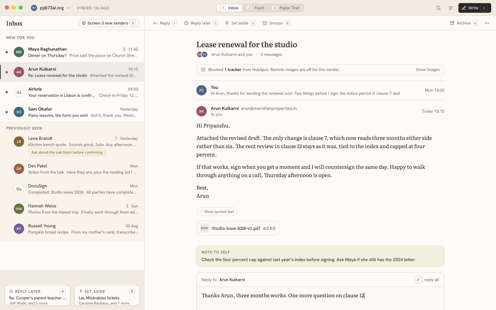

One header row, then the stage. The header carries the account chip on the left (name, a
chevron, the switcher and All accounts behind it), the three boxes as a segmented switch in the
centre with their number keys printed, and on the right search, the places button (which opens
the palette on its Places group) and Write. On macOS the traffic lights float over the left lane.
Nothing else is persistent: no sidebar, no folder tree, no toolbar. Sync status is not shown
unless something is wrong, in which case the account chip carries a small note ("Offline",
"Signed out").

The stage is the list column, 420 px, and the reading pane. The list column has a head (the
place's name in the text face and, in the Inbox, the Screener pill), the list, and the two piles
at the foot. With the pane hidden the list takes the width and a thread opens in place.

### Rows

Two lines at 58 px. Left gutter for the new-mail dot, a 30 px avatar (initials on one of the
eight muted hues, or a bordered brand mark for companies), then sender and time on the first
line and subject and snippet on the second. New mail: a dot and a 600-weight sender. Seen mail:
no dot, subject in the soft ink. A message count sits between sender and time when the thread
has more than one. A note shows as one line under the row on the note surface. In All accounts
the row has a 2 px coloured left edge for its account. The selected row has a 2 px accent edge
and a wash; hover is a lighter wash. There are no chips, no icons on hover, and no checkboxes
until `x` is pressed, at which point the gutter shows one.

### Groups

New for you, Previously seen (on a slightly warmer band), and Back when a snooze has returned.
Group headings are small uppercase labels with a rule, the same as every section label in the
family. The New for you heading carries "Mark all as seen" at its right; nothing carries a count.

### The piles

Two stacks of cards on the shell surface at the foot of the list, Reply later left and Set aside
right. Each stack shows its label, its key, the top thread's subject and sender, and one or two
card edges behind it to read as a pile. An empty pile is a dashed outline with its label. While a
selection exists the piles give way to the action bar.

### The reading pane

A bar of verbs with keys (Reply, Reply later, Set aside, Snooze, then Archive and More on the
right), then the thread: subject in Literata at 22 px, a participants line with stacked avatars,
the tracker banner when anything was stripped, then messages. Each message has an avatar, the
sender's name and address, "to you", and the time; older messages collapse to a preview line.
Bodies are Literata at 15 px on a 46 em measure for text mail, and the sanitised HTML for
HTML mail. Quoted text is a pill. Attachments are chips with a type mark. A note is a block on
the note surface with a small label. The reply box sits last with its own foot: Send with its
key, Remind me if no reply, and attach and note icons.

## Dark

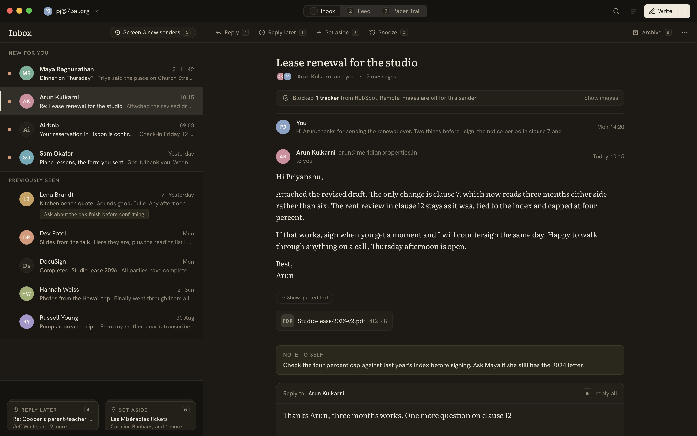

Driven by `data-theme` with the shared dark palette. Message bodies stay on the paper surface
in dark mode too, because HTML mail is written for a light background and inverting it breaks
more than it fixes; the pane's own chrome goes dark around it.

## The Screener

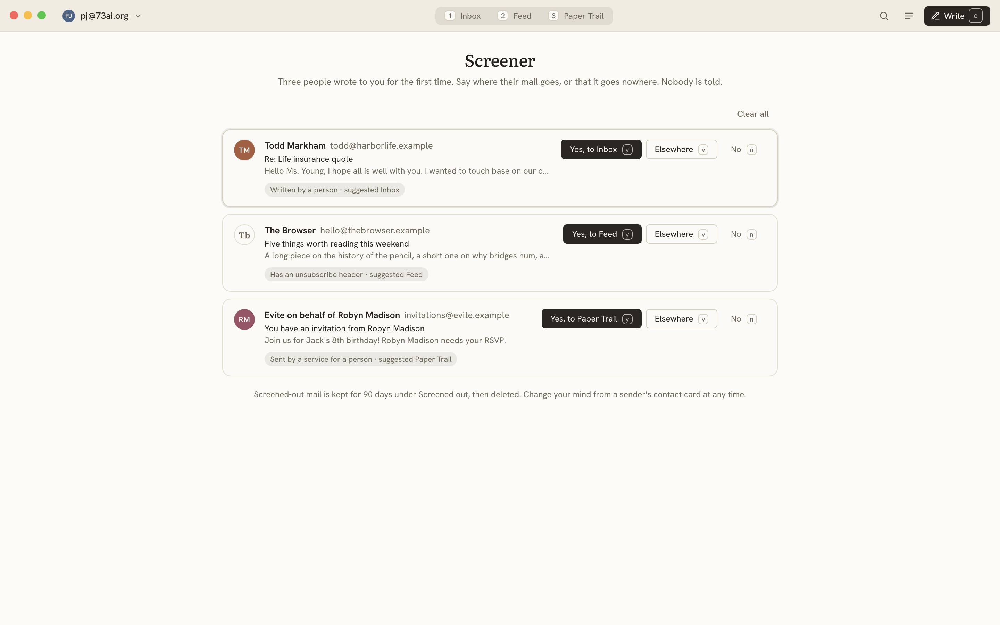

The whole stage. A centred title and one sentence of explanation, then a card per sender:
avatar, name and address, subject, snippet, and a pill with the reason and the suggested box.
On the right, three buttons with their keys: Yes to the suggestion, Elsewhere, No. The focused
card has a faint ring. Under the list, one faint sentence about the 90-day retention and how to
reverse a decision. Clear all is a ghost button at the top right.

## The Feed

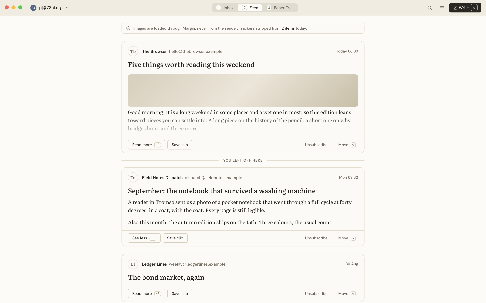

The whole stage, one column of cards on a 720 px measure. Each card: brand avatar, sender and
address, time, the subject as a title in the text face, then the body. A long card fades out
after 300 px with Read more; an open card shows See less. A hairline with "You left off here"
marks the last visit. Card feet carry Read more, Save clip, then Unsubscribe and Move on the
right. A banner at the top of the column says images load through Margin and how many trackers
were stripped today.

## The Paper Trail

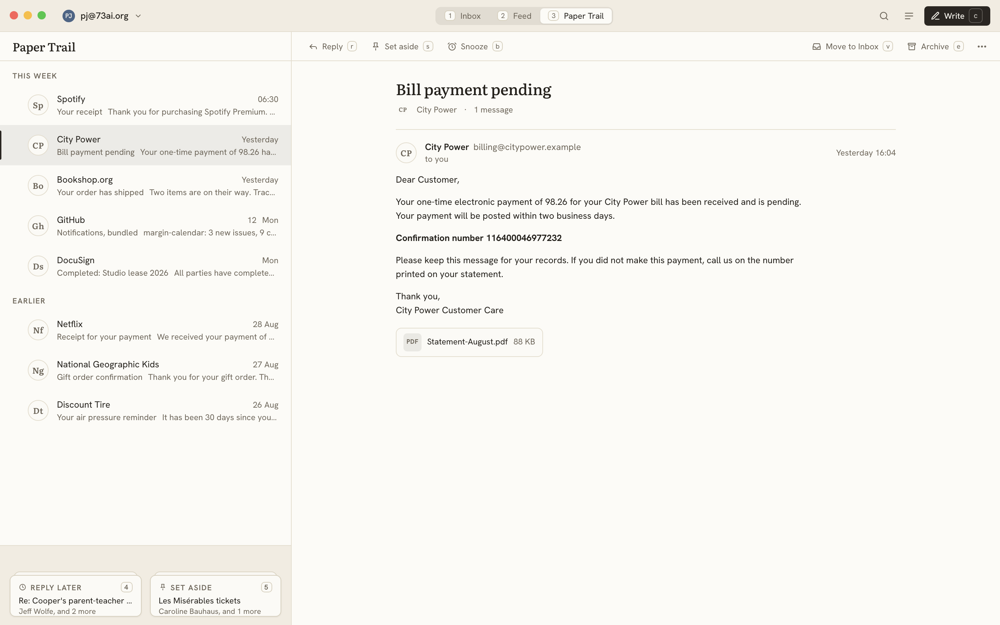

The list column and the pane, with This week and Earlier as the only groups and no dots. A
bundled sender shows a count between its name and the time. Transactional mail renders in the
interface face rather than the text face, because it is data rather than prose. The pane bar
adds Move to Inbox.

## Focus & Reply

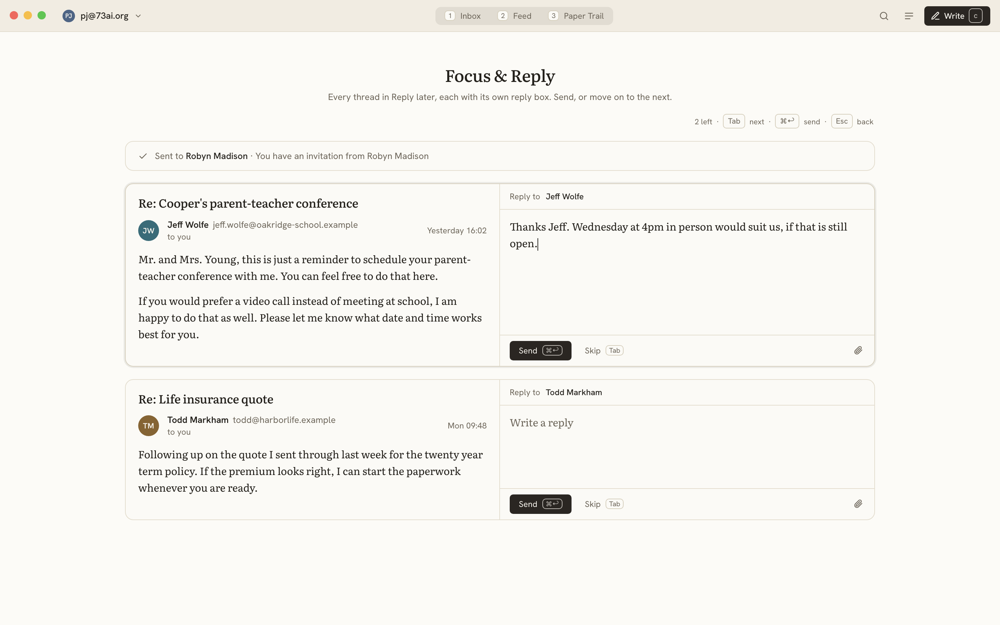

The whole stage. A centred title and a sentence, a right-aligned hint line with the three keys,
then one item per Reply later thread: the latest message on the left, a reply box on the right,
in one bordered card. The active item has a faint ring. A sent item collapses to a single "Sent
to" line with a check. Items you skip stay.

## Compose

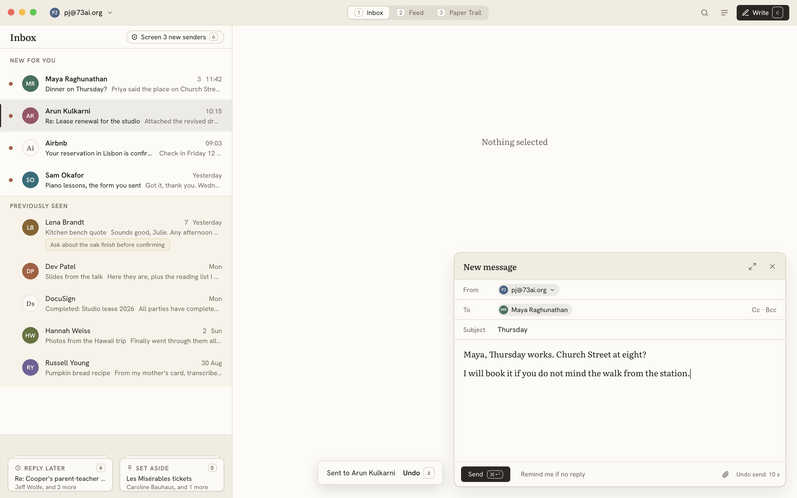

A 600 px card floating bottom right over the stage, with the list still usable behind it. Head:
"New message", expand, close. Fields: From (the account as a chip), To (chips, with Cc and Bcc
revealed on demand), Subject. Body in Literata. Foot: Send with its key, Remind me if no reply,
then attach and the undo delay stated plainly. After a send, a toast at the foot of the window
says who it went to and offers Undo with `z` for the delay.

Replies do not use the card; they are the box at the end of the thread in the pane.

## The palette

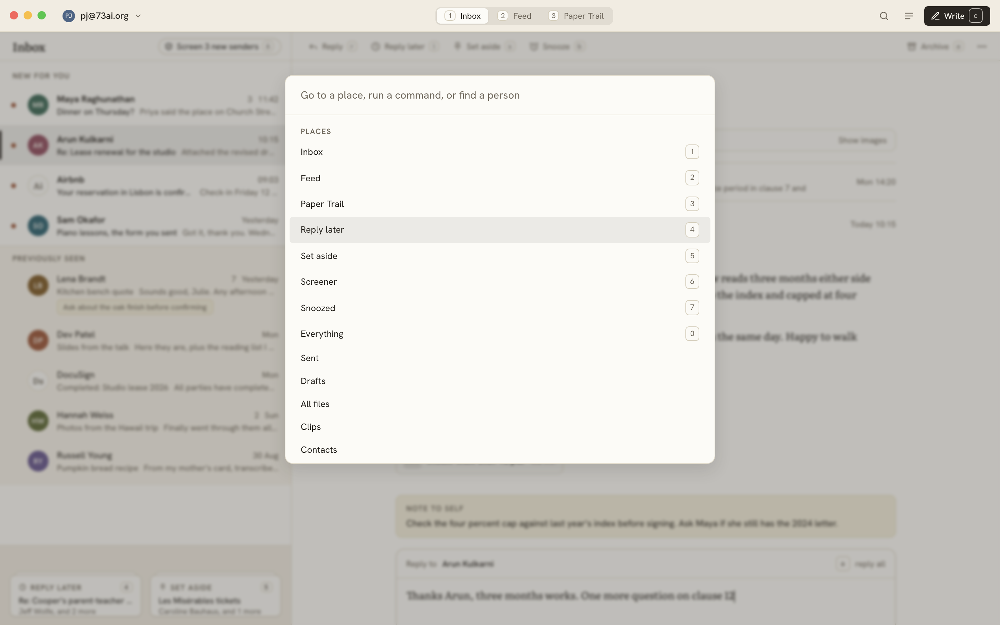

`Cmd+K`. A panel at 12 vh from the top over a scrim, with a single field and a list grouped into
Places, Actions, People, Settings. Every row prints its key. Typing filters across groups. It is
the only menu in the app and the way every setting is reached; the places button in the header
opens it on the Places group. The shortcut sheet behind `?` is generated from the same data.

## Thread details

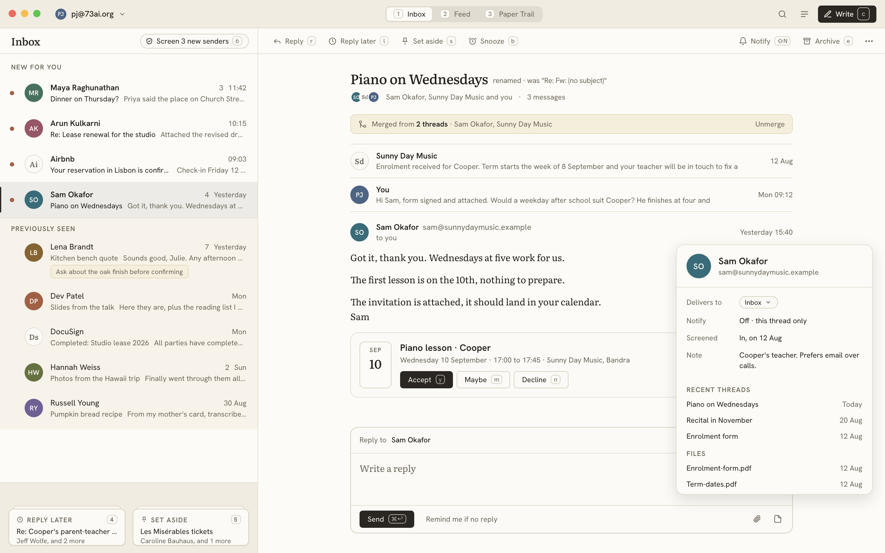

Four things on one screen. The subject shows its rename with "renamed · was …" in small faint
text beside it. A muted banner says the thread was merged from two and offers Unmerge. A calendar
invite renders as a card with the date in a box, the title, the time and place, and Accept, Maybe
and Decline with their keys, plus Open in Margin Calendar. The contact card is a popover hanging
from the sender's name: avatar, name, address, then Delivers to, Notify, Screened, Note, Recent
threads, Files. The pane bar shows Notify as a verb with its key.

## On a phone

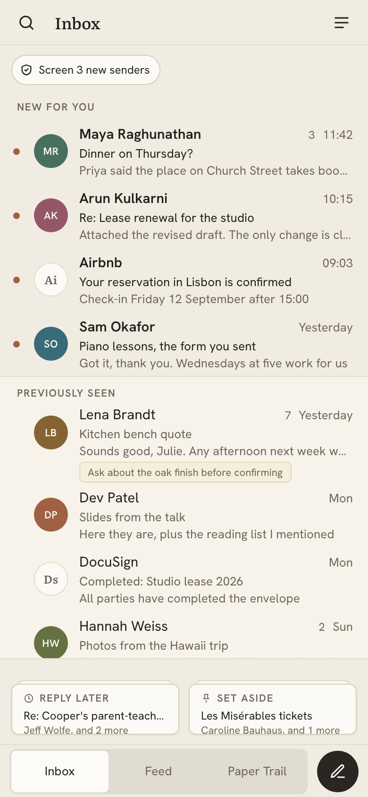

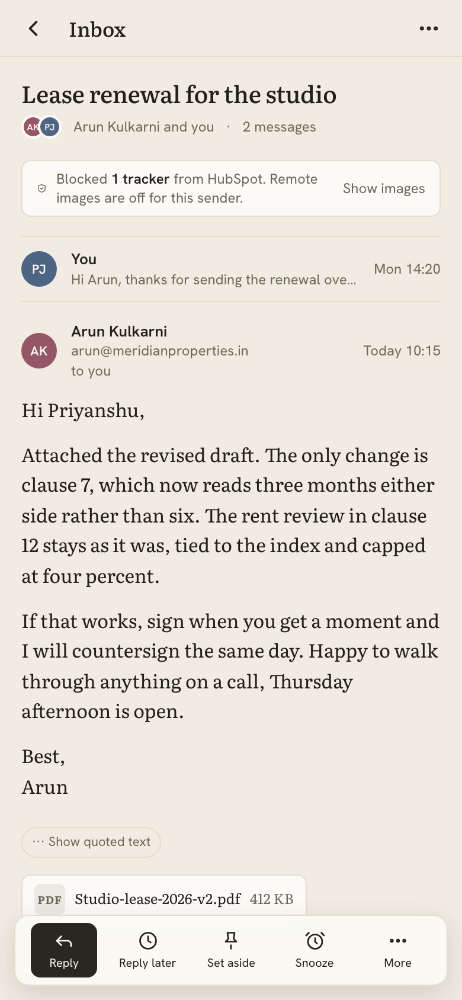

Top bar: search, the place's name in the text face, places. Then the list, with the Screener as
a full-width strip at its top, then the two piles, then the tab bar with the three boxes and the
write button. Rows grow to 68 px with 36 px avatars and stack subject over snippet. There are no
keycaps anywhere. A thread is a page with a back chevron in the top bar and a floating action
bar at the bottom: Reply (filled), Reply later, Set aside, Snooze, More. No inline reply box on a
phone; Reply opens the editor as a sheet. Overlays are bottom sheets. Swipes: right for Reply
later, left for Set aside, both changeable in settings.

## Empty states

Every empty list says one quiet thing in the text face and nothing else: "Nothing new for you"
above Previously seen; "Nothing here" in an empty place; "No one is waiting" in the Screener;
"Nothing due" in Snoozed. No illustration, no photograph, no streak.

## Motion

Transitions name explicit properties and use the family's one easing curve, 120 ms for hovers
and 180 ms for panels and sheets. Rows do not animate when they leave for a pile or an archive;
the toast is the acknowledgement. The compose card slides up; the palette fades. Nothing bounces.

## Not in the mockups

Settings (a standard panel with the sections listed in features.md), search results (the list
column with a query in the head), All files (a card grid with a filter row), Clips (a list of
passages), Contacts (a list with the same row anatomy), the snooze picker (a small popover with
the six choices and their keys), and the selection action bar (the piles' footprint filled with
verbs). All of them are compositions of the pieces above and need no new visual vocabulary.
